# Projects and dependencies analysis

This document provides a comprehensive overview of the projects and their dependencies in the context of upgrading to .NETCoreApp,Version=v10.0.

## Table of Contents

- [Executive Summary](#executive-Summary)
  - [Highlevel Metrics](#highlevel-metrics)
  - [Projects Compatibility](#projects-compatibility)
  - [Package Compatibility](#package-compatibility)
  - [API Compatibility](#api-compatibility)
- [Aggregate NuGet packages details](#aggregate-nuget-packages-details)
- [Top API Migration Challenges](#top-api-migration-challenges)
  - [Technologies and Features](#technologies-and-features)
  - [Most Frequent API Issues](#most-frequent-api-issues)
- [Projects Relationship Graph](#projects-relationship-graph)
- [Project Details](#project-details)

  - [src\AccountDeleter\AccountDeleter.csproj](#srcaccountdeleteraccountdeletercsproj)
  - [src\DatabaseMigrationTools\DatabaseMigrationTools.csproj](#srcdatabasemigrationtoolsdatabasemigrationtoolscsproj)
  - [src\GalleryTools\GalleryTools.csproj](#srcgallerytoolsgallerytoolscsproj)
  - [src\GitHubVulnerabilities2Db\GitHubVulnerabilities2Db.csproj](#srcgithubvulnerabilities2dbgithubvulnerabilities2dbcsproj)
  - [src\GitHubVulnerabilities2v3\GitHubVulnerabilities2V3.csproj](#srcgithubvulnerabilities2v3githubvulnerabilities2v3csproj)
  - [src\NuGet.Jobs.Common\NuGet.Jobs.Common.csproj](#srcnugetjobscommonnugetjobscommoncsproj)
  - [src\NuGet.Services.CatalogValidation\NuGet.Services.CatalogValidation.csproj](#srcnugetservicescatalogvalidationnugetservicescatalogvalidationcsproj)
  - [src\NuGet.Services.Configuration\NuGet.Services.Configuration.csproj](#srcnugetservicesconfigurationnugetservicesconfigurationcsproj)
  - [src\NuGet.Services.Contracts\NuGet.Services.Contracts.csproj](#srcnugetservicescontractsnugetservicescontractscsproj)
  - [src\NuGet.Services.Cursor\NuGet.Services.Cursor.csproj](#srcnugetservicescursornugetservicescursorcsproj)
  - [src\NuGet.Services.DatabaseMigration\NuGet.Services.DatabaseMigration.csproj](#srcnugetservicesdatabasemigrationnugetservicesdatabasemigrationcsproj)
  - [src\NuGet.Services.Entities\NuGet.Services.Entities.csproj](#srcnugetservicesentitiesnugetservicesentitiescsproj)
  - [src\NuGet.Services.FeatureFlags\NuGet.Services.FeatureFlags.csproj](#srcnugetservicesfeatureflagsnugetservicesfeatureflagscsproj)
  - [src\NuGet.Services.Github\NuGet.Services.GitHub.csproj](#srcnugetservicesgithubnugetservicesgithubcsproj)
  - [src\NuGet.Services.KeyVault\NuGet.Services.KeyVault.csproj](#srcnugetserviceskeyvaultnugetserviceskeyvaultcsproj)
  - [src\NuGet.Services.Licenses\NuGet.Services.Licenses.csproj](#srcnugetserviceslicensesnugetserviceslicensescsproj)
  - [src\NuGet.Services.Logging\NuGet.Services.Logging.csproj](#srcnugetservicesloggingnugetservicesloggingcsproj)
  - [src\NuGet.Services.Messaging.Email\NuGet.Services.Messaging.Email.csproj](#srcnugetservicesmessagingemailnugetservicesmessagingemailcsproj)
  - [src\NuGet.Services.Messaging\NuGet.Services.Messaging.csproj](#srcnugetservicesmessagingnugetservicesmessagingcsproj)
  - [src\NuGet.Services.Owin\NuGet.Services.Owin.csproj](#srcnugetservicesowinnugetservicesowincsproj)
  - [src\NuGet.Services.ServiceBus\NuGet.Services.ServiceBus.csproj](#srcnugetservicesservicebusnugetservicesservicebuscsproj)
  - [src\NuGet.Services.Sql\NuGet.Services.Sql.csproj](#srcnugetservicessqlnugetservicessqlcsproj)
  - [src\NuGet.Services.Storage\NuGet.Services.Storage.csproj](#srcnugetservicesstoragenugetservicesstoragecsproj)
  - [src\NuGet.Services.Validation.Issues\NuGet.Services.Validation.Issues.csproj](#srcnugetservicesvalidationissuesnugetservicesvalidationissuescsproj)
  - [src\NuGet.Services.Validation\NuGet.Services.Validation.csproj](#srcnugetservicesvalidationnugetservicesvalidationcsproj)
  - [src\NuGetGallery.Core\NuGetGallery.Core.csproj](#srcnugetgallerycorenugetgallerycorecsproj)
  - [src\NuGetGallery.Services\NuGetGallery.Services.csproj](#srcnugetgalleryservicesnugetgalleryservicescsproj)
  - [src\NuGetGallery\NuGetGallery.csproj](#srcnugetgallerynugetgallerycsproj)
  - [src\Validation.Common.Job\Validation.Common.Job.csproj](#srcvalidationcommonjobvalidationcommonjobcsproj)
  - [src\VerifyGitHubVulnerabilities\VerifyGitHubVulnerabilities.csproj](#srcverifygithubvulnerabilitiesverifygithubvulnerabilitiescsproj)
  - [src\VerifyMicrosoftPackage\VerifyMicrosoftPackage.csproj](#srcverifymicrosoftpackageverifymicrosoftpackagecsproj)
  - [tests\AccountDeleter.Facts\AccountDeleter.Facts.csproj](#testsaccountdeleterfactsaccountdeleterfactscsproj)
  - [tests\GitHubVulnerabilities2Db.Facts\GitHubVulnerabilities2Db.Facts.csproj](#testsgithubvulnerabilities2dbfactsgithubvulnerabilities2dbfactscsproj)
  - [tests\GitHubVulnerabilities2v3.Facts\GitHubVulnerabilities2v3.Facts.csproj](#testsgithubvulnerabilities2v3factsgithubvulnerabilities2v3factscsproj)
  - [tests\NuGet.Services.DatabaseMigration.Facts\NuGet.Services.DatabaseMigration.Facts.csproj](#testsnugetservicesdatabasemigrationfactsnugetservicesdatabasemigrationfactscsproj)
  - [tests\NuGet.Services.Entities.Tests\NuGet.Services.Entities.Tests.csproj](#testsnugetservicesentitiestestsnugetservicesentitiestestscsproj)
  - [tests\NuGetGallery.Core.Facts\NuGetGallery.Core.Facts.csproj](#testsnugetgallerycorefactsnugetgallerycorefactscsproj)
  - [tests\NuGetGallery.Facts\NuGetGallery.Facts.csproj](#testsnugetgalleryfactsnugetgalleryfactscsproj)
  - [tests\VerifyMicrosoftPackage.Facts\VerifyMicrosoftPackage.Facts.csproj](#testsverifymicrosoftpackagefactsverifymicrosoftpackagefactscsproj)


## Executive Summary

### Highlevel Metrics

| Metric | Count | Status |
| :--- | :---: | :--- |
| Total Projects | 39 | All require upgrade |
| Total NuGet Packages | 118 | 61 need upgrade |
| Total Code Files | 2350 |  |
| Total Code Files with Incidents | 568 |  |
| Total Lines of Code | 275820 |  |
| Total Number of Issues | 10499 |  |
| Estimated LOC to modify | 10323+ | at least 3.7% of codebase |

### Projects Compatibility

| Project | Target Framework | Difficulty | Package Issues | API Issues | Est. LOC Impact | Description |
| :--- | :---: | :---: | :---: | :---: | :---: | :--- |
| [src\AccountDeleter\AccountDeleter.csproj](#srcaccountdeleteraccountdeletercsproj) | net472 | 🟢 Low | 0 | 18 | 18+ | DotNetCoreApp, Sdk Style = True |
| [src\DatabaseMigrationTools\DatabaseMigrationTools.csproj](#srcdatabasemigrationtoolsdatabasemigrationtoolscsproj) | net472 | 🟢 Low | 0 | 40 | 40+ | DotNetCoreApp, Sdk Style = True |
| [src\GalleryTools\GalleryTools.csproj](#srcgallerytoolsgallerytoolscsproj) | net472 | 🟢 Low | 1 | 29 | 29+ | DotNetCoreApp, Sdk Style = True |
| [src\GitHubVulnerabilities2Db\GitHubVulnerabilities2Db.csproj](#srcgithubvulnerabilities2dbgithubvulnerabilities2dbcsproj) | net472 | 🟢 Low | 0 | 6 | 6+ | DotNetCoreApp, Sdk Style = True |
| [src\GitHubVulnerabilities2v3\GitHubVulnerabilities2V3.csproj](#srcgithubvulnerabilities2v3githubvulnerabilities2v3csproj) | net472 | 🟢 Low | 0 | 16 | 16+ | DotNetCoreApp, Sdk Style = True |
| [src\NuGet.Jobs.Common\NuGet.Jobs.Common.csproj](#srcnugetjobscommonnugetjobscommoncsproj) | net472;netstandard2.1 | 🟢 Low | 2 | 39 | 39+ | ClassLibrary, Sdk Style = True |
| [src\NuGet.Services.CatalogValidation\NuGet.Services.CatalogValidation.csproj](#srcnugetservicescatalogvalidationnugetservicescatalogvalidationcsproj) | net472;netstandard2.1 | 🟢 Low | 1 | 2 | 2+ | ClassLibrary, Sdk Style = True |
| [src\NuGet.Services.Configuration\NuGet.Services.Configuration.csproj](#srcnugetservicesconfigurationnugetservicesconfigurationcsproj) | net472;netstandard2.0 | 🟢 Low | 6 | 0 |  | ClassLibrary, Sdk Style = True |
| [src\NuGet.Services.Contracts\NuGet.Services.Contracts.csproj](#srcnugetservicescontractsnugetservicescontractscsproj) | net472;netstandard2.0 | 🟢 Low | 0 | 0 |  | ClassLibrary, Sdk Style = True |
| [src\NuGet.Services.Cursor\NuGet.Services.Cursor.csproj](#srcnugetservicescursornugetservicescursorcsproj) | net472 | 🟢 Low | 1 | 14 | 14+ | ClassLibrary, Sdk Style = True |
| [src\NuGet.Services.DatabaseMigration\NuGet.Services.DatabaseMigration.csproj](#srcnugetservicesdatabasemigrationnugetservicesdatabasemigrationcsproj) | net472 | 🟢 Low | 0 | 14 | 14+ | ClassLibrary, Sdk Style = True |
| [src\NuGet.Services.Entities\NuGet.Services.Entities.csproj](#srcnugetservicesentitiesnugetservicesentitiescsproj) | net472;netstandard2.1 | 🟢 Low | 2 | 1 | 1+ | ClassLibrary, Sdk Style = True |
| [src\NuGet.Services.FeatureFlags\NuGet.Services.FeatureFlags.csproj](#srcnugetservicesfeatureflagsnugetservicesfeatureflagscsproj) | net472;netstandard2.0 | 🟢 Low | 1 | 0 |  | ClassLibrary, Sdk Style = True |
| [src\NuGet.Services.Github\NuGet.Services.GitHub.csproj](#srcnugetservicesgithubnugetservicesgithubcsproj) | net472 | 🟢 Low | 0 | 7 | 7+ | ClassLibrary, Sdk Style = True |
| [src\NuGet.Services.KeyVault\NuGet.Services.KeyVault.csproj](#srcnugetserviceskeyvaultnugetserviceskeyvaultcsproj) | net472;netstandard2.0 | 🟢 Low | 3 | 8 | 8+ | ClassLibrary, Sdk Style = True |
| [src\NuGet.Services.Licenses\NuGet.Services.Licenses.csproj](#srcnugetserviceslicensesnugetserviceslicensescsproj) | net472;netstandard2.0 | 🟢 Low | 1 | 0 |  | ClassLibrary, Sdk Style = True |
| [src\NuGet.Services.Logging\NuGet.Services.Logging.csproj](#srcnugetservicesloggingnugetservicesloggingcsproj) | net472;netstandard2.0 | 🟢 Low | 3 | 6 | 6+ | ClassLibrary, Sdk Style = True |
| [src\NuGet.Services.Messaging.Email\NuGet.Services.Messaging.Email.csproj](#srcnugetservicesmessagingemailnugetservicesmessagingemailcsproj) | net472;netstandard2.0 | 🟢 Low | 1 | 0 |  | ClassLibrary, Sdk Style = True |
| [src\NuGet.Services.Messaging\NuGet.Services.Messaging.csproj](#srcnugetservicesmessagingnugetservicesmessagingcsproj) | net472;netstandard2.0 | 🟢 Low | 1 | 0 |  | ClassLibrary, Sdk Style = True |
| [src\NuGet.Services.Owin\NuGet.Services.Owin.csproj](#srcnugetservicesowinnugetservicesowincsproj) | net472 | 🟢 Low | 1 | 4 | 4+ | ClassLibrary, Sdk Style = True |
| [src\NuGet.Services.ServiceBus\NuGet.Services.ServiceBus.csproj](#srcnugetservicesservicebusnugetservicesservicebuscsproj) | net472;netstandard2.0 | 🟢 Low | 4 | 10 | 10+ | ClassLibrary, Sdk Style = True |
| [src\NuGet.Services.Sql\NuGet.Services.Sql.csproj](#srcnugetservicessqlnugetservicessqlcsproj) | net472;netstandard2.0 | 🟢 Low | 1 | 35 | 35+ | ClassLibrary, Sdk Style = True |
| [src\NuGet.Services.Storage\NuGet.Services.Storage.csproj](#srcnugetservicesstoragenugetservicesstoragecsproj) | net472;netstandard2.1 | 🟢 Low | 3 | 185 | 185+ | ClassLibrary, Sdk Style = True |
| [src\NuGet.Services.Validation.Issues\NuGet.Services.Validation.Issues.csproj](#srcnugetservicesvalidationissuesnugetservicesvalidationissuescsproj) | net472;netstandard2.0 | 🟢 Low | 1 | 0 |  | ClassLibrary, Sdk Style = True |
| [src\NuGet.Services.Validation\NuGet.Services.Validation.csproj](#srcnugetservicesvalidationnugetservicesvalidationcsproj) | net472;netstandard2.1 | 🟢 Low | 1 | 17 | 17+ | ClassLibrary, Sdk Style = True |
| [src\NuGetGallery.Core\NuGetGallery.Core.csproj](#srcnugetgallerycorenugetgallerycorecsproj) | net472;netstandard2.1 | 🟢 Low | 5 | 165 | 165+ | ClassLibrary, Sdk Style = True |
| [src\NuGetGallery.Services\NuGetGallery.Services.csproj](#srcnugetgalleryservicesnugetgalleryservicescsproj) | net472;netstandard2.1 | 🟡 Medium | 12 | 472 | 472+ | ClassLibrary, Sdk Style = True |
| [src\NuGetGallery\NuGetGallery.csproj](#srcnugetgallerynugetgallerycsproj) | net472 | 🔴 High | 51 | 8046 | 8046+ | Wap, Sdk Style = False |
| [src\Validation.Common.Job\Validation.Common.Job.csproj](#srcvalidationcommonjobvalidationcommonjobcsproj) | net472;netstandard2.1 | 🟢 Low | 3 | 34 | 34+ | ClassLibrary, Sdk Style = True |
| [src\VerifyGitHubVulnerabilities\VerifyGitHubVulnerabilities.csproj](#srcverifygithubvulnerabilitiesverifygithubvulnerabilitiescsproj) | net472 | 🟢 Low | 0 | 2 | 2+ | DotNetCoreApp, Sdk Style = True |
| [src\VerifyMicrosoftPackage\VerifyMicrosoftPackage.csproj](#srcverifymicrosoftpackageverifymicrosoftpackagecsproj) | net472 | 🟢 Low | 1 | 2 | 2+ | DotNetCoreApp, Sdk Style = True |
| [tests\AccountDeleter.Facts\AccountDeleter.Facts.csproj](#testsaccountdeleterfactsaccountdeleterfactscsproj) | net472 | 🟢 Low | 0 | 0 |  | ClassLibrary, Sdk Style = True |
| [tests\GitHubVulnerabilities2Db.Facts\GitHubVulnerabilities2Db.Facts.csproj](#testsgithubvulnerabilities2dbfactsgithubvulnerabilities2dbfactscsproj) | net472 | 🟢 Low | 0 | 7 | 7+ | ClassLibrary, Sdk Style = True |
| [tests\GitHubVulnerabilities2v3.Facts\GitHubVulnerabilities2v3.Facts.csproj](#testsgithubvulnerabilities2v3factsgithubvulnerabilities2v3factscsproj) | net472 | 🟢 Low | 0 | 0 |  | ClassLibrary, Sdk Style = True |
| [tests\NuGet.Services.DatabaseMigration.Facts\NuGet.Services.DatabaseMigration.Facts.csproj](#testsnugetservicesdatabasemigrationfactsnugetservicesdatabasemigrationfactscsproj) | net472 | 🟢 Low | 0 | 9 | 9+ | ClassLibrary, Sdk Style = True |
| [tests\NuGet.Services.Entities.Tests\NuGet.Services.Entities.Tests.csproj](#testsnugetservicesentitiestestsnugetservicesentitiestestscsproj) | net472 | 🟢 Low | 0 | 0 |  | ClassLibrary, Sdk Style = True |
| [tests\NuGetGallery.Core.Facts\NuGetGallery.Core.Facts.csproj](#testsnugetgallerycorefactsnugetgallerycorefactscsproj) | net472 | 🟢 Low | 0 | 89 | 89+ | ClassLibrary, Sdk Style = True |
| [tests\NuGetGallery.Facts\NuGetGallery.Facts.csproj](#testsnugetgalleryfactsnugetgalleryfactscsproj) | net472 | 🟡 Medium | 0 | 1040 | 1040+ | ClassLibrary, Sdk Style = True |
| [tests\VerifyMicrosoftPackage.Facts\VerifyMicrosoftPackage.Facts.csproj](#testsverifymicrosoftpackagefactsverifymicrosoftpackagefactscsproj) | net472 | 🟢 Low | 0 | 6 | 6+ | ClassLibrary, Sdk Style = True |

### Package Compatibility

| Status | Count | Percentage |
| :--- | :---: | :---: |
| ✅ Compatible | 57 | 48.3% |
| ⚠️ Incompatible | 42 | 35.6% |
| 🔄 Upgrade Recommended | 19 | 16.1% |
| ***Total NuGet Packages*** | ***118*** | ***100%*** |

### API Compatibility

| Category | Count | Impact |
| :--- | :---: | :--- |
| 🔴 Binary Incompatible | 7630 | High - Require code changes |
| 🟡 Source Incompatible | 1720 | Medium - Needs re-compilation and potential conflicting API error fixing |
| 🔵 Behavioral change | 973 | Low - Behavioral changes that may require testing at runtime |
| ✅ Compatible | 175195 |  |
| ***Total APIs Analyzed*** | ***185518*** |  |

## Aggregate NuGet packages details

| Package | Current Version | Suggested Version | Projects | Description |
| :--- | :---: | :---: | :--- | :--- |
| Autofac | 4.9.1 |  | [NuGetGallery.csproj](#srcnugetgallerynugetgallerycsproj)<br/>[Validation.Common.Job.csproj](#srcvalidationcommonjobvalidationcommonjobcsproj) | ✅Compatible |
| Autofac.Extensions.DependencyInjection | 4.4.0 |  | [NuGet.Jobs.Common.csproj](#srcnugetjobscommonnugetjobscommoncsproj)<br/>[NuGetGallery.csproj](#srcnugetgallerynugetgallerycsproj)<br/>[Validation.Common.Job.csproj](#srcvalidationcommonjobvalidationcommonjobcsproj) | ✅Compatible |
| Autofac.Mvc5 | 4.0.2 |  | [NuGetGallery.csproj](#srcnugetgallerynugetgallerycsproj) | ⚠️NuGet package is incompatible |
| Autofac.Mvc5.Owin | 4.0.1 |  | [NuGetGallery.csproj](#srcnugetgallerynugetgallerycsproj) | ⚠️NuGet package is incompatible |
| Autofac.Owin | 4.2.0 |  | [NuGetGallery.csproj](#srcnugetgallerynugetgallerycsproj) | ⚠️NuGet package is incompatible |
| Autofac.WebApi2 | 4.1.0 |  | [NuGetGallery.csproj](#srcnugetgallerynugetgallerycsproj) | ⚠️NuGet package is incompatible |
| Azure.Core | 1.50.0 |  | [NuGet.Services.CatalogValidation.csproj](#srcnugetservicescatalogvalidationnugetservicescatalogvalidationcsproj)<br/>[NuGet.Services.KeyVault.csproj](#srcnugetserviceskeyvaultnugetserviceskeyvaultcsproj)<br/>[NuGet.Services.Messaging.csproj](#srcnugetservicesmessagingnugetservicesmessagingcsproj)<br/>[NuGet.Services.Messaging.Email.csproj](#srcnugetservicesmessagingemailnugetservicesmessagingemailcsproj)<br/>[NuGet.Services.ServiceBus.csproj](#srcnugetservicesservicebusnugetservicesservicebuscsproj)<br/>[NuGet.Services.Validation.csproj](#srcnugetservicesvalidationnugetservicesvalidationcsproj)<br/>[NuGetGallery.Core.csproj](#srcnugetgallerycorenugetgallerycorecsproj) | ✅Compatible |
| Azure.Data.Tables | 12.8.3 |  | [NuGet.Jobs.Common.csproj](#srcnugetjobscommonnugetjobscommoncsproj)<br/>[NuGet.Services.Storage.csproj](#srcnugetservicesstoragenugetservicesstoragecsproj) | ✅Compatible |
| Azure.Identity | 1.17.1 |  | [NuGet.Services.KeyVault.csproj](#srcnugetserviceskeyvaultnugetserviceskeyvaultcsproj)<br/>[NuGet.Services.ServiceBus.csproj](#srcnugetservicesservicebusnugetservicesservicebuscsproj)<br/>[NuGet.Services.Storage.csproj](#srcnugetservicesstoragenugetservicesstoragecsproj)<br/>[NuGetGallery.Core.csproj](#srcnugetgallerycorenugetgallerycorecsproj) | ✅Compatible |
| Azure.Messaging.ServiceBus | 7.16.1 |  | [NuGet.Services.ServiceBus.csproj](#srcnugetservicesservicebusnugetservicesservicebuscsproj) | ✅Compatible |
| Azure.Security.KeyVault.Secrets | 4.4.0 |  | [NuGet.Services.KeyVault.csproj](#srcnugetserviceskeyvaultnugetserviceskeyvaultcsproj) | ✅Compatible |
| Azure.Storage.Blobs | 12.22.2 |  | [NuGet.Services.Storage.csproj](#srcnugetservicesstoragenugetservicesstoragecsproj)<br/>[NuGetGallery.Core.csproj](#srcnugetgallerycorenugetgallerycorecsproj)<br/>[Validation.Common.Job.csproj](#srcvalidationcommonjobvalidationcommonjobcsproj) | ✅Compatible |
| Azure.Storage.Queues | 12.18.0 |  | [NuGet.Services.Storage.csproj](#srcnugetservicesstoragenugetservicesstoragecsproj) | ✅Compatible |
| CommonMark.NET | 0.15.1 |  | [NuGetGallery.csproj](#srcnugetgallerynugetgallerycsproj) | ✅Compatible |
| CsvHelper | 7.1.1 |  | [GalleryTools.csproj](#srcgallerytoolsgallerytoolscsproj) | ✅Compatible |
| d3 | 5.4.0 |  | [NuGetGallery.csproj](#srcnugetgallerynugetgallerycsproj) | ✅Compatible |
| Dapper.StrongName | 1.50.2 |  | [NuGet.Jobs.Common.csproj](#srcnugetjobscommonnugetjobscommoncsproj) | ✅Compatible |
| EntityFramework | 6.5.1 |  | [DatabaseMigrationTools.csproj](#srcdatabasemigrationtoolsdatabasemigrationtoolscsproj)<br/>[NuGet.Services.CatalogValidation.csproj](#srcnugetservicescatalogvalidationnugetservicescatalogvalidationcsproj)<br/>[NuGet.Services.DatabaseMigration.csproj](#srcnugetservicesdatabasemigrationnugetservicesdatabasemigrationcsproj)<br/>[NuGet.Services.Validation.csproj](#srcnugetservicesvalidationnugetservicesvalidationcsproj)<br/>[NuGetGallery.Core.csproj](#srcnugetgallerycorenugetgallerycorecsproj)<br/>[NuGetGallery.csproj](#srcnugetgallerynugetgallerycsproj) | ✅Compatible |
| HtmlSanitizer | 9.0.892 |  | [NuGetGallery.csproj](#srcnugetgallerynugetgallerycsproj) | ✅Compatible |
| Knapcode.MiniZip | 0.20.0 |  | [GalleryTools.csproj](#srcgallerytoolsgallerytoolscsproj) | ✅Compatible |
| Lucene.Net | 3.0.3 |  | [NuGetGallery.csproj](#srcnugetgallerynugetgallerycsproj) | ⚠️NuGet package is incompatible |
| Lucene.Net.Contrib | 3.0.3 |  | [NuGetGallery.csproj](#srcnugetgallerynugetgallerycsproj) | ⚠️NuGet package is incompatible |
| Markdig.Signed | 0.37.0 |  | [NuGet.Services.Messaging.Email.csproj](#srcnugetservicesmessagingemailnugetservicesmessagingemailcsproj) | ✅Compatible |
| MicroBuild.Core | 0.3.0 |  | [AccountDeleter.csproj](#srcaccountdeleteraccountdeletercsproj)<br/>[AccountDeleter.Facts.csproj](#testsaccountdeleterfactsaccountdeleterfactscsproj)<br/>[DatabaseMigrationTools.csproj](#srcdatabasemigrationtoolsdatabasemigrationtoolscsproj)<br/>[GalleryTools.csproj](#srcgallerytoolsgallerytoolscsproj)<br/>[GitHubVulnerabilities2Db.csproj](#srcgithubvulnerabilities2dbgithubvulnerabilities2dbcsproj)<br/>[GitHubVulnerabilities2Db.Facts.csproj](#testsgithubvulnerabilities2dbfactsgithubvulnerabilities2dbfactscsproj)<br/>[GitHubVulnerabilities2V3.csproj](#srcgithubvulnerabilities2v3githubvulnerabilities2v3csproj)<br/>[GitHubVulnerabilities2v3.Facts.csproj](#testsgithubvulnerabilities2v3factsgithubvulnerabilities2v3factscsproj)<br/>[NuGet.Jobs.Common.csproj](#srcnugetjobscommonnugetjobscommoncsproj)<br/>[NuGet.Services.CatalogValidation.csproj](#srcnugetservicescatalogvalidationnugetservicescatalogvalidationcsproj)<br/>[NuGet.Services.Configuration.csproj](#srcnugetservicesconfigurationnugetservicesconfigurationcsproj)<br/>[NuGet.Services.Contracts.csproj](#srcnugetservicescontractsnugetservicescontractscsproj)<br/>[NuGet.Services.Cursor.csproj](#srcnugetservicescursornugetservicescursorcsproj)<br/>[NuGet.Services.DatabaseMigration.csproj](#srcnugetservicesdatabasemigrationnugetservicesdatabasemigrationcsproj)<br/>[NuGet.Services.DatabaseMigration.Facts.csproj](#testsnugetservicesdatabasemigrationfactsnugetservicesdatabasemigrationfactscsproj)<br/>[NuGet.Services.Entities.csproj](#srcnugetservicesentitiesnugetservicesentitiescsproj)<br/>[NuGet.Services.Entities.Tests.csproj](#testsnugetservicesentitiestestsnugetservicesentitiestestscsproj)<br/>[NuGet.Services.FeatureFlags.csproj](#srcnugetservicesfeatureflagsnugetservicesfeatureflagscsproj)<br/>[NuGet.Services.GitHub.csproj](#srcnugetservicesgithubnugetservicesgithubcsproj)<br/>[NuGet.Services.KeyVault.csproj](#srcnugetserviceskeyvaultnugetserviceskeyvaultcsproj)<br/>[NuGet.Services.Licenses.csproj](#srcnugetserviceslicensesnugetserviceslicensescsproj)<br/>[NuGet.Services.Logging.csproj](#srcnugetservicesloggingnugetservicesloggingcsproj)<br/>[NuGet.Services.Messaging.csproj](#srcnugetservicesmessagingnugetservicesmessagingcsproj)<br/>[NuGet.Services.Messaging.Email.csproj](#srcnugetservicesmessagingemailnugetservicesmessagingemailcsproj)<br/>[NuGet.Services.Owin.csproj](#srcnugetservicesowinnugetservicesowincsproj)<br/>[NuGet.Services.ServiceBus.csproj](#srcnugetservicesservicebusnugetservicesservicebuscsproj)<br/>[NuGet.Services.Sql.csproj](#srcnugetservicessqlnugetservicessqlcsproj)<br/>[NuGet.Services.Storage.csproj](#srcnugetservicesstoragenugetservicesstoragecsproj)<br/>[NuGet.Services.Validation.csproj](#srcnugetservicesvalidationnugetservicesvalidationcsproj)<br/>[NuGet.Services.Validation.Issues.csproj](#srcnugetservicesvalidationissuesnugetservicesvalidationissuescsproj)<br/>[NuGetGallery.Core.csproj](#srcnugetgallerycorenugetgallerycorecsproj)<br/>[NuGetGallery.Core.Facts.csproj](#testsnugetgallerycorefactsnugetgallerycorefactscsproj)<br/>[NuGetGallery.csproj](#srcnugetgallerynugetgallerycsproj)<br/>[NuGetGallery.Facts.csproj](#testsnugetgalleryfactsnugetgalleryfactscsproj)<br/>[NuGetGallery.Services.csproj](#srcnugetgalleryservicesnugetgalleryservicescsproj)<br/>[Validation.Common.Job.csproj](#srcvalidationcommonjobvalidationcommonjobcsproj)<br/>[VerifyGitHubVulnerabilities.csproj](#srcverifygithubvulnerabilitiesverifygithubvulnerabilitiescsproj)<br/>[VerifyMicrosoftPackage.csproj](#srcverifymicrosoftpackageverifymicrosoftpackagecsproj)<br/>[VerifyMicrosoftPackage.Facts.csproj](#testsverifymicrosoftpackagefactsverifymicrosoftpackagefactscsproj) | ✅Compatible |
| Microsoft.ApplicationInsights | 2.21.0 |  | [NuGet.Services.Logging.csproj](#srcnugetservicesloggingnugetservicesloggingcsproj)<br/>[NuGetGallery.Services.csproj](#srcnugetgalleryservicesnugetgalleryservicescsproj) | ⚠️NuGet package is deprecated |
| Microsoft.ApplicationInsights.TraceListener | 2.21.0 |  | [NuGetGallery.csproj](#srcnugetgallerynugetgallerycsproj) | ⚠️NuGet package is deprecated |
| Microsoft.ApplicationInsights.Web | 2.21.0 |  | [NuGetGallery.csproj](#srcnugetgallerynugetgallerycsproj) | ⚠️NuGet package is incompatible |
| Microsoft.AspNet.DynamicData.EFProvider | 6.0.0 |  | [NuGetGallery.csproj](#srcnugetgallerynugetgallerycsproj) | ⚠️NuGet package is incompatible |
| Microsoft.AspNet.Identity.Core | 1.0.0 |  | [NuGetGallery.csproj](#srcnugetgallerynugetgallerycsproj) | ⚠️NuGet package is incompatible |
| Microsoft.AspNet.Mvc | 5.2.9 |  | [NuGetGallery.Services.csproj](#srcnugetgalleryservicesnugetgalleryservicescsproj) | ⚠️NuGet package is incompatible |
| Microsoft.AspNet.Razor | 3.2.9 |  | [NuGetGallery.csproj](#srcnugetgallerynugetgallerycsproj) | NuGet package functionality is included with framework reference |
| Microsoft.AspNet.Web.Optimization | 1.1.3 |  | [NuGetGallery.csproj](#srcnugetgallerynugetgallerycsproj) | ⚠️NuGet package is incompatible |
| Microsoft.AspNet.WebApi.Client | 5.2.9 |  | [NuGetGallery.csproj](#srcnugetgallerynugetgallerycsproj) | ✅Compatible |
| Microsoft.AspNet.WebApi.Core | 5.2.9 |  | [NuGetGallery.csproj](#srcnugetgallerynugetgallerycsproj) | ⚠️NuGet package is incompatible |
| Microsoft.AspNet.WebApi.MessageHandlers.Compression.StrongName | 1.3.0 |  | [NuGetGallery.csproj](#srcnugetgallerynugetgallerycsproj) | ⚠️NuGet package is incompatible |
| Microsoft.AspNet.WebApi.OData | 5.7.0 |  | [NuGetGallery.csproj](#srcnugetgallerynugetgallerycsproj) | ⚠️NuGet package is incompatible |
| Microsoft.AspNet.WebApi.WebHost | 5.2.9 |  | [NuGetGallery.csproj](#srcnugetgallerynugetgallerycsproj) | ⚠️NuGet package is incompatible |
| Microsoft.AspNet.WebHelpers | 3.2.9 |  | [NuGetGallery.csproj](#srcnugetgallerynugetgallerycsproj) | ⚠️NuGet package is incompatible |
| Microsoft.AspNet.WebPages | 3.2.9 |  | [NuGetGallery.csproj](#srcnugetgallerynugetgallerycsproj) | NuGet package functionality is included with framework reference |
| Microsoft.AspNet.WebPages.Data | 3.2.9 |  | [NuGetGallery.csproj](#srcnugetgallerynugetgallerycsproj) | ⚠️NuGet package is incompatible |
| Microsoft.AspNet.WebPages.WebData | 3.2.9 |  | [NuGetGallery.csproj](#srcnugetgallerynugetgallerycsproj) | ⚠️NuGet package is incompatible |
| Microsoft.AspNetCore.Cryptography.Internal | 8.0.10 | 10.0.5 | [NuGetGallery.csproj](#srcnugetgallerynugetgallerycsproj) | NuGet package upgrade is recommended |
| Microsoft.AspNetCore.Cryptography.KeyDerivation | 8.0.10 | 10.0.5 | [NuGetGallery.Services.csproj](#srcnugetgalleryservicesnugetgalleryservicescsproj) | NuGet package upgrade is recommended |
| Microsoft.Bcl.Compression | 3.9.85 |  | [NuGetGallery.csproj](#srcnugetgallerynugetgallerycsproj) | ⚠️NuGet package is incompatible |
| Microsoft.CodeAnalysis.NetAnalyzers | 8.0.0 |  | [AccountDeleter.csproj](#srcaccountdeleteraccountdeletercsproj)<br/>[AccountDeleter.Facts.csproj](#testsaccountdeleterfactsaccountdeleterfactscsproj)<br/>[DatabaseMigrationTools.csproj](#srcdatabasemigrationtoolsdatabasemigrationtoolscsproj)<br/>[GalleryTools.csproj](#srcgallerytoolsgallerytoolscsproj)<br/>[GitHubVulnerabilities2Db.csproj](#srcgithubvulnerabilities2dbgithubvulnerabilities2dbcsproj)<br/>[GitHubVulnerabilities2Db.Facts.csproj](#testsgithubvulnerabilities2dbfactsgithubvulnerabilities2dbfactscsproj)<br/>[GitHubVulnerabilities2V3.csproj](#srcgithubvulnerabilities2v3githubvulnerabilities2v3csproj)<br/>[GitHubVulnerabilities2v3.Facts.csproj](#testsgithubvulnerabilities2v3factsgithubvulnerabilities2v3factscsproj)<br/>[NuGet.Jobs.Common.csproj](#srcnugetjobscommonnugetjobscommoncsproj)<br/>[NuGet.Services.CatalogValidation.csproj](#srcnugetservicescatalogvalidationnugetservicescatalogvalidationcsproj)<br/>[NuGet.Services.Configuration.csproj](#srcnugetservicesconfigurationnugetservicesconfigurationcsproj)<br/>[NuGet.Services.Contracts.csproj](#srcnugetservicescontractsnugetservicescontractscsproj)<br/>[NuGet.Services.Cursor.csproj](#srcnugetservicescursornugetservicescursorcsproj)<br/>[NuGet.Services.DatabaseMigration.csproj](#srcnugetservicesdatabasemigrationnugetservicesdatabasemigrationcsproj)<br/>[NuGet.Services.DatabaseMigration.Facts.csproj](#testsnugetservicesdatabasemigrationfactsnugetservicesdatabasemigrationfactscsproj)<br/>[NuGet.Services.Entities.csproj](#srcnugetservicesentitiesnugetservicesentitiescsproj)<br/>[NuGet.Services.Entities.Tests.csproj](#testsnugetservicesentitiestestsnugetservicesentitiestestscsproj)<br/>[NuGet.Services.FeatureFlags.csproj](#srcnugetservicesfeatureflagsnugetservicesfeatureflagscsproj)<br/>[NuGet.Services.GitHub.csproj](#srcnugetservicesgithubnugetservicesgithubcsproj)<br/>[NuGet.Services.KeyVault.csproj](#srcnugetserviceskeyvaultnugetserviceskeyvaultcsproj)<br/>[NuGet.Services.Licenses.csproj](#srcnugetserviceslicensesnugetserviceslicensescsproj)<br/>[NuGet.Services.Logging.csproj](#srcnugetservicesloggingnugetservicesloggingcsproj)<br/>[NuGet.Services.Messaging.csproj](#srcnugetservicesmessagingnugetservicesmessagingcsproj)<br/>[NuGet.Services.Messaging.Email.csproj](#srcnugetservicesmessagingemailnugetservicesmessagingemailcsproj)<br/>[NuGet.Services.Owin.csproj](#srcnugetservicesowinnugetservicesowincsproj)<br/>[NuGet.Services.ServiceBus.csproj](#srcnugetservicesservicebusnugetservicesservicebuscsproj)<br/>[NuGet.Services.Sql.csproj](#srcnugetservicessqlnugetservicessqlcsproj)<br/>[NuGet.Services.Storage.csproj](#srcnugetservicesstoragenugetservicesstoragecsproj)<br/>[NuGet.Services.Validation.csproj](#srcnugetservicesvalidationnugetservicesvalidationcsproj)<br/>[NuGet.Services.Validation.Issues.csproj](#srcnugetservicesvalidationissuesnugetservicesvalidationissuescsproj)<br/>[NuGetGallery.Core.csproj](#srcnugetgallerycorenugetgallerycorecsproj)<br/>[NuGetGallery.Core.Facts.csproj](#testsnugetgallerycorefactsnugetgallerycorefactscsproj)<br/>[NuGetGallery.csproj](#srcnugetgallerynugetgallerycsproj)<br/>[NuGetGallery.Facts.csproj](#testsnugetgalleryfactsnugetgalleryfactscsproj)<br/>[NuGetGallery.Services.csproj](#srcnugetgalleryservicesnugetgalleryservicescsproj)<br/>[Validation.Common.Job.csproj](#srcvalidationcommonjobvalidationcommonjobcsproj)<br/>[VerifyGitHubVulnerabilities.csproj](#srcverifygithubvulnerabilitiesverifygithubvulnerabilitiescsproj)<br/>[VerifyMicrosoftPackage.csproj](#srcverifymicrosoftpackageverifymicrosoftpackagecsproj)<br/>[VerifyMicrosoftPackage.Facts.csproj](#testsverifymicrosoftpackagefactsverifymicrosoftpackagefactscsproj) | ✅Compatible |
| Microsoft.CodeDom.Providers.DotNetCompilerPlatform | 4.1.0 |  | [NuGetGallery.csproj](#srcnugetgallerynugetgallerycsproj) | NuGet package functionality is included with framework reference |
| Microsoft.Data.Services | 5.8.4 |  | [NuGetGallery.csproj](#srcnugetgallerynugetgallerycsproj) | ⚠️NuGet package is incompatible |
| Microsoft.Data.Services.Client | 5.8.4 |  | [NuGetGallery.Core.csproj](#srcnugetgallerycorenugetgallerycorecsproj) | ✅Compatible |
| Microsoft.Extensions.Caching.Memory | 8.0.1 | 10.0.5 | [NuGetGallery.Core.csproj](#srcnugetgallerycorenugetgallerycorecsproj) | NuGet package upgrade is recommended |
| Microsoft.Extensions.CommandLineUtils | 1.1.1 |  | [GalleryTools.csproj](#srcgallerytoolsgallerytoolscsproj)<br/>[VerifyMicrosoftPackage.csproj](#srcverifymicrosoftpackageverifymicrosoftpackagecsproj) | ⚠️NuGet package is deprecated |
| Microsoft.Extensions.Configuration.Abstractions | 8.0.0 | 10.0.5 | [NuGet.Services.Configuration.csproj](#srcnugetservicesconfigurationnugetservicesconfigurationcsproj) | NuGet package upgrade is recommended |
| Microsoft.Extensions.Configuration.Binder | 8.0.2 | 10.0.5 | [NuGet.Services.Configuration.csproj](#srcnugetservicesconfigurationnugetservicesconfigurationcsproj) | NuGet package upgrade is recommended |
| Microsoft.Extensions.Configuration.EnvironmentVariables | 8.0.0 | 10.0.5 | [NuGet.Services.Configuration.csproj](#srcnugetservicesconfigurationnugetservicesconfigurationcsproj) | NuGet package upgrade is recommended |
| Microsoft.Extensions.Configuration.FileExtensions | 8.0.1 | 10.0.5 | [NuGet.Services.Configuration.csproj](#srcnugetservicesconfigurationnugetservicesconfigurationcsproj) | NuGet package upgrade is recommended |
| Microsoft.Extensions.Configuration.Json | 8.0.1 | 10.0.5 | [NuGet.Services.Configuration.csproj](#srcnugetservicesconfigurationnugetservicesconfigurationcsproj) | NuGet package upgrade is recommended |
| Microsoft.Extensions.DependencyInjection | 8.0.1 | 10.0.5 | [NuGet.Jobs.Common.csproj](#srcnugetjobscommonnugetjobscommoncsproj)<br/>[NuGetGallery.csproj](#srcnugetgallerynugetgallerycsproj)<br/>[Validation.Common.Job.csproj](#srcvalidationcommonjobvalidationcommonjobcsproj) | NuGet package upgrade is recommended |
| Microsoft.Extensions.DependencyInjection.Abstractions | 8.0.2 | 10.0.5 | [NuGet.Services.ServiceBus.csproj](#srcnugetservicesservicebusnugetservicesservicebuscsproj) | NuGet package upgrade is recommended |
| Microsoft.Extensions.Http | 8.0.0 | 10.0.5 | [NuGetGallery.csproj](#srcnugetgallerynugetgallerycsproj) | NuGet package upgrade is recommended |
| Microsoft.Extensions.Http.Polly | 8.0.8 | 10.0.5 | [NuGetGallery.csproj](#srcnugetgallerynugetgallerycsproj) | NuGet package upgrade is recommended |
| Microsoft.Extensions.Logging | 8.0.1 | 10.0.5 | [NuGet.Services.FeatureFlags.csproj](#srcnugetservicesfeatureflagsnugetservicesfeatureflagscsproj)<br/>[NuGet.Services.Logging.csproj](#srcnugetservicesloggingnugetservicesloggingcsproj)<br/>[NuGet.Services.Messaging.csproj](#srcnugetservicesmessagingnugetservicesmessagingcsproj)<br/>[NuGet.Services.ServiceBus.csproj](#srcnugetservicesservicebusnugetservicesservicebuscsproj)<br/>[NuGetGallery.csproj](#srcnugetgallerynugetgallerycsproj) | NuGet package upgrade is recommended |
| Microsoft.Extensions.Logging.Abstractions | 8.0.3 | 10.0.5 | [NuGet.Services.KeyVault.csproj](#srcnugetserviceskeyvaultnugetserviceskeyvaultcsproj)<br/>[NuGet.Services.Sql.csproj](#srcnugetservicessqlnugetservicessqlcsproj)<br/>[NuGet.Services.Storage.csproj](#srcnugetservicesstoragenugetservicesstoragecsproj)<br/>[NuGetGallery.csproj](#srcnugetgallerynugetgallerycsproj) | NuGet package upgrade is recommended |
| Microsoft.Extensions.Options | 8.0.2 | 10.0.5 | [NuGet.Services.Configuration.csproj](#srcnugetservicesconfigurationnugetservicesconfigurationcsproj) | NuGet package upgrade is recommended |
| Microsoft.Extensions.Options.ConfigurationExtensions | 8.0.0 | 10.0.5 | [NuGet.Jobs.Common.csproj](#srcnugetjobscommonnugetjobscommoncsproj)<br/>[Validation.Common.Job.csproj](#srcvalidationcommonjobvalidationcommonjobcsproj) | NuGet package upgrade is recommended |
| Microsoft.Identity.Client | 4.80.0 |  | [NuGet.Services.Sql.csproj](#srcnugetservicessqlnugetservicessqlcsproj) | ✅Compatible |
| Microsoft.Identity.Web | 3.8.2 |  | [NuGetGallery.Services.csproj](#srcnugetgalleryservicesnugetgalleryservicescsproj) | ✅Compatible |
| Microsoft.Net.Http | 2.2.29 |  | [NuGetGallery.csproj](#srcnugetgallerynugetgallerycsproj) | Needs to be replaced with Replace with new package System.Net.Http=4.3.4 |
| Microsoft.Owin | 4.2.2 |  | [NuGet.Services.Owin.csproj](#srcnugetservicesowinnugetservicesowincsproj)<br/>[NuGetGallery.Services.csproj](#srcnugetgalleryservicesnugetgalleryservicescsproj) | ⚠️NuGet package is incompatible |
| Microsoft.Owin.Host.SystemWeb | 4.2.2 |  | [NuGetGallery.Services.csproj](#srcnugetgalleryservicesnugetgalleryservicescsproj) | ⚠️NuGet package is incompatible |
| Microsoft.Owin.Security | 4.2.2 |  | [NuGetGallery.Services.csproj](#srcnugetgalleryservicesnugetgalleryservicescsproj) | ⚠️NuGet package is incompatible |
| Microsoft.Owin.Security.Cookies | 4.2.2 |  | [NuGetGallery.Services.csproj](#srcnugetgalleryservicesnugetgalleryservicescsproj) | ⚠️NuGet package is incompatible |
| Microsoft.Owin.Security.MicrosoftAccount | 4.2.2 |  | [NuGetGallery.Services.csproj](#srcnugetgalleryservicesnugetgalleryservicescsproj) | ⚠️NuGet package is incompatible |
| Microsoft.Owin.Security.OpenIdConnect | 4.2.2 |  | [NuGetGallery.Services.csproj](#srcnugetgalleryservicesnugetgalleryservicescsproj) | ⚠️NuGet package is incompatible |
| Microsoft.Security.Utilities.Core | 1.12.0 |  | [NuGetGallery.Services.csproj](#srcnugetgalleryservicesnugetgalleryservicescsproj) | ✅Compatible |
| Microsoft.SourceLink.GitHub | 8.0.0 |  | [AccountDeleter.csproj](#srcaccountdeleteraccountdeletercsproj)<br/>[AccountDeleter.Facts.csproj](#testsaccountdeleterfactsaccountdeleterfactscsproj)<br/>[DatabaseMigrationTools.csproj](#srcdatabasemigrationtoolsdatabasemigrationtoolscsproj)<br/>[GalleryTools.csproj](#srcgallerytoolsgallerytoolscsproj)<br/>[GitHubVulnerabilities2Db.csproj](#srcgithubvulnerabilities2dbgithubvulnerabilities2dbcsproj)<br/>[GitHubVulnerabilities2Db.Facts.csproj](#testsgithubvulnerabilities2dbfactsgithubvulnerabilities2dbfactscsproj)<br/>[GitHubVulnerabilities2V3.csproj](#srcgithubvulnerabilities2v3githubvulnerabilities2v3csproj)<br/>[GitHubVulnerabilities2v3.Facts.csproj](#testsgithubvulnerabilities2v3factsgithubvulnerabilities2v3factscsproj)<br/>[NuGet.Jobs.Common.csproj](#srcnugetjobscommonnugetjobscommoncsproj)<br/>[NuGet.Services.CatalogValidation.csproj](#srcnugetservicescatalogvalidationnugetservicescatalogvalidationcsproj)<br/>[NuGet.Services.Configuration.csproj](#srcnugetservicesconfigurationnugetservicesconfigurationcsproj)<br/>[NuGet.Services.Contracts.csproj](#srcnugetservicescontractsnugetservicescontractscsproj)<br/>[NuGet.Services.Cursor.csproj](#srcnugetservicescursornugetservicescursorcsproj)<br/>[NuGet.Services.DatabaseMigration.csproj](#srcnugetservicesdatabasemigrationnugetservicesdatabasemigrationcsproj)<br/>[NuGet.Services.DatabaseMigration.Facts.csproj](#testsnugetservicesdatabasemigrationfactsnugetservicesdatabasemigrationfactscsproj)<br/>[NuGet.Services.Entities.csproj](#srcnugetservicesentitiesnugetservicesentitiescsproj)<br/>[NuGet.Services.Entities.Tests.csproj](#testsnugetservicesentitiestestsnugetservicesentitiestestscsproj)<br/>[NuGet.Services.FeatureFlags.csproj](#srcnugetservicesfeatureflagsnugetservicesfeatureflagscsproj)<br/>[NuGet.Services.GitHub.csproj](#srcnugetservicesgithubnugetservicesgithubcsproj)<br/>[NuGet.Services.KeyVault.csproj](#srcnugetserviceskeyvaultnugetserviceskeyvaultcsproj)<br/>[NuGet.Services.Licenses.csproj](#srcnugetserviceslicensesnugetserviceslicensescsproj)<br/>[NuGet.Services.Logging.csproj](#srcnugetservicesloggingnugetservicesloggingcsproj)<br/>[NuGet.Services.Messaging.csproj](#srcnugetservicesmessagingnugetservicesmessagingcsproj)<br/>[NuGet.Services.Messaging.Email.csproj](#srcnugetservicesmessagingemailnugetservicesmessagingemailcsproj)<br/>[NuGet.Services.Owin.csproj](#srcnugetservicesowinnugetservicesowincsproj)<br/>[NuGet.Services.ServiceBus.csproj](#srcnugetservicesservicebusnugetservicesservicebuscsproj)<br/>[NuGet.Services.Sql.csproj](#srcnugetservicessqlnugetservicessqlcsproj)<br/>[NuGet.Services.Storage.csproj](#srcnugetservicesstoragenugetservicesstoragecsproj)<br/>[NuGet.Services.Validation.csproj](#srcnugetservicesvalidationnugetservicesvalidationcsproj)<br/>[NuGet.Services.Validation.Issues.csproj](#srcnugetservicesvalidationissuesnugetservicesvalidationissuescsproj)<br/>[NuGetGallery.Core.csproj](#srcnugetgallerycorenugetgallerycorecsproj)<br/>[NuGetGallery.Core.Facts.csproj](#testsnugetgallerycorefactsnugetgallerycorefactscsproj)<br/>[NuGetGallery.csproj](#srcnugetgallerynugetgallerycsproj)<br/>[NuGetGallery.Facts.csproj](#testsnugetgalleryfactsnugetgalleryfactscsproj)<br/>[NuGetGallery.Services.csproj](#srcnugetgalleryservicesnugetgalleryservicescsproj)<br/>[Validation.Common.Job.csproj](#srcvalidationcommonjobvalidationcommonjobcsproj)<br/>[VerifyGitHubVulnerabilities.csproj](#srcverifygithubvulnerabilitiesverifygithubvulnerabilitiescsproj)<br/>[VerifyMicrosoftPackage.csproj](#srcverifymicrosoftpackageverifymicrosoftpackagecsproj)<br/>[VerifyMicrosoftPackage.Facts.csproj](#testsverifymicrosoftpackagefactsverifymicrosoftpackagefactscsproj) | ✅Compatible |
| Microsoft.Web.Infrastructure | 1.0.0 |  | [NuGetGallery.csproj](#srcnugetgallerynugetgallerycsproj) | NuGet package functionality is included with framework reference |
| Microsoft.Web.Xdt | 3.1.0 |  | [NuGetGallery.csproj](#srcnugetgallerynugetgallerycsproj) | ✅Compatible |
| Microsoft.WindowsAzure.ConfigurationManager | 3.2.3 |  | [NuGetGallery.Core.csproj](#srcnugetgallerycorenugetgallerycorecsproj) | ⚠️NuGet package is incompatible |
| Modernizr | 2.8.3 |  | [NuGetGallery.csproj](#srcnugetgallerynugetgallerycsproj) | ✅Compatible |
| Moment.js | 2.29.4 |  | [NuGetGallery.csproj](#srcnugetgallerynugetgallerycsproj) | ⚠️NuGet package is deprecated |
| Moq | 4.20.70 |  | [AccountDeleter.Facts.csproj](#testsaccountdeleterfactsaccountdeleterfactscsproj)<br/>[GitHubVulnerabilities2Db.Facts.csproj](#testsgithubvulnerabilities2dbfactsgithubvulnerabilities2dbfactscsproj)<br/>[GitHubVulnerabilities2v3.Facts.csproj](#testsgithubvulnerabilities2v3factsgithubvulnerabilities2v3factscsproj)<br/>[NuGet.Services.DatabaseMigration.Facts.csproj](#testsnugetservicesdatabasemigrationfactsnugetservicesdatabasemigrationfactscsproj)<br/>[NuGetGallery.Core.Facts.csproj](#testsnugetgallerycorefactsnugetgallerycorefactscsproj)<br/>[NuGetGallery.Facts.csproj](#testsnugetgalleryfactsnugetgalleryfactscsproj) | ✅Compatible |
| MvcTreeView | 1.4.0 |  | [NuGetGallery.csproj](#srcnugetgallerynugetgallerycsproj) | ✅Compatible |
| Newtonsoft.Json | 13.0.3 | 13.0.4 | [NuGet.Services.Entities.csproj](#srcnugetservicesentitiesnugetservicesentitiescsproj)<br/>[NuGet.Services.KeyVault.csproj](#srcnugetserviceskeyvaultnugetserviceskeyvaultcsproj)<br/>[NuGet.Services.Logging.csproj](#srcnugetservicesloggingnugetservicesloggingcsproj)<br/>[NuGet.Services.ServiceBus.csproj](#srcnugetservicesservicebusnugetservicesservicebuscsproj)<br/>[NuGet.Services.Storage.csproj](#srcnugetservicesstoragenugetservicesstoragecsproj)<br/>[NuGet.Services.Validation.Issues.csproj](#srcnugetservicesvalidationissuesnugetservicesvalidationissuescsproj) | NuGet package upgrade is recommended |
| NuGet.Frameworks | 6.13.2 |  | [NuGet.Services.Entities.csproj](#srcnugetservicesentitiesnugetservicesentitiescsproj) | ✅Compatible |
| NuGet.Packaging | 6.13.2 |  | [NuGet.Services.Licenses.csproj](#srcnugetserviceslicensesnugetserviceslicensescsproj)<br/>[NuGetGallery.Core.csproj](#srcnugetgallerycorenugetgallerycorecsproj)<br/>[Validation.Common.Job.csproj](#srcvalidationcommonjobvalidationcommonjobcsproj) | ✅Compatible |
| NuGet.Protocol | 6.13.2 |  | [NuGetGallery.Services.csproj](#srcnugetgalleryservicesnugetgalleryservicescsproj) | ✅Compatible |
| NuGet.StrongName.AnglicanGeek.MarkdownMailer | 1.2.0 |  | [NuGet.Services.Messaging.Email.csproj](#srcnugetservicesmessagingemailnugetservicesmessagingemailcsproj)<br/>[NuGetGallery.csproj](#srcnugetgallerynugetgallerycsproj) | ⚠️NuGet package is incompatible |
| NuGet.StrongName.DynamicData.EFCodeFirstProvider | 0.3.0 |  | [NuGetGallery.csproj](#srcnugetgallerynugetgallerycsproj) | ⚠️NuGet package is incompatible |
| NuGet.StrongName.elmah | 1.2.2 |  | [NuGetGallery.csproj](#srcnugetgallerynugetgallerycsproj) | ✅Compatible |
| NuGet.StrongName.elmah.sqlserver | 1.2.2 |  | [NuGetGallery.csproj](#srcnugetgallerynugetgallerycsproj) | ✅Compatible |
| NuGet.StrongName.QueryInterceptor | 0.1.4237.2400 |  | [NuGetGallery.csproj](#srcnugetgallerynugetgallerycsproj) | ⚠️NuGet package is incompatible |
| NuGet.StrongName.WebActivator | 1.4.4 |  | [NuGetGallery.csproj](#srcnugetgallerynugetgallerycsproj) | ⚠️NuGet package is incompatible |
| NuGet.StrongName.WebBackgrounder | 0.2.0 |  | [NuGetGallery.Services.csproj](#srcnugetgalleryservicesnugetgalleryservicescsproj) | ⚠️NuGet package is incompatible |
| NuGet.StrongName.WebBackgrounder.EntityFramework | 0.1.0 |  | [NuGetGallery.csproj](#srcnugetgallerynugetgallerycsproj) | ⚠️NuGet package is incompatible |
| NuGet.Versioning | 6.13.2 |  | [NuGet.Services.CatalogValidation.csproj](#srcnugetservicescatalogvalidationnugetservicescatalogvalidationcsproj)<br/>[NuGet.Services.Validation.csproj](#srcnugetservicesvalidationnugetservicesvalidationcsproj) | ✅Compatible |
| Owin | 1.0.0 |  | [NuGetGallery.csproj](#srcnugetgallerynugetgallerycsproj) | ⚠️NuGet package is incompatible |
| PolySharp | 1.15.0 |  | [AccountDeleter.csproj](#srcaccountdeleteraccountdeletercsproj)<br/>[AccountDeleter.Facts.csproj](#testsaccountdeleterfactsaccountdeleterfactscsproj)<br/>[DatabaseMigrationTools.csproj](#srcdatabasemigrationtoolsdatabasemigrationtoolscsproj)<br/>[GalleryTools.csproj](#srcgallerytoolsgallerytoolscsproj)<br/>[GitHubVulnerabilities2Db.csproj](#srcgithubvulnerabilities2dbgithubvulnerabilities2dbcsproj)<br/>[GitHubVulnerabilities2Db.Facts.csproj](#testsgithubvulnerabilities2dbfactsgithubvulnerabilities2dbfactscsproj)<br/>[GitHubVulnerabilities2V3.csproj](#srcgithubvulnerabilities2v3githubvulnerabilities2v3csproj)<br/>[GitHubVulnerabilities2v3.Facts.csproj](#testsgithubvulnerabilities2v3factsgithubvulnerabilities2v3factscsproj)<br/>[NuGet.Jobs.Common.csproj](#srcnugetjobscommonnugetjobscommoncsproj)<br/>[NuGet.Services.CatalogValidation.csproj](#srcnugetservicescatalogvalidationnugetservicescatalogvalidationcsproj)<br/>[NuGet.Services.Configuration.csproj](#srcnugetservicesconfigurationnugetservicesconfigurationcsproj)<br/>[NuGet.Services.Contracts.csproj](#srcnugetservicescontractsnugetservicescontractscsproj)<br/>[NuGet.Services.Cursor.csproj](#srcnugetservicescursornugetservicescursorcsproj)<br/>[NuGet.Services.DatabaseMigration.csproj](#srcnugetservicesdatabasemigrationnugetservicesdatabasemigrationcsproj)<br/>[NuGet.Services.DatabaseMigration.Facts.csproj](#testsnugetservicesdatabasemigrationfactsnugetservicesdatabasemigrationfactscsproj)<br/>[NuGet.Services.Entities.csproj](#srcnugetservicesentitiesnugetservicesentitiescsproj)<br/>[NuGet.Services.Entities.Tests.csproj](#testsnugetservicesentitiestestsnugetservicesentitiestestscsproj)<br/>[NuGet.Services.FeatureFlags.csproj](#srcnugetservicesfeatureflagsnugetservicesfeatureflagscsproj)<br/>[NuGet.Services.GitHub.csproj](#srcnugetservicesgithubnugetservicesgithubcsproj)<br/>[NuGet.Services.KeyVault.csproj](#srcnugetserviceskeyvaultnugetserviceskeyvaultcsproj)<br/>[NuGet.Services.Licenses.csproj](#srcnugetserviceslicensesnugetserviceslicensescsproj)<br/>[NuGet.Services.Logging.csproj](#srcnugetservicesloggingnugetservicesloggingcsproj)<br/>[NuGet.Services.Messaging.csproj](#srcnugetservicesmessagingnugetservicesmessagingcsproj)<br/>[NuGet.Services.Messaging.Email.csproj](#srcnugetservicesmessagingemailnugetservicesmessagingemailcsproj)<br/>[NuGet.Services.Owin.csproj](#srcnugetservicesowinnugetservicesowincsproj)<br/>[NuGet.Services.ServiceBus.csproj](#srcnugetservicesservicebusnugetservicesservicebuscsproj)<br/>[NuGet.Services.Sql.csproj](#srcnugetservicessqlnugetservicessqlcsproj)<br/>[NuGet.Services.Storage.csproj](#srcnugetservicesstoragenugetservicesstoragecsproj)<br/>[NuGet.Services.Validation.csproj](#srcnugetservicesvalidationnugetservicesvalidationcsproj)<br/>[NuGet.Services.Validation.Issues.csproj](#srcnugetservicesvalidationissuesnugetservicesvalidationissuescsproj)<br/>[NuGetGallery.Core.csproj](#srcnugetgallerycorenugetgallerycorecsproj)<br/>[NuGetGallery.Core.Facts.csproj](#testsnugetgallerycorefactsnugetgallerycorefactscsproj)<br/>[NuGetGallery.csproj](#srcnugetgallerynugetgallerycsproj)<br/>[NuGetGallery.Facts.csproj](#testsnugetgalleryfactsnugetgalleryfactscsproj)<br/>[NuGetGallery.Services.csproj](#srcnugetgalleryservicesnugetgalleryservicescsproj)<br/>[Validation.Common.Job.csproj](#srcvalidationcommonjobvalidationcommonjobcsproj)<br/>[VerifyGitHubVulnerabilities.csproj](#srcverifygithubvulnerabilitiesverifygithubvulnerabilitiescsproj)<br/>[VerifyMicrosoftPackage.csproj](#srcverifymicrosoftpackageverifymicrosoftpackagecsproj)<br/>[VerifyMicrosoftPackage.Facts.csproj](#testsverifymicrosoftpackagefactsverifymicrosoftpackagefactscsproj) | ✅Compatible |
| RouteMagic | 1.1.3 |  | [NuGetGallery.csproj](#srcnugetgallerynugetgallerycsproj) | ⚠️NuGet package is incompatible |
| Serilog.Enrichers.Environment | 2.1.3 |  | [NuGet.Services.Logging.csproj](#srcnugetservicesloggingnugetservicesloggingcsproj) | ✅Compatible |
| Serilog.Enrichers.Process | 2.0.1 |  | [NuGet.Services.Logging.csproj](#srcnugetservicesloggingnugetservicesloggingcsproj) | ✅Compatible |
| Serilog.Extensions.Logging | 3.0.1 |  | [NuGet.Services.Logging.csproj](#srcnugetservicesloggingnugetservicesloggingcsproj) | ✅Compatible |
| Serilog.Sinks.ApplicationInsights | 3.0.4 |  | [NuGet.Services.Logging.csproj](#srcnugetservicesloggingnugetservicesloggingcsproj) | ✅Compatible |
| Serilog.Sinks.Console | 3.1.1 |  | [NuGet.Services.Logging.csproj](#srcnugetservicesloggingnugetservicesloggingcsproj) | ✅Compatible |
| SerilogTraceListener | 3.2.0 |  | [NuGet.Services.Logging.csproj](#srcnugetservicesloggingnugetservicesloggingcsproj) | ✅Compatible |
| SharpZipLib | 1.3.3 |  | [NuGetGallery.csproj](#srcnugetgallerynugetgallerycsproj) | ✅Compatible |
| Strathweb.CacheOutput.WebApi2.StrongName | 0.9.0 |  | [NuGetGallery.csproj](#srcnugetgallerynugetgallerycsproj) | ⚠️NuGet package is incompatible |
| System.ComponentModel.Annotations | 5.0.0 |  | [NuGet.Services.Entities.csproj](#srcnugetservicesentitiesnugetservicesentitiescsproj) | NuGet package functionality is included with framework reference |
| System.Data.SqlClient | 4.8.6 |  | [NuGet.Jobs.Common.csproj](#srcnugetjobscommonnugetjobscommoncsproj)<br/>[NuGet.Services.DatabaseMigration.csproj](#srcnugetservicesdatabasemigrationnugetservicesdatabasemigrationcsproj)<br/>[NuGet.Services.Entities.csproj](#srcnugetservicesentitiesnugetservicesentitiescsproj)<br/>[NuGetGallery.csproj](#srcnugetgallerynugetgallerycsproj) | ✅Compatible |
| System.Diagnostics.Debug | 4.3.0 |  | [NuGetGallery.csproj](#srcnugetgallerynugetgallerycsproj) | NuGet package functionality is included with framework reference |
| System.Formats.Asn1 | 8.0.2 | 10.0.5 | [NuGet.Services.Licenses.csproj](#srcnugetserviceslicensesnugetserviceslicensescsproj)<br/>[NuGetGallery.Core.csproj](#srcnugetgallerycorenugetgallerycorecsproj)<br/>[Validation.Common.Job.csproj](#srcvalidationcommonjobvalidationcommonjobcsproj) | NuGet package upgrade is recommended |
| System.Linq.Expressions | 4.3.0 |  | [NuGetGallery.csproj](#srcnugetgallerynugetgallerycsproj) | NuGet package functionality is included with framework reference |
| System.Net.Http | 4.3.4 |  | [NuGetGallery.csproj](#srcnugetgallerynugetgallerycsproj) | NuGet package functionality is included with framework reference |
| System.Runtime | 4.3.1 |  | [NuGetGallery.Services.csproj](#srcnugetgalleryservicesnugetgalleryservicescsproj) | NuGet package functionality is included with framework reference |
| System.Text.Json | 8.0.6 | 10.0.5 | [NuGet.Services.CatalogValidation.csproj](#srcnugetservicescatalogvalidationnugetservicescatalogvalidationcsproj)<br/>[NuGet.Services.Cursor.csproj](#srcnugetservicescursornugetservicescursorcsproj)<br/>[NuGet.Services.KeyVault.csproj](#srcnugetserviceskeyvaultnugetserviceskeyvaultcsproj)<br/>[NuGet.Services.ServiceBus.csproj](#srcnugetservicesservicebusnugetservicesservicebuscsproj)<br/>[NuGet.Services.Storage.csproj](#srcnugetservicesstoragenugetservicesstoragecsproj)<br/>[NuGet.Services.Validation.csproj](#srcnugetservicesvalidationnugetservicesvalidationcsproj)<br/>[NuGetGallery.Core.csproj](#srcnugetgallerycorenugetgallerycorecsproj)<br/>[NuGetGallery.csproj](#srcnugetgallerynugetgallerycsproj)<br/>[NuGetGallery.Services.csproj](#srcnugetgalleryservicesnugetgalleryservicescsproj) | NuGet package upgrade is recommended |
| WebActivatorEx | 2.0.6 |  | [NuGetGallery.csproj](#srcnugetgallerynugetgallerycsproj) | ⚠️NuGet package is incompatible |
| WebGrease | 1.6.0 |  | [NuGetGallery.csproj](#srcnugetgallerynugetgallerycsproj) | ✅Compatible |
| WindowsAzure.Caching | 1.7.0 |  | [NuGetGallery.csproj](#srcnugetgallerynugetgallerycsproj) | ⚠️NuGet package is incompatible |
| xunit | 2.9.0 |  | [AccountDeleter.Facts.csproj](#testsaccountdeleterfactsaccountdeleterfactscsproj)<br/>[GitHubVulnerabilities2Db.Facts.csproj](#testsgithubvulnerabilities2dbfactsgithubvulnerabilities2dbfactscsproj)<br/>[GitHubVulnerabilities2v3.Facts.csproj](#testsgithubvulnerabilities2v3factsgithubvulnerabilities2v3factscsproj)<br/>[NuGet.Services.DatabaseMigration.Facts.csproj](#testsnugetservicesdatabasemigrationfactsnugetservicesdatabasemigrationfactscsproj)<br/>[NuGet.Services.Entities.Tests.csproj](#testsnugetservicesentitiestestsnugetservicesentitiestestscsproj)<br/>[NuGetGallery.Core.Facts.csproj](#testsnugetgallerycorefactsnugetgallerycorefactscsproj)<br/>[NuGetGallery.Facts.csproj](#testsnugetgalleryfactsnugetgalleryfactscsproj)<br/>[VerifyMicrosoftPackage.Facts.csproj](#testsverifymicrosoftpackagefactsverifymicrosoftpackagefactscsproj) | ✅Compatible |
| xunit.runner.visualstudio | 2.8.2 |  | [AccountDeleter.Facts.csproj](#testsaccountdeleterfactsaccountdeleterfactscsproj)<br/>[GitHubVulnerabilities2Db.Facts.csproj](#testsgithubvulnerabilities2dbfactsgithubvulnerabilities2dbfactscsproj)<br/>[GitHubVulnerabilities2v3.Facts.csproj](#testsgithubvulnerabilities2v3factsgithubvulnerabilities2v3factscsproj)<br/>[NuGet.Services.DatabaseMigration.Facts.csproj](#testsnugetservicesdatabasemigrationfactsnugetservicesdatabasemigrationfactscsproj)<br/>[NuGet.Services.Entities.Tests.csproj](#testsnugetservicesentitiestestsnugetservicesentitiestestscsproj)<br/>[NuGetGallery.Core.Facts.csproj](#testsnugetgallerycorefactsnugetgallerycorefactscsproj)<br/>[NuGetGallery.Facts.csproj](#testsnugetgalleryfactsnugetgalleryfactscsproj)<br/>[VerifyMicrosoftPackage.Facts.csproj](#testsverifymicrosoftpackagefactsverifymicrosoftpackagefactscsproj) | ✅Compatible |

## Top API Migration Challenges

### Technologies and Features

| Technology | Issues | Percentage | Migration Path |
| :--- | :---: | :---: | :--- |
| ASP.NET Framework (System.Web) | 8880 | 86.0% | Legacy ASP.NET Framework APIs for web applications (System.Web.*) that don't exist in ASP.NET Core due to architectural differences. ASP.NET Core represents a complete redesign of the web framework. Migrate to ASP.NET Core equivalents or consider System.Web.Adapters package for compatibility. |
| WCF Client APIs | 46 | 0.4% | WCF client-side APIs for building service clients that communicate with WCF services. These APIs are available as exact equivalents via NuGet packages - add System.ServiceModel.* NuGet packages (System.ServiceModel.Http, System.ServiceModel.Primitives, System.ServiceModel.NetTcp, etc.) |
| Legacy Configuration System | 30 | 0.3% | Legacy XML-based configuration system (app.config/web.config) that has been replaced by a more flexible configuration model in .NET Core. The old system was rigid and XML-based. Migrate to Microsoft.Extensions.Configuration with JSON/environment variables; use System.Configuration.ConfigurationManager NuGet package as interim bridge if needed. |
| WCF Data Services | 24 | 0.2% | WCF Data Services (OData) APIs for exposing data through OData endpoints that are not supported in .NET Core/.NET. WCF Data Services provided OData v1-v3 support but is obsolete. Migrate to OData v4+ libraries or ASP.NET Core OData. |
| Deprecated Remoting & Serialization | 16 | 0.2% | Legacy .NET Remoting, BinaryFormatter, and related serialization APIs that are deprecated and removed for security reasons. Remoting provided distributed object communication but had significant security vulnerabilities. Migrate to gRPC, HTTP APIs, or modern serialization (System.Text.Json, protobuf). |
| Legacy Cryptography | 11 | 0.1% | Obsolete or insecure cryptographic algorithms that have been deprecated for security reasons. These algorithms are no longer considered secure by modern standards. Migrate to modern cryptographic APIs using secure algorithms. |
| IdentityModel & Claims-based Security | 2 | 0.0% | Windows Identity Foundation (WIF), SAML, and claims-based authentication APIs that have been replaced by modern identity libraries. WIF was the original identity framework for .NET Framework. Migrate to Microsoft.IdentityModel.* packages (modern identity stack). |

### Most Frequent API Issues

| API | Count | Percentage | Category |
| :--- | :---: | :---: | :--- |
| T:System.Uri | 771 | 7.5% | Behavioral Change |
| T:System.Web.Mvc.UrlHelper | 298 | 2.9% | Binary Incompatible |
| T:System.Web.Mvc.JsonResult | 266 | 2.6% | Binary Incompatible |
| T:System.Web.Mvc.ActionResult | 253 | 2.5% | Binary Incompatible |
| T:System.Web.HttpContextBase | 223 | 2.2% | Source Incompatible |
| T:System.Web.HttpRequestBase | 148 | 1.4% | Source Incompatible |
| T:System.Web.Mvc.ViewResult | 140 | 1.4% | Binary Incompatible |
| T:System.Web.Routing.Route | 127 | 1.2% | Binary Incompatible |
| M:System.Web.Mvc.HttpGetAttribute.#ctor | 125 | 1.2% | Binary Incompatible |
| T:System.Web.Mvc.HttpGetAttribute | 125 | 1.2% | Binary Incompatible |
| T:System.Web.Mvc.JsonRequestBehavior | 120 | 1.2% | Binary Incompatible |
| T:System.Web.Mvc.RouteCollectionExtensions | 118 | 1.1% | Binary Incompatible |
| P:System.Web.Mvc.Controller.Url | 116 | 1.1% | Binary Incompatible |
| M:System.Web.Mvc.HttpPostAttribute.#ctor | 109 | 1.1% | Binary Incompatible |
| T:System.Web.Mvc.HttpPostAttribute | 109 | 1.1% | Binary Incompatible |
| M:System.Web.Mvc.ValidateAntiForgeryTokenAttribute.#ctor | 107 | 1.0% | Binary Incompatible |
| T:System.Web.Mvc.ValidateAntiForgeryTokenAttribute | 107 | 1.0% | Binary Incompatible |
| T:System.Web.Mvc.TempDataDictionary | 105 | 1.0% | Binary Incompatible |
| P:System.Web.Mvc.ControllerBase.TempData | 103 | 1.0% | Binary Incompatible |
| P:System.Web.Mvc.TempDataDictionary.Item(System.String) | 100 | 1.0% | Binary Incompatible |
| T:System.Web.HttpResponseBase | 91 | 0.9% | Source Incompatible |
| M:System.Uri.#ctor(System.String) | 83 | 0.8% | Behavioral Change |
| M:System.Web.Mvc.RouteCollectionExtensions.MapRoute(System.Web.Routing.RouteCollection,System.String,System.String,System.Object) | 83 | 0.8% | Binary Incompatible |
| P:System.Web.HttpContextBase.Request | 82 | 0.8% | Source Incompatible |
| T:System.Web.Routing.HttpMethodConstraint | 82 | 0.8% | Binary Incompatible |
| T:System.Web.HttpContext | 77 | 0.7% | Source Incompatible |
| T:System.Web.DynamicData.MetaTable | 72 | 0.7% | Binary Incompatible |
| T:System.Web.Routing.RouteValueDictionary | 70 | 0.7% | Binary Incompatible |
| T:System.Data.SqlClient.SqlConnection | 66 | 0.6% | Source Incompatible |
| T:System.Web.Http.IHttpActionResult | 66 | 0.6% | Binary Incompatible |
| T:System.Web.Mvc.HttpStatusCodeResult | 63 | 0.6% | Binary Incompatible |
| T:System.Web.UI.Control | 63 | 0.6% | Binary Incompatible |
| T:System.Web.DynamicData.MetaColumn | 61 | 0.6% | Binary Incompatible |
| M:System.Web.Routing.RouteValueDictionary.Add(System.String,System.Object) | 61 | 0.6% | Binary Incompatible |
| M:System.Web.Mvc.Controller.Json(System.Object) | 60 | 0.6% | Binary Incompatible |
| T:System.Web.Mvc.RedirectToRouteResult | 56 | 0.5% | Binary Incompatible |
| M:System.Web.Mvc.Controller.View(System.Object) | 56 | 0.5% | Binary Incompatible |
| F:System.Web.Mvc.JsonRequestBehavior.AllowGet | 56 | 0.5% | Binary Incompatible |
| T:System.Web.Mvc.UrlParameter | 52 | 0.5% | Binary Incompatible |
| T:System.Web.Mvc.ModelStateDictionary | 50 | 0.5% | Binary Incompatible |
| T:System.Web.Mvc.RedirectResult | 49 | 0.5% | Binary Incompatible |
| T:System.Web.Optimization.Bundle | 46 | 0.4% | Binary Incompatible |
| M:System.Web.Optimization.Bundle.Include(System.String,System.Web.Optimization.IItemTransform[]) | 46 | 0.4% | Binary Incompatible |
| P:System.Web.HttpResponseBase.StatusCode | 45 | 0.4% | Source Incompatible |
| M:System.Web.Routing.RouteValueDictionary.#ctor | 45 | 0.4% | Binary Incompatible |
| P:System.Web.HttpContextBase.Response | 43 | 0.4% | Source Incompatible |
| T:System.Web.UI.WebControls.GridView | 43 | 0.4% | Binary Incompatible |
| T:System.Web.Mvc.HttpNotFoundResult | 42 | 0.4% | Binary Incompatible |
| P:System.Web.Mvc.Controller.ModelState | 42 | 0.4% | Binary Incompatible |
| M:System.Web.Routing.HttpMethodConstraint.#ctor(System.String[]) | 41 | 0.4% | Binary Incompatible |

## Projects Relationship Graph

Legend:
📦 SDK-style project
⚙️ Classic project

```mermaid
flowchart LR
    P1["<b>⚙️&nbsp;NuGetGallery.csproj</b><br/><small>net472</small>"]
    P2["<b>📦&nbsp;NuGetGallery.Facts.csproj</b><br/><small>net472</small>"]
    P3["<b>📦&nbsp;NuGetGallery.Core.csproj</b><br/><small>net472;netstandard2.1</small>"]
    P4["<b>📦&nbsp;NuGetGallery.Core.Facts.csproj</b><br/><small>net472</small>"]
    P5["<b>📦&nbsp;GalleryTools.csproj</b><br/><small>net472</small>"]
    P6["<b>📦&nbsp;NuGet.Services.Entities.csproj</b><br/><small>net472;netstandard2.1</small>"]
    P7["<b>📦&nbsp;NuGet.Services.Entities.Tests.csproj</b><br/><small>net472</small>"]
    P8["<b>📦&nbsp;VerifyMicrosoftPackage.csproj</b><br/><small>net472</small>"]
    P9["<b>📦&nbsp;VerifyMicrosoftPackage.Facts.csproj</b><br/><small>net472</small>"]
    P10["<b>📦&nbsp;DatabaseMigrationTools.csproj</b><br/><small>net472</small>"]
    P11["<b>📦&nbsp;NuGet.Services.DatabaseMigration.csproj</b><br/><small>net472</small>"]
    P12["<b>📦&nbsp;NuGet.Services.DatabaseMigration.Facts.csproj</b><br/><small>net472</small>"]
    P13["<b>📦&nbsp;NuGetGallery.Services.csproj</b><br/><small>net472;netstandard2.1</small>"]
    P14["<b>📦&nbsp;AccountDeleter.csproj</b><br/><small>net472</small>"]
    P15["<b>📦&nbsp;AccountDeleter.Facts.csproj</b><br/><small>net472</small>"]
    P16["<b>📦&nbsp;GitHubVulnerabilities2Db.csproj</b><br/><small>net472</small>"]
    P17["<b>📦&nbsp;GitHubVulnerabilities2Db.Facts.csproj</b><br/><small>net472</small>"]
    P18["<b>📦&nbsp;VerifyGitHubVulnerabilities.csproj</b><br/><small>net472</small>"]
    P19["<b>📦&nbsp;NuGet.Services.GitHub.csproj</b><br/><small>net472</small>"]
    P20["<b>📦&nbsp;GitHubVulnerabilities2V3.csproj</b><br/><small>net472</small>"]
    P21["<b>📦&nbsp;GitHubVulnerabilities2v3.Facts.csproj</b><br/><small>net472</small>"]
    P22["<b>📦&nbsp;NuGet.Jobs.Common.csproj</b><br/><small>net472;netstandard2.1</small>"]
    P23["<b>📦&nbsp;Validation.Common.Job.csproj</b><br/><small>net472;netstandard2.1</small>"]
    P24["<b>📦&nbsp;NuGet.Services.Logging.csproj</b><br/><small>net472;netstandard2.0</small>"]
    P25["<b>📦&nbsp;NuGet.Services.Contracts.csproj</b><br/><small>net472;netstandard2.0</small>"]
    P26["<b>📦&nbsp;NuGet.Services.Configuration.csproj</b><br/><small>net472;netstandard2.0</small>"]
    P27["<b>📦&nbsp;NuGet.Services.KeyVault.csproj</b><br/><small>net472;netstandard2.0</small>"]
    P28["<b>📦&nbsp;NuGet.Services.Licenses.csproj</b><br/><small>net472;netstandard2.0</small>"]
    P29["<b>📦&nbsp;NuGet.Services.Sql.csproj</b><br/><small>net472;netstandard2.0</small>"]
    P30["<b>📦&nbsp;NuGet.Services.Owin.csproj</b><br/><small>net472</small>"]
    P31["<b>📦&nbsp;NuGet.Services.Storage.csproj</b><br/><small>net472;netstandard2.1</small>"]
    P32["<b>📦&nbsp;NuGet.Services.ServiceBus.csproj</b><br/><small>net472;netstandard2.0</small>"]
    P33["<b>📦&nbsp;NuGet.Services.FeatureFlags.csproj</b><br/><small>net472;netstandard2.0</small>"]
    P34["<b>📦&nbsp;NuGet.Services.Cursor.csproj</b><br/><small>net472</small>"]
    P35["<b>📦&nbsp;NuGet.Services.Messaging.Email.csproj</b><br/><small>net472;netstandard2.0</small>"]
    P36["<b>📦&nbsp;NuGet.Services.Messaging.csproj</b><br/><small>net472;netstandard2.0</small>"]
    P37["<b>📦&nbsp;NuGet.Services.Validation.csproj</b><br/><small>net472;netstandard2.1</small>"]
    P38["<b>📦&nbsp;NuGet.Services.CatalogValidation.csproj</b><br/><small>net472;netstandard2.1</small>"]
    P39["<b>📦&nbsp;NuGet.Services.Validation.Issues.csproj</b><br/><small>net472;netstandard2.0</small>"]
    P1 --> P26
    P1 --> P25
    P1 --> P6
    P1 --> P33
    P1 --> P27
    P1 --> P28
    P1 --> P24
    P1 --> P35
    P1 --> P36
    P1 --> P30
    P1 --> P32
    P1 --> P29
    P1 --> P39
    P1 --> P37
    P1 --> P3
    P1 --> P13
    P2 --> P4
    P2 --> P1
    P3 --> P35
    P3 --> P6
    P3 --> P37
    P3 --> P33
    P3 --> P39
    P4 --> P3
    P5 --> P1
    P5 --> P16
    P7 --> P6
    P8 --> P13
    P9 --> P4
    P9 --> P8
    P10 --> P1
    P10 --> P37
    P10 --> P38
    P10 --> P11
    P11 --> P22
    P12 --> P10
    P13 --> P3
    P13 --> P24
    P13 --> P26
    P14 --> P23
    P14 --> P13
    P15 --> P4
    P15 --> P14
    P16 --> P19
    P16 --> P22
    P16 --> P13
    P16 --> P34
    P17 --> P4
    P17 --> P16
    P17 --> P2
    P18 --> P16
    P18 --> P22
    P19 --> P13
    P19 --> P34
    P20 --> P19
    P20 --> P3
    P20 --> P22
    P20 --> P34
    P21 --> P20
    P22 --> P35
    P22 --> P3
    P22 --> P24
    P22 --> P26
    P22 --> P31
    P22 --> P33
    P22 --> P29
    P23 --> P22
    P23 --> P31
    P23 --> P32
    P24 --> P25
    P26 --> P27
    P29 --> P27
    P32 --> P25
    P34 --> P31
    P35 --> P36
    P36 --> P25
    P36 --> P32
    P37 --> P25
    P37 --> P32
    P38 --> P37
    P39 --> P25
    click P1 "#srcnugetgallerynugetgallerycsproj"
    click P2 "#testsnugetgalleryfactsnugetgalleryfactscsproj"
    click P3 "#srcnugetgallerycorenugetgallerycorecsproj"
    click P4 "#testsnugetgallerycorefactsnugetgallerycorefactscsproj"
    click P5 "#srcgallerytoolsgallerytoolscsproj"
    click P6 "#srcnugetservicesentitiesnugetservicesentitiescsproj"
    click P7 "#testsnugetservicesentitiestestsnugetservicesentitiestestscsproj"
    click P8 "#srcverifymicrosoftpackageverifymicrosoftpackagecsproj"
    click P9 "#testsverifymicrosoftpackagefactsverifymicrosoftpackagefactscsproj"
    click P10 "#srcdatabasemigrationtoolsdatabasemigrationtoolscsproj"
    click P11 "#srcnugetservicesdatabasemigrationnugetservicesdatabasemigrationcsproj"
    click P12 "#testsnugetservicesdatabasemigrationfactsnugetservicesdatabasemigrationfactscsproj"
    click P13 "#srcnugetgalleryservicesnugetgalleryservicescsproj"
    click P14 "#srcaccountdeleteraccountdeletercsproj"
    click P15 "#testsaccountdeleterfactsaccountdeleterfactscsproj"
    click P16 "#srcgithubvulnerabilities2dbgithubvulnerabilities2dbcsproj"
    click P17 "#testsgithubvulnerabilities2dbfactsgithubvulnerabilities2dbfactscsproj"
    click P18 "#srcverifygithubvulnerabilitiesverifygithubvulnerabilitiescsproj"
    click P19 "#srcnugetservicesgithubnugetservicesgithubcsproj"
    click P20 "#srcgithubvulnerabilities2v3githubvulnerabilities2v3csproj"
    click P21 "#testsgithubvulnerabilities2v3factsgithubvulnerabilities2v3factscsproj"
    click P22 "#srcnugetjobscommonnugetjobscommoncsproj"
    click P23 "#srcvalidationcommonjobvalidationcommonjobcsproj"
    click P24 "#srcnugetservicesloggingnugetservicesloggingcsproj"
    click P25 "#srcnugetservicescontractsnugetservicescontractscsproj"
    click P26 "#srcnugetservicesconfigurationnugetservicesconfigurationcsproj"
    click P27 "#srcnugetserviceskeyvaultnugetserviceskeyvaultcsproj"
    click P28 "#srcnugetserviceslicensesnugetserviceslicensescsproj"
    click P29 "#srcnugetservicessqlnugetservicessqlcsproj"
    click P30 "#srcnugetservicesowinnugetservicesowincsproj"
    click P31 "#srcnugetservicesstoragenugetservicesstoragecsproj"
    click P32 "#srcnugetservicesservicebusnugetservicesservicebuscsproj"
    click P33 "#srcnugetservicesfeatureflagsnugetservicesfeatureflagscsproj"
    click P34 "#srcnugetservicescursornugetservicescursorcsproj"
    click P35 "#srcnugetservicesmessagingemailnugetservicesmessagingemailcsproj"
    click P36 "#srcnugetservicesmessagingnugetservicesmessagingcsproj"
    click P37 "#srcnugetservicesvalidationnugetservicesvalidationcsproj"
    click P38 "#srcnugetservicescatalogvalidationnugetservicescatalogvalidationcsproj"
    click P39 "#srcnugetservicesvalidationissuesnugetservicesvalidationissuescsproj"

```

## Project Details

<a id="srcaccountdeleteraccountdeletercsproj"></a>
### src\AccountDeleter\AccountDeleter.csproj

#### Project Info

- **Current Target Framework:** net472
- **Proposed Target Framework:** net10.0
- **SDK-style**: True
- **Project Kind:** DotNetCoreApp
- **Dependencies**: 2
- **Dependants**: 1
- **Number of Files**: 39
- **Number of Files with Incidents**: 3
- **Lines of Code**: 2354
- **Estimated LOC to modify**: 18+ (at least 0.8% of the project)

#### Dependency Graph

Legend:
📦 SDK-style project
⚙️ Classic project

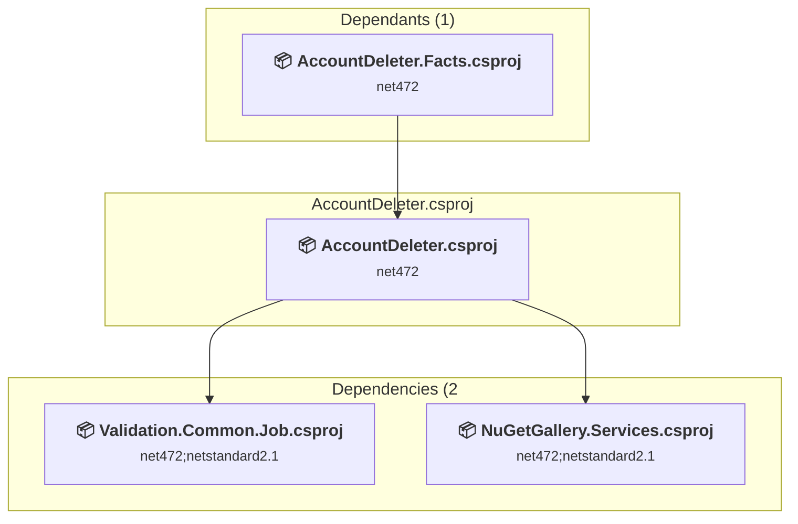

### API Compatibility

| Category | Count | Impact |
| :--- | :---: | :--- |
| 🔴 Binary Incompatible | 1 | High - Require code changes |
| 🟡 Source Incompatible | 2 | Medium - Needs re-compilation and potential conflicting API error fixing |
| 🔵 Behavioral change | 15 | Low - Behavioral changes that may require testing at runtime |
| ✅ Compatible | 3045 |  |
| ***Total APIs Analyzed*** | ***3063*** |  |

<a id="srcdatabasemigrationtoolsdatabasemigrationtoolscsproj"></a>
### src\DatabaseMigrationTools\DatabaseMigrationTools.csproj

#### Project Info

- **Current Target Framework:** net472
- **Proposed Target Framework:** net10.0
- **SDK-style**: True
- **Project Kind:** DotNetCoreApp
- **Dependencies**: 4
- **Dependants**: 1
- **Number of Files**: 6
- **Number of Files with Incidents**: 5
- **Lines of Code**: 205
- **Estimated LOC to modify**: 40+ (at least 19.5% of the project)

#### Dependency Graph

Legend:
📦 SDK-style project
⚙️ Classic project

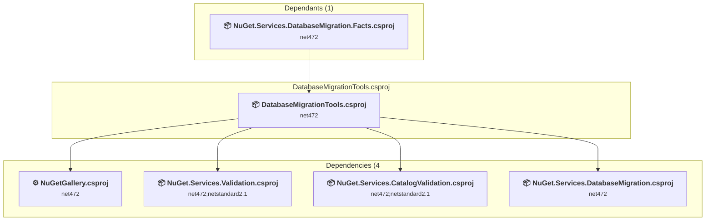

### API Compatibility

| Category | Count | Impact |
| :--- | :---: | :--- |
| 🔴 Binary Incompatible | 0 | High - Require code changes |
| 🟡 Source Incompatible | 40 | Medium - Needs re-compilation and potential conflicting API error fixing |
| 🔵 Behavioral change | 0 | Low - Behavioral changes that may require testing at runtime |
| ✅ Compatible | 416 |  |
| ***Total APIs Analyzed*** | ***456*** |  |

<a id="srcgallerytoolsgallerytoolscsproj"></a>
### src\GalleryTools\GalleryTools.csproj

#### Project Info

- **Current Target Framework:** net472
- **Proposed Target Framework:** net10.0
- **SDK-style**: True
- **Project Kind:** DotNetCoreApp
- **Dependencies**: 2
- **Dependants**: 0
- **Number of Files**: 12
- **Number of Files with Incidents**: 7
- **Lines of Code**: 1994
- **Estimated LOC to modify**: 29+ (at least 1.5% of the project)

#### Dependency Graph

Legend:
📦 SDK-style project
⚙️ Classic project

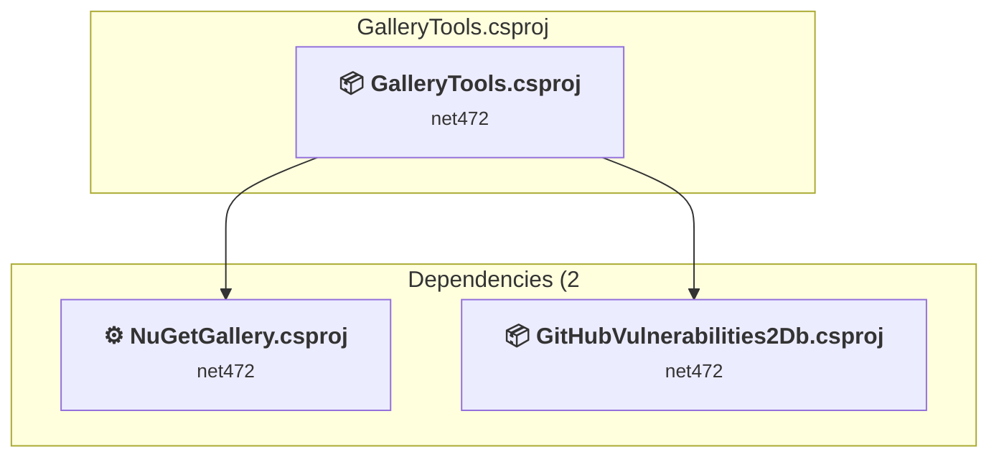

### API Compatibility

| Category | Count | Impact |
| :--- | :---: | :--- |
| 🔴 Binary Incompatible | 0 | High - Require code changes |
| 🟡 Source Incompatible | 11 | Medium - Needs re-compilation and potential conflicting API error fixing |
| 🔵 Behavioral change | 18 | Low - Behavioral changes that may require testing at runtime |
| ✅ Compatible | 2234 |  |
| ***Total APIs Analyzed*** | ***2263*** |  |

<a id="srcgithubvulnerabilities2dbgithubvulnerabilities2dbcsproj"></a>
### src\GitHubVulnerabilities2Db\GitHubVulnerabilities2Db.csproj

#### Project Info

- **Current Target Framework:** net472
- **Proposed Target Framework:** net10.0
- **SDK-style**: True
- **Project Kind:** DotNetCoreApp
- **Dependencies**: 4
- **Dependants**: 3
- **Number of Files**: 10
- **Number of Files with Incidents**: 3
- **Lines of Code**: 1253
- **Estimated LOC to modify**: 6+ (at least 0.5% of the project)

#### Dependency Graph

Legend:
📦 SDK-style project
⚙️ Classic project

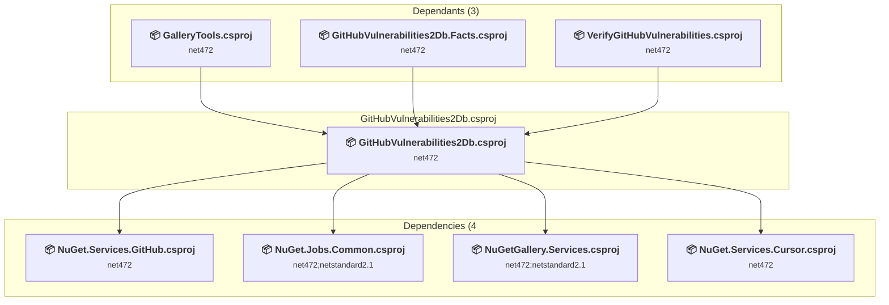

### API Compatibility

| Category | Count | Impact |
| :--- | :---: | :--- |
| 🔴 Binary Incompatible | 0 | High - Require code changes |
| 🟡 Source Incompatible | 3 | Medium - Needs re-compilation and potential conflicting API error fixing |
| 🔵 Behavioral change | 3 | Low - Behavioral changes that may require testing at runtime |
| ✅ Compatible | 1308 |  |
| ***Total APIs Analyzed*** | ***1314*** |  |

#### Project Technologies and Features

| Technology | Issues | Percentage | Migration Path |
| :--- | :---: | :---: | :--- |
| ASP.NET Framework (System.Web) | 2 | 33.3% | Legacy ASP.NET Framework APIs for web applications (System.Web.*) that don't exist in ASP.NET Core due to architectural differences. ASP.NET Core represents a complete redesign of the web framework. Migrate to ASP.NET Core equivalents or consider System.Web.Adapters package for compatibility. |

<a id="srcgithubvulnerabilities2v3githubvulnerabilities2v3csproj"></a>
### src\GitHubVulnerabilities2v3\GitHubVulnerabilities2V3.csproj

#### Project Info

- **Current Target Framework:** net472
- **Proposed Target Framework:** net10.0
- **SDK-style**: True
- **Project Kind:** DotNetCoreApp
- **Dependencies**: 4
- **Dependants**: 1
- **Number of Files**: 9
- **Number of Files with Incidents**: 3
- **Lines of Code**: 701
- **Estimated LOC to modify**: 16+ (at least 2.3% of the project)

#### Dependency Graph

Legend:
📦 SDK-style project
⚙️ Classic project

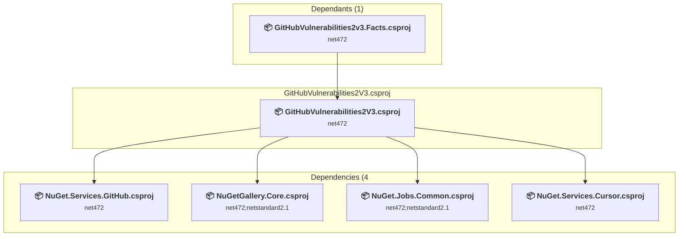

### API Compatibility

| Category | Count | Impact |
| :--- | :---: | :--- |
| 🔴 Binary Incompatible | 0 | High - Require code changes |
| 🟡 Source Incompatible | 0 | Medium - Needs re-compilation and potential conflicting API error fixing |
| 🔵 Behavioral change | 16 | Low - Behavioral changes that may require testing at runtime |
| ✅ Compatible | 1103 |  |
| ***Total APIs Analyzed*** | ***1119*** |  |

<a id="srcnugetjobscommonnugetjobscommoncsproj"></a>
### src\NuGet.Jobs.Common\NuGet.Jobs.Common.csproj

#### Project Info

- **Current Target Framework:** net472;netstandard2.1
- **Proposed Target Framework:** net472;netstandard2.1;net10.0
- **SDK-style**: True
- **Project Kind:** ClassLibrary
- **Dependencies**: 7
- **Dependants**: 5
- **Number of Files**: 34
- **Number of Files with Incidents**: 8
- **Lines of Code**: 2866
- **Estimated LOC to modify**: 39+ (at least 1.4% of the project)

#### Dependency Graph

Legend:
📦 SDK-style project
⚙️ Classic project

```mermaid
flowchart TB
    subgraph upstream["Dependants (5)"]
        P11["<b>📦&nbsp;NuGet.Services.DatabaseMigration.csproj</b><br/><small>net472</small>"]
        P16["<b>📦&nbsp;GitHubVulnerabilities2Db.csproj</b><br/><small>net472</small>"]
        P18["<b>📦&nbsp;VerifyGitHubVulnerabilities.csproj</b><br/><small>net472</small>"]
        P20["<b>📦&nbsp;GitHubVulnerabilities2V3.csproj</b><br/><small>net472</small>"]
        P23["<b>📦&nbsp;Validation.Common.Job.csproj</b><br/><small>net472;netstandard2.1</small>"]
        click P11 "#srcnugetservicesdatabasemigrationnugetservicesdatabasemigrationcsproj"
        click P16 "#srcgithubvulnerabilities2dbgithubvulnerabilities2dbcsproj"
        click P18 "#srcverifygithubvulnerabilitiesverifygithubvulnerabilitiescsproj"
        click P20 "#srcgithubvulnerabilities2v3githubvulnerabilities2v3csproj"
        click P23 "#srcvalidationcommonjobvalidationcommonjobcsproj"
    end
    subgraph current["NuGet.Jobs.Common.csproj"]
        MAIN["<b>📦&nbsp;NuGet.Jobs.Common.csproj</b><br/><small>net472;netstandard2.1</small>"]
        click MAIN "#srcnugetjobscommonnugetjobscommoncsproj"
    end
    subgraph downstream["Dependencies (7"]
        P35["<b>📦&nbsp;NuGet.Services.Messaging.Email.csproj</b><br/><small>net472;netstandard2.0</small>"]
        P3["<b>📦&nbsp;NuGetGallery.Core.csproj</b><br/><small>net472;netstandard2.1</small>"]
        P24["<b>📦&nbsp;NuGet.Services.Logging.csproj</b><br/><small>net472;netstandard2.0</small>"]
        P26["<b>📦&nbsp;NuGet.Services.Configuration.csproj</b><br/><small>net472;netstandard2.0</small>"]
        P31["<b>📦&nbsp;NuGet.Services.Storage.csproj</b><br/><small>net472;netstandard2.1</small>"]
        P33["<b>📦&nbsp;NuGet.Services.FeatureFlags.csproj</b><br/><small>net472;netstandard2.0</small>"]
        P29["<b>📦&nbsp;NuGet.Services.Sql.csproj</b><br/><small>net472;netstandard2.0</small>"]
        click P35 "#srcnugetservicesmessagingemailnugetservicesmessagingemailcsproj"
        click P3 "#srcnugetgallerycorenugetgallerycorecsproj"
        click P24 "#srcnugetservicesloggingnugetservicesloggingcsproj"
        click P26 "#srcnugetservicesconfigurationnugetservicesconfigurationcsproj"
        click P31 "#srcnugetservicesstoragenugetservicesstoragecsproj"
        click P33 "#srcnugetservicesfeatureflagsnugetservicesfeatureflagscsproj"
        click P29 "#srcnugetservicessqlnugetservicessqlcsproj"
    end
    P11 --> MAIN
    P16 --> MAIN
    P18 --> MAIN
    P20 --> MAIN
    P23 --> MAIN
    MAIN --> P35
    MAIN --> P3
    MAIN --> P24
    MAIN --> P26
    MAIN --> P31
    MAIN --> P33
    MAIN --> P29

```

### API Compatibility

| Category | Count | Impact |
| :--- | :---: | :--- |
| 🔴 Binary Incompatible | 9 | High - Require code changes |
| 🟡 Source Incompatible | 22 | Medium - Needs re-compilation and potential conflicting API error fixing |
| 🔵 Behavioral change | 8 | Low - Behavioral changes that may require testing at runtime |
| ✅ Compatible | 2443 |  |
| ***Total APIs Analyzed*** | ***2482*** |  |

<a id="srcnugetservicescatalogvalidationnugetservicescatalogvalidationcsproj"></a>
### src\NuGet.Services.CatalogValidation\NuGet.Services.CatalogValidation.csproj

#### Project Info

- **Current Target Framework:** net472;netstandard2.1
- **Proposed Target Framework:** net472;netstandard2.1;net10.0
- **SDK-style**: True
- **Project Kind:** ClassLibrary
- **Dependencies**: 1
- **Dependants**: 1
- **Number of Files**: 5
- **Number of Files with Incidents**: 2
- **Lines of Code**: 483
- **Estimated LOC to modify**: 2+ (at least 0.4% of the project)

#### Dependency Graph

Legend:
📦 SDK-style project
⚙️ Classic project

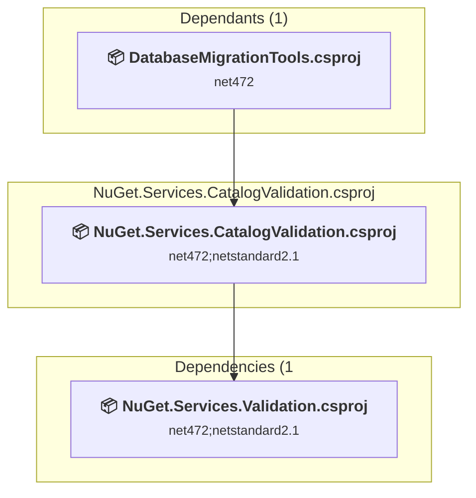

### API Compatibility

| Category | Count | Impact |
| :--- | :---: | :--- |
| 🔴 Binary Incompatible | 0 | High - Require code changes |
| 🟡 Source Incompatible | 2 | Medium - Needs re-compilation and potential conflicting API error fixing |
| 🔵 Behavioral change | 0 | Low - Behavioral changes that may require testing at runtime |
| ✅ Compatible | 1184 |  |
| ***Total APIs Analyzed*** | ***1186*** |  |

<a id="srcnugetservicesconfigurationnugetservicesconfigurationcsproj"></a>
### src\NuGet.Services.Configuration\NuGet.Services.Configuration.csproj

#### Project Info

- **Current Target Framework:** net472;netstandard2.0
- **Proposed Target Framework:** net472;netstandard2.0;net10.0
- **SDK-style**: True
- **Project Kind:** ClassLibrary
- **Dependencies**: 1
- **Dependants**: 3
- **Number of Files**: 24
- **Number of Files with Incidents**: 1
- **Lines of Code**: 1298
- **Estimated LOC to modify**: 0+ (at least 0.0% of the project)

#### Dependency Graph

Legend:
📦 SDK-style project
⚙️ Classic project

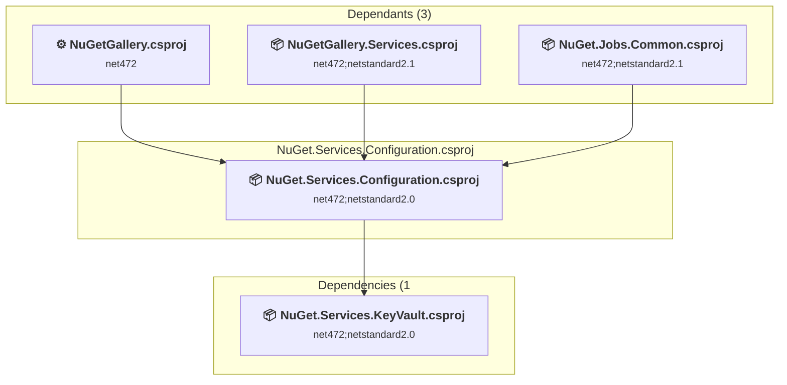

### API Compatibility

| Category | Count | Impact |
| :--- | :---: | :--- |
| 🔴 Binary Incompatible | 0 | High - Require code changes |
| 🟡 Source Incompatible | 0 | Medium - Needs re-compilation and potential conflicting API error fixing |
| 🔵 Behavioral change | 0 | Low - Behavioral changes that may require testing at runtime |
| ✅ Compatible | 1476 |  |
| ***Total APIs Analyzed*** | ***1476*** |  |

<a id="srcnugetservicescontractsnugetservicescontractscsproj"></a>
### src\NuGet.Services.Contracts\NuGet.Services.Contracts.csproj

#### Project Info

- **Current Target Framework:** net472;netstandard2.0
- **Proposed Target Framework:** net472;netstandard2.0;net10.0
- **SDK-style**: True
- **Project Kind:** ClassLibrary
- **Dependencies**: 0
- **Dependants**: 6
- **Number of Files**: 10
- **Number of Files with Incidents**: 1
- **Lines of Code**: 299
- **Estimated LOC to modify**: 0+ (at least 0.0% of the project)

#### Dependency Graph

Legend:
📦 SDK-style project
⚙️ Classic project

```mermaid
flowchart TB
    subgraph upstream["Dependants (6)"]
        P1["<b>⚙️&nbsp;NuGetGallery.csproj</b><br/><small>net472</small>"]
        P24["<b>📦&nbsp;NuGet.Services.Logging.csproj</b><br/><small>net472;netstandard2.0</small>"]
        P32["<b>📦&nbsp;NuGet.Services.ServiceBus.csproj</b><br/><small>net472;netstandard2.0</small>"]
        P36["<b>📦&nbsp;NuGet.Services.Messaging.csproj</b><br/><small>net472;netstandard2.0</small>"]
        P37["<b>📦&nbsp;NuGet.Services.Validation.csproj</b><br/><small>net472;netstandard2.1</small>"]
        P39["<b>📦&nbsp;NuGet.Services.Validation.Issues.csproj</b><br/><small>net472;netstandard2.0</small>"]
        click P1 "#srcnugetgallerynugetgallerycsproj"
        click P24 "#srcnugetservicesloggingnugetservicesloggingcsproj"
        click P32 "#srcnugetservicesservicebusnugetservicesservicebuscsproj"
        click P36 "#srcnugetservicesmessagingnugetservicesmessagingcsproj"
        click P37 "#srcnugetservicesvalidationnugetservicesvalidationcsproj"
        click P39 "#srcnugetservicesvalidationissuesnugetservicesvalidationissuescsproj"
    end
    subgraph current["NuGet.Services.Contracts.csproj"]
        MAIN["<b>📦&nbsp;NuGet.Services.Contracts.csproj</b><br/><small>net472;netstandard2.0</small>"]
        click MAIN "#srcnugetservicescontractsnugetservicescontractscsproj"
    end
    P1 --> MAIN
    P24 --> MAIN
    P32 --> MAIN
    P36 --> MAIN
    P37 --> MAIN
    P39 --> MAIN

```

### API Compatibility

| Category | Count | Impact |
| :--- | :---: | :--- |
| 🔴 Binary Incompatible | 0 | High - Require code changes |
| 🟡 Source Incompatible | 0 | Medium - Needs re-compilation and potential conflicting API error fixing |
| 🔵 Behavioral change | 0 | Low - Behavioral changes that may require testing at runtime |
| ✅ Compatible | 440 |  |
| ***Total APIs Analyzed*** | ***440*** |  |

<a id="srcnugetservicescursornugetservicescursorcsproj"></a>
### src\NuGet.Services.Cursor\NuGet.Services.Cursor.csproj

#### Project Info

- **Current Target Framework:** net472
- **Proposed Target Framework:** net10.0
- **SDK-style**: True
- **Project Kind:** ClassLibrary
- **Dependencies**: 1
- **Dependants**: 3
- **Number of Files**: 6
- **Number of Files with Incidents**: 3
- **Lines of Code**: 188
- **Estimated LOC to modify**: 14+ (at least 7.4% of the project)

#### Dependency Graph

Legend:
📦 SDK-style project
⚙️ Classic project

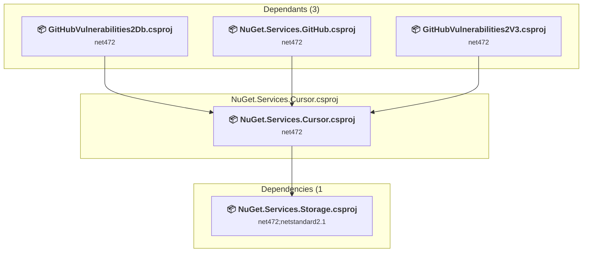

### API Compatibility

| Category | Count | Impact |
| :--- | :---: | :--- |
| 🔴 Binary Incompatible | 0 | High - Require code changes |
| 🟡 Source Incompatible | 0 | Medium - Needs re-compilation and potential conflicting API error fixing |
| 🔵 Behavioral change | 14 | Low - Behavioral changes that may require testing at runtime |
| ✅ Compatible | 518 |  |
| ***Total APIs Analyzed*** | ***532*** |  |

<a id="srcnugetservicesdatabasemigrationnugetservicesdatabasemigrationcsproj"></a>
### src\NuGet.Services.DatabaseMigration\NuGet.Services.DatabaseMigration.csproj

#### Project Info

- **Current Target Framework:** net472
- **Proposed Target Framework:** net10.0
- **SDK-style**: True
- **Project Kind:** ClassLibrary
- **Dependencies**: 1
- **Dependants**: 1
- **Number of Files**: 5
- **Number of Files with Incidents**: 4
- **Lines of Code**: 256
- **Estimated LOC to modify**: 14+ (at least 5.5% of the project)

#### Dependency Graph

Legend:
📦 SDK-style project
⚙️ Classic project

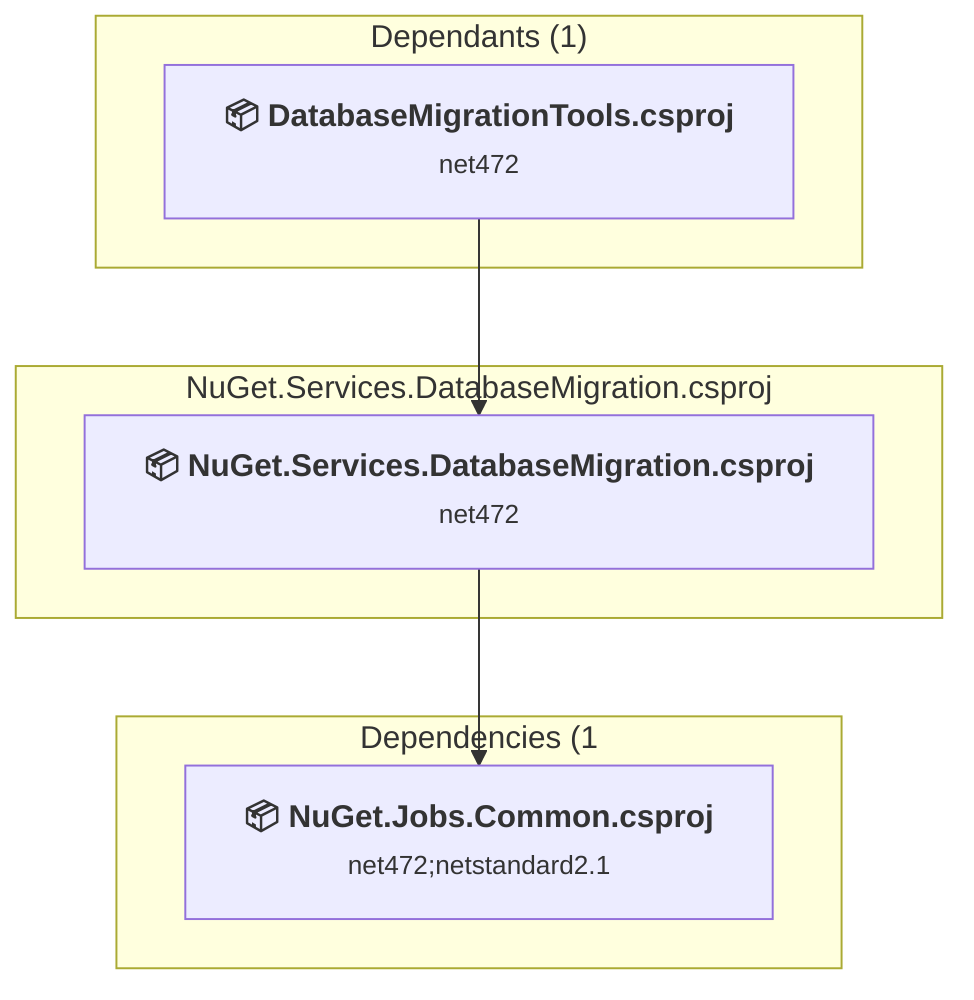

### API Compatibility

| Category | Count | Impact |
| :--- | :---: | :--- |
| 🔴 Binary Incompatible | 0 | High - Require code changes |
| 🟡 Source Incompatible | 14 | Medium - Needs re-compilation and potential conflicting API error fixing |
| 🔵 Behavioral change | 0 | Low - Behavioral changes that may require testing at runtime |
| ✅ Compatible | 530 |  |
| ***Total APIs Analyzed*** | ***544*** |  |

<a id="srcnugetservicesentitiesnugetservicesentitiescsproj"></a>
### src\NuGet.Services.Entities\NuGet.Services.Entities.csproj

#### Project Info

- **Current Target Framework:** net472;netstandard2.1
- **Proposed Target Framework:** net472;netstandard2.1;net10.0
- **SDK-style**: True
- **Project Kind:** ClassLibrary
- **Dependencies**: 0
- **Dependants**: 3
- **Number of Files**: 51
- **Number of Files with Incidents**: 2
- **Lines of Code**: 2662
- **Estimated LOC to modify**: 1+ (at least 0.0% of the project)

#### Dependency Graph

Legend:
📦 SDK-style project
⚙️ Classic project

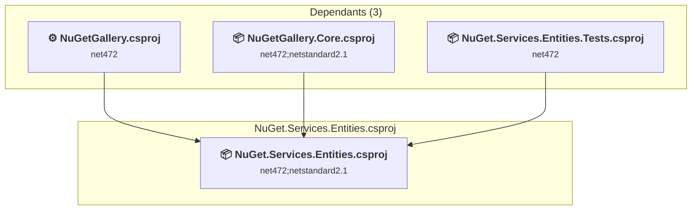

### API Compatibility

| Category | Count | Impact |
| :--- | :---: | :--- |
| 🔴 Binary Incompatible | 0 | High - Require code changes |
| 🟡 Source Incompatible | 1 | Medium - Needs re-compilation and potential conflicting API error fixing |
| 🔵 Behavioral change | 0 | Low - Behavioral changes that may require testing at runtime |
| ✅ Compatible | 2737 |  |
| ***Total APIs Analyzed*** | ***2738*** |  |

<a id="srcnugetservicesfeatureflagsnugetservicesfeatureflagscsproj"></a>
### src\NuGet.Services.FeatureFlags\NuGet.Services.FeatureFlags.csproj

#### Project Info

- **Current Target Framework:** net472;netstandard2.0
- **Proposed Target Framework:** net472;netstandard2.0;net10.0
- **SDK-style**: True
- **Project Kind:** ClassLibrary
- **Dependencies**: 0
- **Dependants**: 3
- **Number of Files**: 11
- **Number of Files with Incidents**: 1
- **Lines of Code**: 500
- **Estimated LOC to modify**: 0+ (at least 0.0% of the project)

#### Dependency Graph

Legend:
📦 SDK-style project
⚙️ Classic project

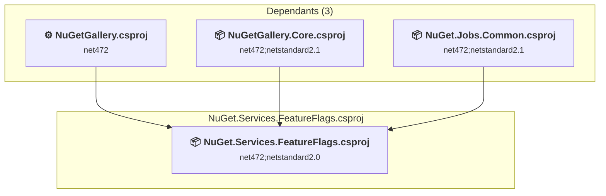

### API Compatibility

| Category | Count | Impact |
| :--- | :---: | :--- |
| 🔴 Binary Incompatible | 0 | High - Require code changes |
| 🟡 Source Incompatible | 0 | Medium - Needs re-compilation and potential conflicting API error fixing |
| 🔵 Behavioral change | 0 | Low - Behavioral changes that may require testing at runtime |
| ✅ Compatible | 637 |  |
| ***Total APIs Analyzed*** | ***637*** |  |

<a id="srcnugetservicesgithubnugetservicesgithubcsproj"></a>
### src\NuGet.Services.Github\NuGet.Services.GitHub.csproj

#### Project Info

- **Current Target Framework:** net472
- **Proposed Target Framework:** net10.0
- **SDK-style**: True
- **Project Kind:** ClassLibrary
- **Dependencies**: 2
- **Dependants**: 2
- **Number of Files**: 20
- **Number of Files with Incidents**: 3
- **Lines of Code**: 844
- **Estimated LOC to modify**: 7+ (at least 0.8% of the project)

#### Dependency Graph

Legend:
📦 SDK-style project
⚙️ Classic project

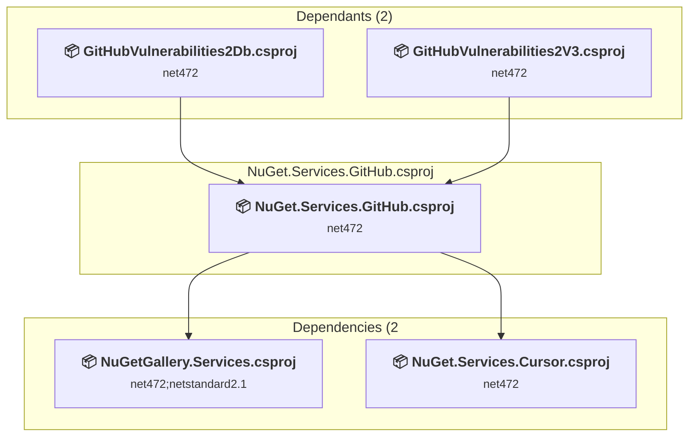

### API Compatibility

| Category | Count | Impact |
| :--- | :---: | :--- |
| 🔴 Binary Incompatible | 0 | High - Require code changes |
| 🟡 Source Incompatible | 0 | Medium - Needs re-compilation and potential conflicting API error fixing |
| 🔵 Behavioral change | 7 | Low - Behavioral changes that may require testing at runtime |
| ✅ Compatible | 837 |  |
| ***Total APIs Analyzed*** | ***844*** |  |

<a id="srcnugetserviceskeyvaultnugetserviceskeyvaultcsproj"></a>
### src\NuGet.Services.KeyVault\NuGet.Services.KeyVault.csproj

#### Project Info

- **Current Target Framework:** net472;netstandard2.0
- **Proposed Target Framework:** net472;netstandard2.0;net10.0
- **SDK-style**: True
- **Project Kind:** ClassLibrary
- **Dependencies**: 0
- **Dependants**: 3
- **Number of Files**: 21
- **Number of Files with Incidents**: 3
- **Lines of Code**: 1105
- **Estimated LOC to modify**: 8+ (at least 0.7% of the project)

#### Dependency Graph

Legend:
📦 SDK-style project
⚙️ Classic project

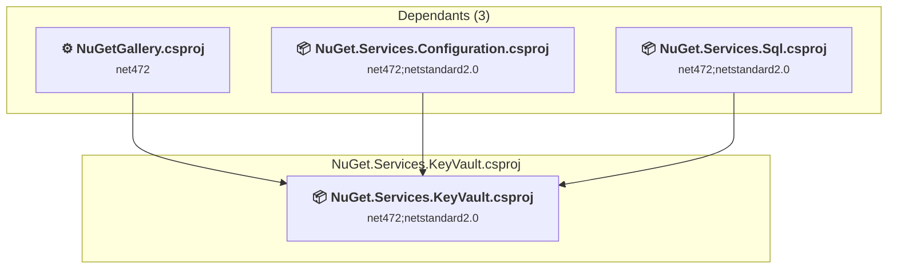

### API Compatibility

| Category | Count | Impact |
| :--- | :---: | :--- |
| 🔴 Binary Incompatible | 0 | High - Require code changes |
| 🟡 Source Incompatible | 4 | Medium - Needs re-compilation and potential conflicting API error fixing |
| 🔵 Behavioral change | 4 | Low - Behavioral changes that may require testing at runtime |
| ✅ Compatible | 1198 |  |
| ***Total APIs Analyzed*** | ***1206*** |  |

<a id="srcnugetserviceslicensesnugetserviceslicensescsproj"></a>
### src\NuGet.Services.Licenses\NuGet.Services.Licenses.csproj

#### Project Info

- **Current Target Framework:** net472;netstandard2.0
- **Proposed Target Framework:** net472;netstandard2.0;net10.0
- **SDK-style**: True
- **Project Kind:** ClassLibrary
- **Dependencies**: 0
- **Dependants**: 1
- **Number of Files**: 8
- **Number of Files with Incidents**: 1
- **Lines of Code**: 428
- **Estimated LOC to modify**: 0+ (at least 0.0% of the project)

#### Dependency Graph

Legend:
📦 SDK-style project
⚙️ Classic project

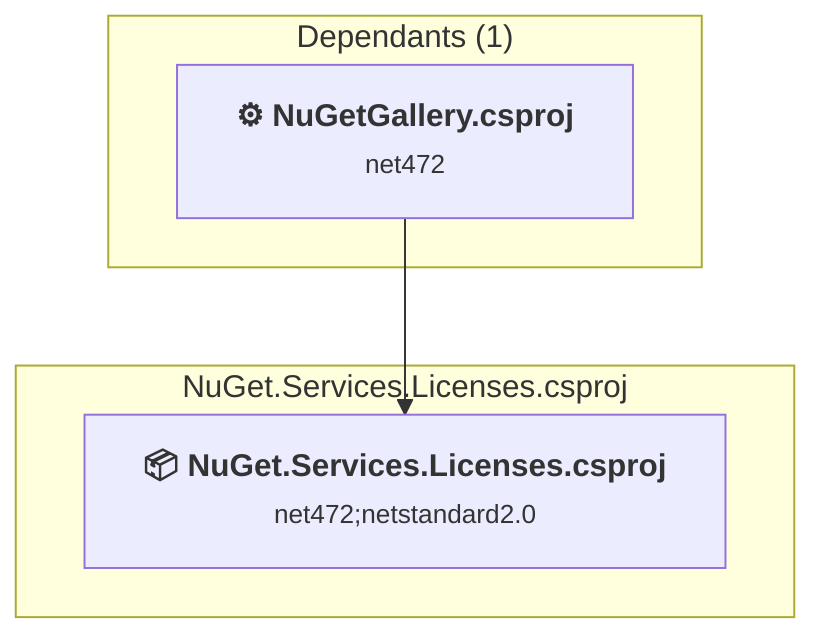

### API Compatibility

| Category | Count | Impact |
| :--- | :---: | :--- |
| 🔴 Binary Incompatible | 0 | High - Require code changes |
| 🟡 Source Incompatible | 0 | Medium - Needs re-compilation and potential conflicting API error fixing |
| 🔵 Behavioral change | 0 | Low - Behavioral changes that may require testing at runtime |
| ✅ Compatible | 527 |  |
| ***Total APIs Analyzed*** | ***527*** |  |

<a id="srcnugetservicesloggingnugetservicesloggingcsproj"></a>
### src\NuGet.Services.Logging\NuGet.Services.Logging.csproj

#### Project Info

- **Current Target Framework:** net472;netstandard2.0
- **Proposed Target Framework:** net472;netstandard2.0;net10.0
- **SDK-style**: True
- **Project Kind:** ClassLibrary
- **Dependencies**: 1
- **Dependants**: 3
- **Number of Files**: 21
- **Number of Files with Incidents**: 3
- **Lines of Code**: 1124
- **Estimated LOC to modify**: 6+ (at least 0.5% of the project)

#### Dependency Graph

Legend:
📦 SDK-style project
⚙️ Classic project

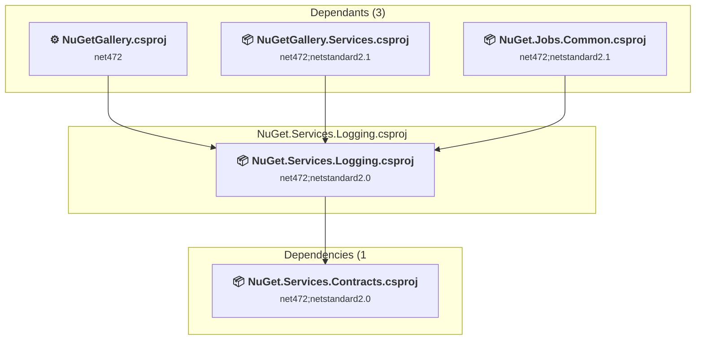

### API Compatibility

| Category | Count | Impact |
| :--- | :---: | :--- |
| 🔴 Binary Incompatible | 0 | High - Require code changes |
| 🟡 Source Incompatible | 2 | Medium - Needs re-compilation and potential conflicting API error fixing |
| 🔵 Behavioral change | 4 | Low - Behavioral changes that may require testing at runtime |
| ✅ Compatible | 1352 |  |
| ***Total APIs Analyzed*** | ***1358*** |  |

#### Project Technologies and Features

| Technology | Issues | Percentage | Migration Path |
| :--- | :---: | :---: | :--- |
| ASP.NET Framework (System.Web) | 2 | 33.3% | Legacy ASP.NET Framework APIs for web applications (System.Web.*) that don't exist in ASP.NET Core due to architectural differences. ASP.NET Core represents a complete redesign of the web framework. Migrate to ASP.NET Core equivalents or consider System.Web.Adapters package for compatibility. |

<a id="srcnugetservicesmessagingemailnugetservicesmessagingemailcsproj"></a>
### src\NuGet.Services.Messaging.Email\NuGet.Services.Messaging.Email.csproj

#### Project Info

- **Current Target Framework:** net472;netstandard2.0
- **Proposed Target Framework:** net472;netstandard2.0;net10.0
- **SDK-style**: True
- **Project Kind:** ClassLibrary
- **Dependencies**: 1
- **Dependants**: 3
- **Number of Files**: 16
- **Number of Files with Incidents**: 1
- **Lines of Code**: 841
- **Estimated LOC to modify**: 0+ (at least 0.0% of the project)

#### Dependency Graph

Legend:
📦 SDK-style project
⚙️ Classic project

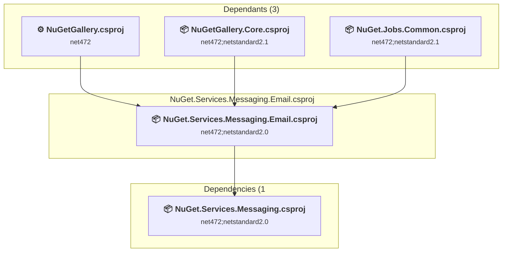

### API Compatibility

| Category | Count | Impact |
| :--- | :---: | :--- |
| 🔴 Binary Incompatible | 0 | High - Require code changes |
| 🟡 Source Incompatible | 0 | Medium - Needs re-compilation and potential conflicting API error fixing |
| 🔵 Behavioral change | 0 | Low - Behavioral changes that may require testing at runtime |
| ✅ Compatible | 964 |  |
| ***Total APIs Analyzed*** | ***964*** |  |

<a id="srcnugetservicesmessagingnugetservicesmessagingcsproj"></a>
### src\NuGet.Services.Messaging\NuGet.Services.Messaging.csproj

#### Project Info

- **Current Target Framework:** net472;netstandard2.0
- **Proposed Target Framework:** net472;netstandard2.0;net10.0
- **SDK-style**: True
- **Project Kind:** ClassLibrary
- **Dependencies**: 2
- **Dependants**: 2
- **Number of Files**: 5
- **Number of Files with Incidents**: 1
- **Lines of Code**: 240
- **Estimated LOC to modify**: 0+ (at least 0.0% of the project)

#### Dependency Graph

Legend:
📦 SDK-style project
⚙️ Classic project

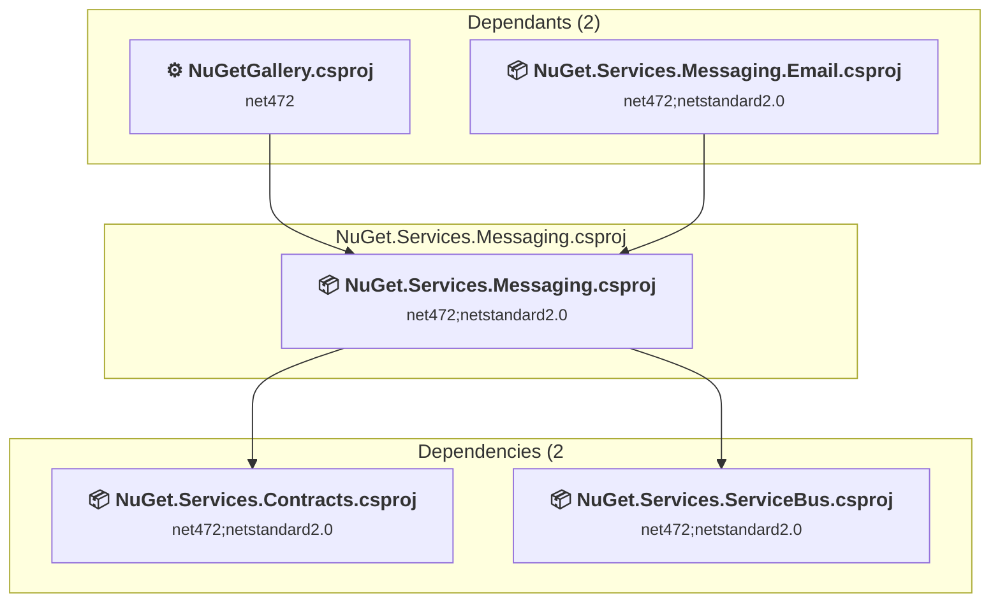

### API Compatibility

| Category | Count | Impact |
| :--- | :---: | :--- |
| 🔴 Binary Incompatible | 0 | High - Require code changes |
| 🟡 Source Incompatible | 0 | Medium - Needs re-compilation and potential conflicting API error fixing |
| 🔵 Behavioral change | 0 | Low - Behavioral changes that may require testing at runtime |
| ✅ Compatible | 582 |  |
| ***Total APIs Analyzed*** | ***582*** |  |

<a id="srcnugetservicesowinnugetservicesowincsproj"></a>
### src\NuGet.Services.Owin\NuGet.Services.Owin.csproj

#### Project Info

- **Current Target Framework:** net472
- **Proposed Target Framework:** net10.0
- **SDK-style**: True
- **Project Kind:** ClassLibrary
- **Dependencies**: 0
- **Dependants**: 1
- **Number of Files**: 2
- **Number of Files with Incidents**: 2
- **Lines of Code**: 96
- **Estimated LOC to modify**: 4+ (at least 4.2% of the project)

#### Dependency Graph

Legend:
📦 SDK-style project
⚙️ Classic project

```mermaid
flowchart TB
    subgraph upstream["Dependants (1)"]
        P1["<b>⚙️&nbsp;NuGetGallery.csproj</b><br/><small>net472</small>"]
        click P1 "#srcnugetgallerynugetgallerycsproj"
    end
    subgraph current["NuGet.Services.Owin.csproj"]
        MAIN["<b>📦&nbsp;NuGet.Services.Owin.csproj</b><br/><small>net472</small>"]
        click MAIN "#srcnugetservicesowinnugetservicesowincsproj"
    end
    P1 --> MAIN

```

### API Compatibility

| Category | Count | Impact |
| :--- | :---: | :--- |
| 🔴 Binary Incompatible | 0 | High - Require code changes |
| 🟡 Source Incompatible | 0 | Medium - Needs re-compilation and potential conflicting API error fixing |
| 🔵 Behavioral change | 4 | Low - Behavioral changes that may require testing at runtime |
| ✅ Compatible | 512 |  |
| ***Total APIs Analyzed*** | ***516*** |  |

<a id="srcnugetservicesservicebusnugetservicesservicebuscsproj"></a>
### src\NuGet.Services.ServiceBus\NuGet.Services.ServiceBus.csproj

#### Project Info

- **Current Target Framework:** net472;netstandard2.0
- **Proposed Target Framework:** net472;netstandard2.0;net10.0
- **SDK-style**: True
- **Project Kind:** ClassLibrary
- **Dependencies**: 1
- **Dependants**: 4
- **Number of Files**: 17
- **Number of Files with Incidents**: 5
- **Lines of Code**: 1066
- **Estimated LOC to modify**: 10+ (at least 0.9% of the project)

#### Dependency Graph

Legend:
📦 SDK-style project
⚙️ Classic project

```mermaid
flowchart TB
    subgraph upstream["Dependants (4)"]
        P1["<b>⚙️&nbsp;NuGetGallery.csproj</b><br/><small>net472</small>"]
        P23["<b>📦&nbsp;Validation.Common.Job.csproj</b><br/><small>net472;netstandard2.1</small>"]
        P36["<b>📦&nbsp;NuGet.Services.Messaging.csproj</b><br/><small>net472;netstandard2.0</small>"]
        P37["<b>📦&nbsp;NuGet.Services.Validation.csproj</b><br/><small>net472;netstandard2.1</small>"]
        click P1 "#srcnugetgallerynugetgallerycsproj"
        click P23 "#srcvalidationcommonjobvalidationcommonjobcsproj"
        click P36 "#srcnugetservicesmessagingnugetservicesmessagingcsproj"
        click P37 "#srcnugetservicesvalidationnugetservicesvalidationcsproj"
    end
    subgraph current["NuGet.Services.ServiceBus.csproj"]
        MAIN["<b>📦&nbsp;NuGet.Services.ServiceBus.csproj</b><br/><small>net472;netstandard2.0</small>"]
        click MAIN "#srcnugetservicesservicebusnugetservicesservicebuscsproj"
    end
    subgraph downstream["Dependencies (1"]
        P25["<b>📦&nbsp;NuGet.Services.Contracts.csproj</b><br/><small>net472;netstandard2.0</small>"]
        click P25 "#srcnugetservicescontractsnugetservicescontractscsproj"
    end
    P1 --> MAIN
    P23 --> MAIN
    P36 --> MAIN
    P37 --> MAIN
    MAIN --> P25

```

### API Compatibility

| Category | Count | Impact |
| :--- | :---: | :--- |
| 🔴 Binary Incompatible | 0 | High - Require code changes |
| 🟡 Source Incompatible | 6 | Medium - Needs re-compilation and potential conflicting API error fixing |
| 🔵 Behavioral change | 4 | Low - Behavioral changes that may require testing at runtime |
| ✅ Compatible | 1168 |  |
| ***Total APIs Analyzed*** | ***1178*** |  |

<a id="srcnugetservicessqlnugetservicessqlcsproj"></a>
### src\NuGet.Services.Sql\NuGet.Services.Sql.csproj

#### Project Info

- **Current Target Framework:** net472;netstandard2.0
- **Proposed Target Framework:** net472;netstandard2.0;net10.0
- **SDK-style**: True
- **Project Kind:** ClassLibrary
- **Dependencies**: 1
- **Dependants**: 2
- **Number of Files**: 8
- **Number of Files with Incidents**: 5
- **Lines of Code**: 570
- **Estimated LOC to modify**: 35+ (at least 6.1% of the project)

#### Dependency Graph

Legend:
📦 SDK-style project
⚙️ Classic project

```mermaid
flowchart TB
    subgraph upstream["Dependants (2)"]
        P1["<b>⚙️&nbsp;NuGetGallery.csproj</b><br/><small>net472</small>"]
        P22["<b>📦&nbsp;NuGet.Jobs.Common.csproj</b><br/><small>net472;netstandard2.1</small>"]
        click P1 "#srcnugetgallerynugetgallerycsproj"
        click P22 "#srcnugetjobscommonnugetjobscommoncsproj"
    end
    subgraph current["NuGet.Services.Sql.csproj"]
        MAIN["<b>📦&nbsp;NuGet.Services.Sql.csproj</b><br/><small>net472;netstandard2.0</small>"]
        click MAIN "#srcnugetservicessqlnugetservicessqlcsproj"
    end
    subgraph downstream["Dependencies (1"]
        P27["<b>📦&nbsp;NuGet.Services.KeyVault.csproj</b><br/><small>net472;netstandard2.0</small>"]
        click P27 "#srcnugetserviceskeyvaultnugetserviceskeyvaultcsproj"
    end
    P1 --> MAIN
    P22 --> MAIN
    MAIN --> P27

```

### API Compatibility

| Category | Count | Impact |
| :--- | :---: | :--- |
| 🔴 Binary Incompatible | 0 | High - Require code changes |
| 🟡 Source Incompatible | 35 | Medium - Needs re-compilation and potential conflicting API error fixing |
| 🔵 Behavioral change | 0 | Low - Behavioral changes that may require testing at runtime |
| ✅ Compatible | 766 |  |
| ***Total APIs Analyzed*** | ***801*** |  |

<a id="srcnugetservicesstoragenugetservicesstoragecsproj"></a>
### src\NuGet.Services.Storage\NuGet.Services.Storage.csproj

#### Project Info

- **Current Target Framework:** net472;netstandard2.1
- **Proposed Target Framework:** net472;netstandard2.1;net10.0
- **SDK-style**: True
- **Project Kind:** ClassLibrary
- **Dependencies**: 0
- **Dependants**: 3
- **Number of Files**: 34
- **Number of Files with Incidents**: 17
- **Lines of Code**: 2307
- **Estimated LOC to modify**: 185+ (at least 8.0% of the project)

#### Dependency Graph

Legend:
📦 SDK-style project
⚙️ Classic project

```mermaid
flowchart TB
    subgraph upstream["Dependants (3)"]
        P22["<b>📦&nbsp;NuGet.Jobs.Common.csproj</b><br/><small>net472;netstandard2.1</small>"]
        P23["<b>📦&nbsp;Validation.Common.Job.csproj</b><br/><small>net472;netstandard2.1</small>"]
        P34["<b>📦&nbsp;NuGet.Services.Cursor.csproj</b><br/><small>net472</small>"]
        click P22 "#srcnugetjobscommonnugetjobscommoncsproj"
        click P23 "#srcvalidationcommonjobvalidationcommonjobcsproj"
        click P34 "#srcnugetservicescursornugetservicescursorcsproj"
    end
    subgraph current["NuGet.Services.Storage.csproj"]
        MAIN["<b>📦&nbsp;NuGet.Services.Storage.csproj</b><br/><small>net472;netstandard2.1</small>"]
        click MAIN "#srcnugetservicesstoragenugetservicesstoragecsproj"
    end
    P22 --> MAIN
    P23 --> MAIN
    P34 --> MAIN

```

### API Compatibility

| Category | Count | Impact |
| :--- | :---: | :--- |
| 🔴 Binary Incompatible | 0 | High - Require code changes |
| 🟡 Source Incompatible | 6 | Medium - Needs re-compilation and potential conflicting API error fixing |
| 🔵 Behavioral change | 179 | Low - Behavioral changes that may require testing at runtime |
| ✅ Compatible | 2253 |  |
| ***Total APIs Analyzed*** | ***2438*** |  |

<a id="srcnugetservicesvalidationissuesnugetservicesvalidationissuescsproj"></a>
### src\NuGet.Services.Validation.Issues\NuGet.Services.Validation.Issues.csproj

#### Project Info

- **Current Target Framework:** net472;netstandard2.0
- **Proposed Target Framework:** net472;netstandard2.0;net10.0
- **SDK-style**: True
- **Project Kind:** ClassLibrary
- **Dependencies**: 1
- **Dependants**: 2
- **Number of Files**: 6
- **Number of Files with Incidents**: 1
- **Lines of Code**: 218
- **Estimated LOC to modify**: 0+ (at least 0.0% of the project)

#### Dependency Graph

Legend:
📦 SDK-style project
⚙️ Classic project

```mermaid
flowchart TB
    subgraph upstream["Dependants (2)"]
        P1["<b>⚙️&nbsp;NuGetGallery.csproj</b><br/><small>net472</small>"]
        P3["<b>📦&nbsp;NuGetGallery.Core.csproj</b><br/><small>net472;netstandard2.1</small>"]
        click P1 "#srcnugetgallerynugetgallerycsproj"
        click P3 "#srcnugetgallerycorenugetgallerycorecsproj"
    end
    subgraph current["NuGet.Services.Validation.Issues.csproj"]
        MAIN["<b>📦&nbsp;NuGet.Services.Validation.Issues.csproj</b><br/><small>net472;netstandard2.0</small>"]
        click MAIN "#srcnugetservicesvalidationissuesnugetservicesvalidationissuescsproj"
    end
    subgraph downstream["Dependencies (1"]
        P25["<b>📦&nbsp;NuGet.Services.Contracts.csproj</b><br/><small>net472;netstandard2.0</small>"]
        click P25 "#srcnugetservicescontractsnugetservicescontractscsproj"
    end
    P1 --> MAIN
    P3 --> MAIN
    MAIN --> P25

```

### API Compatibility

| Category | Count | Impact |
| :--- | :---: | :--- |
| 🔴 Binary Incompatible | 0 | High - Require code changes |
| 🟡 Source Incompatible | 0 | Medium - Needs re-compilation and potential conflicting API error fixing |
| 🔵 Behavioral change | 0 | Low - Behavioral changes that may require testing at runtime |
| ✅ Compatible | 476 |  |
| ***Total APIs Analyzed*** | ***476*** |  |

<a id="srcnugetservicesvalidationnugetservicesvalidationcsproj"></a>
### src\NuGet.Services.Validation\NuGet.Services.Validation.csproj

#### Project Info

- **Current Target Framework:** net472;netstandard2.1
- **Proposed Target Framework:** net472;netstandard2.1;net10.0
- **SDK-style**: True
- **Project Kind:** ClassLibrary
- **Dependencies**: 2
- **Dependants**: 4
- **Number of Files**: 121
- **Number of Files with Incidents**: 6
- **Lines of Code**: 4313
- **Estimated LOC to modify**: 17+ (at least 0.4% of the project)

#### Dependency Graph

Legend:
📦 SDK-style project
⚙️ Classic project

```mermaid
flowchart TB
    subgraph upstream["Dependants (4)"]
        P1["<b>⚙️&nbsp;NuGetGallery.csproj</b><br/><small>net472</small>"]
        P3["<b>📦&nbsp;NuGetGallery.Core.csproj</b><br/><small>net472;netstandard2.1</small>"]
        P10["<b>📦&nbsp;DatabaseMigrationTools.csproj</b><br/><small>net472</small>"]
        P38["<b>📦&nbsp;NuGet.Services.CatalogValidation.csproj</b><br/><small>net472;netstandard2.1</small>"]
        click P1 "#srcnugetgallerynugetgallerycsproj"
        click P3 "#srcnugetgallerycorenugetgallerycorecsproj"
        click P10 "#srcdatabasemigrationtoolsdatabasemigrationtoolscsproj"
        click P38 "#srcnugetservicescatalogvalidationnugetservicescatalogvalidationcsproj"
    end
    subgraph current["NuGet.Services.Validation.csproj"]
        MAIN["<b>📦&nbsp;NuGet.Services.Validation.csproj</b><br/><small>net472;netstandard2.1</small>"]
        click MAIN "#srcnugetservicesvalidationnugetservicesvalidationcsproj"
    end
    subgraph downstream["Dependencies (2"]
        P25["<b>📦&nbsp;NuGet.Services.Contracts.csproj</b><br/><small>net472;netstandard2.0</small>"]
        P32["<b>📦&nbsp;NuGet.Services.ServiceBus.csproj</b><br/><small>net472;netstandard2.0</small>"]
        click P25 "#srcnugetservicescontractsnugetservicescontractscsproj"
        click P32 "#srcnugetservicesservicebusnugetservicesservicebuscsproj"
    end
    P1 --> MAIN
    P3 --> MAIN
    P10 --> MAIN
    P38 --> MAIN
    MAIN --> P25
    MAIN --> P32

```

### API Compatibility

| Category | Count | Impact |
| :--- | :---: | :--- |
| 🔴 Binary Incompatible | 4 | High - Require code changes |
| 🟡 Source Incompatible | 2 | Medium - Needs re-compilation and potential conflicting API error fixing |
| 🔵 Behavioral change | 11 | Low - Behavioral changes that may require testing at runtime |
| ✅ Compatible | 3880 |  |
| ***Total APIs Analyzed*** | ***3897*** |  |

#### Project Technologies and Features

| Technology | Issues | Percentage | Migration Path |
| :--- | :---: | :---: | :--- |
| Deprecated Remoting & Serialization | 4 | 23.5% | Legacy .NET Remoting, BinaryFormatter, and related serialization APIs that are deprecated and removed for security reasons. Remoting provided distributed object communication but had significant security vulnerabilities. Migrate to gRPC, HTTP APIs, or modern serialization (System.Text.Json, protobuf). |

<a id="srcnugetgallerycorenugetgallerycorecsproj"></a>
### src\NuGetGallery.Core\NuGetGallery.Core.csproj

#### Project Info

- **Current Target Framework:** net472;netstandard2.1
- **Proposed Target Framework:** net472;netstandard2.1;net10.0
- **SDK-style**: True
- **Project Kind:** ClassLibrary
- **Dependencies**: 5
- **Dependants**: 5
- **Number of Files**: 204
- **Number of Files with Incidents**: 20
- **Lines of Code**: 13540
- **Estimated LOC to modify**: 165+ (at least 1.2% of the project)

#### Dependency Graph

Legend:
📦 SDK-style project
⚙️ Classic project

```mermaid
flowchart TB
    subgraph upstream["Dependants (5)"]
        P1["<b>⚙️&nbsp;NuGetGallery.csproj</b><br/><small>net472</small>"]
        P4["<b>📦&nbsp;NuGetGallery.Core.Facts.csproj</b><br/><small>net472</small>"]
        P13["<b>📦&nbsp;NuGetGallery.Services.csproj</b><br/><small>net472;netstandard2.1</small>"]
        P20["<b>📦&nbsp;GitHubVulnerabilities2V3.csproj</b><br/><small>net472</small>"]
        P22["<b>📦&nbsp;NuGet.Jobs.Common.csproj</b><br/><small>net472;netstandard2.1</small>"]
        click P1 "#srcnugetgallerynugetgallerycsproj"
        click P4 "#testsnugetgallerycorefactsnugetgallerycorefactscsproj"
        click P13 "#srcnugetgalleryservicesnugetgalleryservicescsproj"
        click P20 "#srcgithubvulnerabilities2v3githubvulnerabilities2v3csproj"
        click P22 "#srcnugetjobscommonnugetjobscommoncsproj"
    end
    subgraph current["NuGetGallery.Core.csproj"]
        MAIN["<b>📦&nbsp;NuGetGallery.Core.csproj</b><br/><small>net472;netstandard2.1</small>"]
        click MAIN "#srcnugetgallerycorenugetgallerycorecsproj"
    end
    subgraph downstream["Dependencies (5"]
        P35["<b>📦&nbsp;NuGet.Services.Messaging.Email.csproj</b><br/><small>net472;netstandard2.0</small>"]
        P6["<b>📦&nbsp;NuGet.Services.Entities.csproj</b><br/><small>net472;netstandard2.1</small>"]
        P37["<b>📦&nbsp;NuGet.Services.Validation.csproj</b><br/><small>net472;netstandard2.1</small>"]
        P33["<b>📦&nbsp;NuGet.Services.FeatureFlags.csproj</b><br/><small>net472;netstandard2.0</small>"]
        P39["<b>📦&nbsp;NuGet.Services.Validation.Issues.csproj</b><br/><small>net472;netstandard2.0</small>"]
        click P35 "#srcnugetservicesmessagingemailnugetservicesmessagingemailcsproj"
        click P6 "#srcnugetservicesentitiesnugetservicesentitiescsproj"
        click P37 "#srcnugetservicesvalidationnugetservicesvalidationcsproj"
        click P33 "#srcnugetservicesfeatureflagsnugetservicesfeatureflagscsproj"
        click P39 "#srcnugetservicesvalidationissuesnugetservicesvalidationissuescsproj"
    end
    P1 --> MAIN
    P4 --> MAIN
    P13 --> MAIN
    P20 --> MAIN
    P22 --> MAIN
    MAIN --> P35
    MAIN --> P6
    MAIN --> P37
    MAIN --> P33
    MAIN --> P39

```

### API Compatibility

| Category | Count | Impact |
| :--- | :---: | :--- |
| 🔴 Binary Incompatible | 4 | High - Require code changes |
| 🟡 Source Incompatible | 70 | Medium - Needs re-compilation and potential conflicting API error fixing |
| 🔵 Behavioral change | 91 | Low - Behavioral changes that may require testing at runtime |
| ✅ Compatible | 11995 |  |
| ***Total APIs Analyzed*** | ***12160*** |  |

#### Project Technologies and Features

| Technology | Issues | Percentage | Migration Path |
| :--- | :---: | :---: | :--- |
| Legacy Cryptography | 2 | 1.2% | Obsolete or insecure cryptographic algorithms that have been deprecated for security reasons. These algorithms are no longer considered secure by modern standards. Migrate to modern cryptographic APIs using secure algorithms. |
| ASP.NET Framework (System.Web) | 58 | 35.2% | Legacy ASP.NET Framework APIs for web applications (System.Web.*) that don't exist in ASP.NET Core due to architectural differences. ASP.NET Core represents a complete redesign of the web framework. Migrate to ASP.NET Core equivalents or consider System.Web.Adapters package for compatibility. |
| Deprecated Remoting & Serialization | 4 | 2.4% | Legacy .NET Remoting, BinaryFormatter, and related serialization APIs that are deprecated and removed for security reasons. Remoting provided distributed object communication but had significant security vulnerabilities. Migrate to gRPC, HTTP APIs, or modern serialization (System.Text.Json, protobuf). |

<a id="srcnugetgalleryservicesnugetgalleryservicescsproj"></a>
### src\NuGetGallery.Services\NuGetGallery.Services.csproj

#### Project Info

- **Current Target Framework:** net472;netstandard2.1
- **Proposed Target Framework:** net472;netstandard2.1;net10.0
- **SDK-style**: True
- **Project Kind:** ClassLibrary
- **Dependencies**: 3
- **Dependants**: 5
- **Number of Files**: 236
- **Number of Files with Incidents**: 54
- **Lines of Code**: 27848
- **Estimated LOC to modify**: 472+ (at least 1.7% of the project)

#### Dependency Graph

Legend:
📦 SDK-style project
⚙️ Classic project

```mermaid
flowchart TB
    subgraph upstream["Dependants (5)"]
        P1["<b>⚙️&nbsp;NuGetGallery.csproj</b><br/><small>net472</small>"]
        P8["<b>📦&nbsp;VerifyMicrosoftPackage.csproj</b><br/><small>net472</small>"]
        P14["<b>📦&nbsp;AccountDeleter.csproj</b><br/><small>net472</small>"]
        P16["<b>📦&nbsp;GitHubVulnerabilities2Db.csproj</b><br/><small>net472</small>"]
        P19["<b>📦&nbsp;NuGet.Services.GitHub.csproj</b><br/><small>net472</small>"]
        click P1 "#srcnugetgallerynugetgallerycsproj"
        click P8 "#srcverifymicrosoftpackageverifymicrosoftpackagecsproj"
        click P14 "#srcaccountdeleteraccountdeletercsproj"
        click P16 "#srcgithubvulnerabilities2dbgithubvulnerabilities2dbcsproj"
        click P19 "#srcnugetservicesgithubnugetservicesgithubcsproj"
    end
    subgraph current["NuGetGallery.Services.csproj"]
        MAIN["<b>📦&nbsp;NuGetGallery.Services.csproj</b><br/><small>net472;netstandard2.1</small>"]
        click MAIN "#srcnugetgalleryservicesnugetgalleryservicescsproj"
    end
    subgraph downstream["Dependencies (3"]
        P3["<b>📦&nbsp;NuGetGallery.Core.csproj</b><br/><small>net472;netstandard2.1</small>"]
        P24["<b>📦&nbsp;NuGet.Services.Logging.csproj</b><br/><small>net472;netstandard2.0</small>"]
        P26["<b>📦&nbsp;NuGet.Services.Configuration.csproj</b><br/><small>net472;netstandard2.0</small>"]
        click P3 "#srcnugetgallerycorenugetgallerycorecsproj"
        click P24 "#srcnugetservicesloggingnugetservicesloggingcsproj"
        click P26 "#srcnugetservicesconfigurationnugetservicesconfigurationcsproj"
    end
    P1 --> MAIN
    P8 --> MAIN
    P14 --> MAIN
    P16 --> MAIN
    P19 --> MAIN
    MAIN --> P3
    MAIN --> P24
    MAIN --> P26

```

### API Compatibility

| Category | Count | Impact |
| :--- | :---: | :--- |
| 🔴 Binary Incompatible | 81 | High - Require code changes |
| 🟡 Source Incompatible | 270 | Medium - Needs re-compilation and potential conflicting API error fixing |
| 🔵 Behavioral change | 121 | Low - Behavioral changes that may require testing at runtime |
| ✅ Compatible | 23343 |  |
| ***Total APIs Analyzed*** | ***23815*** |  |

#### Project Technologies and Features

| Technology | Issues | Percentage | Migration Path |
| :--- | :---: | :---: | :--- |
| Legacy Cryptography | 7 | 1.5% | Obsolete or insecure cryptographic algorithms that have been deprecated for security reasons. These algorithms are no longer considered secure by modern standards. Migrate to modern cryptographic APIs using secure algorithms. |
| IdentityModel & Claims-based Security | 2 | 0.4% | Windows Identity Foundation (WIF), SAML, and claims-based authentication APIs that have been replaced by modern identity libraries. WIF was the original identity framework for .NET Framework. Migrate to Microsoft.IdentityModel.* packages (modern identity stack). |
| Legacy Configuration System | 22 | 4.7% | Legacy XML-based configuration system (app.config/web.config) that has been replaced by a more flexible configuration model in .NET Core. The old system was rigid and XML-based. Migrate to Microsoft.Extensions.Configuration with JSON/environment variables; use System.Configuration.ConfigurationManager NuGet package as interim bridge if needed. |
| ASP.NET Framework (System.Web) | 282 | 59.7% | Legacy ASP.NET Framework APIs for web applications (System.Web.*) that don't exist in ASP.NET Core due to architectural differences. ASP.NET Core represents a complete redesign of the web framework. Migrate to ASP.NET Core equivalents or consider System.Web.Adapters package for compatibility. |

<a id="srcnugetgallerynugetgallerycsproj"></a>
### src\NuGetGallery\NuGetGallery.csproj

#### Project Info

- **Current Target Framework:** net472
- **Proposed Target Framework:** net10.0
- **SDK-style**: False
- **Project Kind:** Wap
- **Dependencies**: 16
- **Dependants**: 3
- **Number of Files**: 1329
- **Number of Files with Incidents**: 292
- **Lines of Code**: 79540
- **Estimated LOC to modify**: 8046+ (at least 10.1% of the project)

#### Dependency Graph

Legend:
📦 SDK-style project
⚙️ Classic project

```mermaid
flowchart TB
    subgraph upstream["Dependants (3)"]
        P2["<b>📦&nbsp;NuGetGallery.Facts.csproj</b><br/><small>net472</small>"]
        P5["<b>📦&nbsp;GalleryTools.csproj</b><br/><small>net472</small>"]
        P10["<b>📦&nbsp;DatabaseMigrationTools.csproj</b><br/><small>net472</small>"]
        click P2 "#testsnugetgalleryfactsnugetgalleryfactscsproj"
        click P5 "#srcgallerytoolsgallerytoolscsproj"
        click P10 "#srcdatabasemigrationtoolsdatabasemigrationtoolscsproj"
    end
    subgraph current["NuGetGallery.csproj"]
        MAIN["<b>⚙️&nbsp;NuGetGallery.csproj</b><br/><small>net472</small>"]
        click MAIN "#srcnugetgallerynugetgallerycsproj"
    end
    subgraph downstream["Dependencies (16"]
        P26["<b>📦&nbsp;NuGet.Services.Configuration.csproj</b><br/><small>net472;netstandard2.0</small>"]
        P25["<b>📦&nbsp;NuGet.Services.Contracts.csproj</b><br/><small>net472;netstandard2.0</small>"]
        P6["<b>📦&nbsp;NuGet.Services.Entities.csproj</b><br/><small>net472;netstandard2.1</small>"]
        P33["<b>📦&nbsp;NuGet.Services.FeatureFlags.csproj</b><br/><small>net472;netstandard2.0</small>"]
        P27["<b>📦&nbsp;NuGet.Services.KeyVault.csproj</b><br/><small>net472;netstandard2.0</small>"]
        P28["<b>📦&nbsp;NuGet.Services.Licenses.csproj</b><br/><small>net472;netstandard2.0</small>"]
        P24["<b>📦&nbsp;NuGet.Services.Logging.csproj</b><br/><small>net472;netstandard2.0</small>"]
        P35["<b>📦&nbsp;NuGet.Services.Messaging.Email.csproj</b><br/><small>net472;netstandard2.0</small>"]
        P36["<b>📦&nbsp;NuGet.Services.Messaging.csproj</b><br/><small>net472;netstandard2.0</small>"]
        P30["<b>📦&nbsp;NuGet.Services.Owin.csproj</b><br/><small>net472</small>"]
        P32["<b>📦&nbsp;NuGet.Services.ServiceBus.csproj</b><br/><small>net472;netstandard2.0</small>"]
        P29["<b>📦&nbsp;NuGet.Services.Sql.csproj</b><br/><small>net472;netstandard2.0</small>"]
        P39["<b>📦&nbsp;NuGet.Services.Validation.Issues.csproj</b><br/><small>net472;netstandard2.0</small>"]
        P37["<b>📦&nbsp;NuGet.Services.Validation.csproj</b><br/><small>net472;netstandard2.1</small>"]
        P3["<b>📦&nbsp;NuGetGallery.Core.csproj</b><br/><small>net472;netstandard2.1</small>"]
        P13["<b>📦&nbsp;NuGetGallery.Services.csproj</b><br/><small>net472;netstandard2.1</small>"]
        click P26 "#srcnugetservicesconfigurationnugetservicesconfigurationcsproj"
        click P25 "#srcnugetservicescontractsnugetservicescontractscsproj"
        click P6 "#srcnugetservicesentitiesnugetservicesentitiescsproj"
        click P33 "#srcnugetservicesfeatureflagsnugetservicesfeatureflagscsproj"
        click P27 "#srcnugetserviceskeyvaultnugetserviceskeyvaultcsproj"
        click P28 "#srcnugetserviceslicensesnugetserviceslicensescsproj"
        click P24 "#srcnugetservicesloggingnugetservicesloggingcsproj"
        click P35 "#srcnugetservicesmessagingemailnugetservicesmessagingemailcsproj"
        click P36 "#srcnugetservicesmessagingnugetservicesmessagingcsproj"
        click P30 "#srcnugetservicesowinnugetservicesowincsproj"
        click P32 "#srcnugetservicesservicebusnugetservicesservicebuscsproj"
        click P29 "#srcnugetservicessqlnugetservicessqlcsproj"
        click P39 "#srcnugetservicesvalidationissuesnugetservicesvalidationissuescsproj"
        click P37 "#srcnugetservicesvalidationnugetservicesvalidationcsproj"
        click P3 "#srcnugetgallerycorenugetgallerycorecsproj"
        click P13 "#srcnugetgalleryservicesnugetgalleryservicescsproj"
    end
    P2 --> MAIN
    P5 --> MAIN
    P10 --> MAIN
    MAIN --> P26
    MAIN --> P25
    MAIN --> P6
    MAIN --> P33
    MAIN --> P27
    MAIN --> P28
    MAIN --> P24
    MAIN --> P35
    MAIN --> P36
    MAIN --> P30
    MAIN --> P32
    MAIN --> P29
    MAIN --> P39
    MAIN --> P37
    MAIN --> P3
    MAIN --> P13

```

### API Compatibility

| Category | Count | Impact |
| :--- | :---: | :--- |
| 🔴 Binary Incompatible | 6992 | High - Require code changes |
| 🟡 Source Incompatible | 837 | Medium - Needs re-compilation and potential conflicting API error fixing |
| 🔵 Behavioral change | 217 | Low - Behavioral changes that may require testing at runtime |
| ✅ Compatible | 47436 |  |
| ***Total APIs Analyzed*** | ***55482*** |  |

#### Project Technologies and Features

| Technology | Issues | Percentage | Migration Path |
| :--- | :---: | :---: | :--- |
| WCF Data Services | 24 | 0.3% | WCF Data Services (OData) APIs for exposing data through OData endpoints that are not supported in .NET Core/.NET. WCF Data Services provided OData v1-v3 support but is obsolete. Migrate to OData v4+ libraries or ASP.NET Core OData. |
| Deprecated Remoting & Serialization | 4 | 0.0% | Legacy .NET Remoting, BinaryFormatter, and related serialization APIs that are deprecated and removed for security reasons. Remoting provided distributed object communication but had significant security vulnerabilities. Migrate to gRPC, HTTP APIs, or modern serialization (System.Text.Json, protobuf). |
| WCF Client APIs | 46 | 0.6% | WCF client-side APIs for building service clients that communicate with WCF services. These APIs are available as exact equivalents via NuGet packages - add System.ServiceModel.* NuGet packages (System.ServiceModel.Http, System.ServiceModel.Primitives, System.ServiceModel.NetTcp, etc.) |
| Legacy Cryptography | 2 | 0.0% | Obsolete or insecure cryptographic algorithms that have been deprecated for security reasons. These algorithms are no longer considered secure by modern standards. Migrate to modern cryptographic APIs using secure algorithms. |
| Legacy Configuration System | 6 | 0.1% | Legacy XML-based configuration system (app.config/web.config) that has been replaced by a more flexible configuration model in .NET Core. The old system was rigid and XML-based. Migrate to Microsoft.Extensions.Configuration with JSON/environment variables; use System.Configuration.ConfigurationManager NuGet package as interim bridge if needed. |
| ASP.NET Framework (System.Web) | 7670 | 95.3% | Legacy ASP.NET Framework APIs for web applications (System.Web.*) that don't exist in ASP.NET Core due to architectural differences. ASP.NET Core represents a complete redesign of the web framework. Migrate to ASP.NET Core equivalents or consider System.Web.Adapters package for compatibility. |

<a id="srcvalidationcommonjobvalidationcommonjobcsproj"></a>
### src\Validation.Common.Job\Validation.Common.Job.csproj

#### Project Info

- **Current Target Framework:** net472;netstandard2.1
- **Proposed Target Framework:** net472;netstandard2.1;net10.0
- **SDK-style**: True
- **Project Kind:** ClassLibrary
- **Dependencies**: 3
- **Dependants**: 1
- **Number of Files**: 57
- **Number of Files with Incidents**: 13
- **Lines of Code**: 2641
- **Estimated LOC to modify**: 34+ (at least 1.3% of the project)

#### Dependency Graph

Legend:
📦 SDK-style project
⚙️ Classic project

```mermaid
flowchart TB
    subgraph upstream["Dependants (1)"]
        P14["<b>📦&nbsp;AccountDeleter.csproj</b><br/><small>net472</small>"]
        click P14 "#srcaccountdeleteraccountdeletercsproj"
    end
    subgraph current["Validation.Common.Job.csproj"]
        MAIN["<b>📦&nbsp;Validation.Common.Job.csproj</b><br/><small>net472;netstandard2.1</small>"]
        click MAIN "#srcvalidationcommonjobvalidationcommonjobcsproj"
    end
    subgraph downstream["Dependencies (3"]
        P22["<b>📦&nbsp;NuGet.Jobs.Common.csproj</b><br/><small>net472;netstandard2.1</small>"]
        P31["<b>📦&nbsp;NuGet.Services.Storage.csproj</b><br/><small>net472;netstandard2.1</small>"]
        P32["<b>📦&nbsp;NuGet.Services.ServiceBus.csproj</b><br/><small>net472;netstandard2.0</small>"]
        click P22 "#srcnugetjobscommonnugetjobscommoncsproj"
        click P31 "#srcnugetservicesstoragenugetservicesstoragecsproj"
        click P32 "#srcnugetservicesservicebusnugetservicesservicebuscsproj"
    end
    P14 --> MAIN
    MAIN --> P22
    MAIN --> P31
    MAIN --> P32

```

### API Compatibility

| Category | Count | Impact |
| :--- | :---: | :--- |
| 🔴 Binary Incompatible | 4 | High - Require code changes |
| 🟡 Source Incompatible | 6 | Medium - Needs re-compilation and potential conflicting API error fixing |
| 🔵 Behavioral change | 24 | Low - Behavioral changes that may require testing at runtime |
| ✅ Compatible | 3200 |  |
| ***Total APIs Analyzed*** | ***3234*** |  |

<a id="srcverifygithubvulnerabilitiesverifygithubvulnerabilitiescsproj"></a>
### src\VerifyGitHubVulnerabilities\VerifyGitHubVulnerabilities.csproj

#### Project Info

- **Current Target Framework:** net472
- **Proposed Target Framework:** net10.0
- **SDK-style**: True
- **Project Kind:** DotNetCoreApp
- **Dependencies**: 2
- **Dependants**: 0
- **Number of Files**: 5
- **Number of Files with Incidents**: 3
- **Lines of Code**: 535
- **Estimated LOC to modify**: 2+ (at least 0.4% of the project)

#### Dependency Graph

Legend:
📦 SDK-style project
⚙️ Classic project

```mermaid
flowchart TB
    subgraph current["VerifyGitHubVulnerabilities.csproj"]
        MAIN["<b>📦&nbsp;VerifyGitHubVulnerabilities.csproj</b><br/><small>net472</small>"]
        click MAIN "#srcverifygithubvulnerabilitiesverifygithubvulnerabilitiescsproj"
    end
    subgraph downstream["Dependencies (2"]
        P16["<b>📦&nbsp;GitHubVulnerabilities2Db.csproj</b><br/><small>net472</small>"]
        P22["<b>📦&nbsp;NuGet.Jobs.Common.csproj</b><br/><small>net472;netstandard2.1</small>"]
        click P16 "#srcgithubvulnerabilities2dbgithubvulnerabilities2dbcsproj"
        click P22 "#srcnugetjobscommonnugetjobscommoncsproj"
    end
    MAIN --> P16
    MAIN --> P22

```

### API Compatibility

| Category | Count | Impact |
| :--- | :---: | :--- |
| 🔴 Binary Incompatible | 0 | High - Require code changes |
| 🟡 Source Incompatible | 1 | Medium - Needs re-compilation and potential conflicting API error fixing |
| 🔵 Behavioral change | 1 | Low - Behavioral changes that may require testing at runtime |
| ✅ Compatible | 861 |  |
| ***Total APIs Analyzed*** | ***863*** |  |

<a id="srcverifymicrosoftpackageverifymicrosoftpackagecsproj"></a>
### src\VerifyMicrosoftPackage\VerifyMicrosoftPackage.csproj

#### Project Info

- **Current Target Framework:** net472
- **Proposed Target Framework:** net10.0
- **SDK-style**: True
- **Project Kind:** DotNetCoreApp
- **Dependencies**: 1
- **Dependants**: 1
- **Number of Files**: 9
- **Number of Files with Incidents**: 2
- **Lines of Code**: 1299
- **Estimated LOC to modify**: 2+ (at least 0.2% of the project)

#### Dependency Graph

Legend:
📦 SDK-style project
⚙️ Classic project

```mermaid
flowchart TB
    subgraph upstream["Dependants (1)"]
        P9["<b>📦&nbsp;VerifyMicrosoftPackage.Facts.csproj</b><br/><small>net472</small>"]
        click P9 "#testsverifymicrosoftpackagefactsverifymicrosoftpackagefactscsproj"
    end
    subgraph current["VerifyMicrosoftPackage.csproj"]
        MAIN["<b>📦&nbsp;VerifyMicrosoftPackage.csproj</b><br/><small>net472</small>"]
        click MAIN "#srcverifymicrosoftpackageverifymicrosoftpackagecsproj"
    end
    subgraph downstream["Dependencies (1"]
        P13["<b>📦&nbsp;NuGetGallery.Services.csproj</b><br/><small>net472;netstandard2.1</small>"]
        click P13 "#srcnugetgalleryservicesnugetgalleryservicescsproj"
    end
    P9 --> MAIN
    MAIN --> P13

```

### API Compatibility

| Category | Count | Impact |
| :--- | :---: | :--- |
| 🔴 Binary Incompatible | 0 | High - Require code changes |
| 🟡 Source Incompatible | 2 | Medium - Needs re-compilation and potential conflicting API error fixing |
| 🔵 Behavioral change | 0 | Low - Behavioral changes that may require testing at runtime |
| ✅ Compatible | 2362 |  |
| ***Total APIs Analyzed*** | ***2364*** |  |

#### Project Technologies and Features

| Technology | Issues | Percentage | Migration Path |
| :--- | :---: | :---: | :--- |
| ASP.NET Framework (System.Web) | 2 | 100.0% | Legacy ASP.NET Framework APIs for web applications (System.Web.*) that don't exist in ASP.NET Core due to architectural differences. ASP.NET Core represents a complete redesign of the web framework. Migrate to ASP.NET Core equivalents or consider System.Web.Adapters package for compatibility. |

<a id="testsaccountdeleterfactsaccountdeleterfactscsproj"></a>
### tests\AccountDeleter.Facts\AccountDeleter.Facts.csproj

#### Project Info

- **Current Target Framework:** net472
- **Proposed Target Framework:** net10.0
- **SDK-style**: True
- **Project Kind:** ClassLibrary
- **Dependencies**: 2
- **Dependants**: 0
- **Number of Files**: 3
- **Number of Files with Incidents**: 1
- **Lines of Code**: 376
- **Estimated LOC to modify**: 0+ (at least 0.0% of the project)

#### Dependency Graph

Legend:
📦 SDK-style project
⚙️ Classic project

```mermaid
flowchart TB
    subgraph current["AccountDeleter.Facts.csproj"]
        MAIN["<b>📦&nbsp;AccountDeleter.Facts.csproj</b><br/><small>net472</small>"]
        click MAIN "#testsaccountdeleterfactsaccountdeleterfactscsproj"
    end
    subgraph downstream["Dependencies (2"]
        P4["<b>📦&nbsp;NuGetGallery.Core.Facts.csproj</b><br/><small>net472</small>"]
        P14["<b>📦&nbsp;AccountDeleter.csproj</b><br/><small>net472</small>"]
        click P4 "#testsnugetgallerycorefactsnugetgallerycorefactscsproj"
        click P14 "#srcaccountdeleteraccountdeletercsproj"
    end
    MAIN --> P4
    MAIN --> P14

```

### API Compatibility

| Category | Count | Impact |
| :--- | :---: | :--- |
| 🔴 Binary Incompatible | 0 | High - Require code changes |
| 🟡 Source Incompatible | 0 | Medium - Needs re-compilation and potential conflicting API error fixing |
| 🔵 Behavioral change | 0 | Low - Behavioral changes that may require testing at runtime |
| ✅ Compatible | 1068 |  |
| ***Total APIs Analyzed*** | ***1068*** |  |

<a id="testsgithubvulnerabilities2dbfactsgithubvulnerabilities2dbfactscsproj"></a>
### tests\GitHubVulnerabilities2Db.Facts\GitHubVulnerabilities2Db.Facts.csproj

#### Project Info

- **Current Target Framework:** net472
- **Proposed Target Framework:** net10.0
- **SDK-style**: True
- **Project Kind:** ClassLibrary
- **Dependencies**: 3
- **Dependants**: 0
- **Number of Files**: 4
- **Number of Files with Incidents**: 2
- **Lines of Code**: 702
- **Estimated LOC to modify**: 7+ (at least 1.0% of the project)

#### Dependency Graph

Legend:
📦 SDK-style project
⚙️ Classic project

```mermaid
flowchart TB
    subgraph current["GitHubVulnerabilities2Db.Facts.csproj"]
        MAIN["<b>📦&nbsp;GitHubVulnerabilities2Db.Facts.csproj</b><br/><small>net472</small>"]
        click MAIN "#testsgithubvulnerabilities2dbfactsgithubvulnerabilities2dbfactscsproj"
    end
    subgraph downstream["Dependencies (3"]
        P4["<b>📦&nbsp;NuGetGallery.Core.Facts.csproj</b><br/><small>net472</small>"]
        P16["<b>📦&nbsp;GitHubVulnerabilities2Db.csproj</b><br/><small>net472</small>"]
        P2["<b>📦&nbsp;NuGetGallery.Facts.csproj</b><br/><small>net472</small>"]
        click P4 "#testsnugetgallerycorefactsnugetgallerycorefactscsproj"
        click P16 "#srcgithubvulnerabilities2dbgithubvulnerabilities2dbcsproj"
        click P2 "#testsnugetgalleryfactsnugetgalleryfactscsproj"
    end
    MAIN --> P4
    MAIN --> P16
    MAIN --> P2

```

### API Compatibility

| Category | Count | Impact |
| :--- | :---: | :--- |
| 🔴 Binary Incompatible | 0 | High - Require code changes |
| 🟡 Source Incompatible | 0 | Medium - Needs re-compilation and potential conflicting API error fixing |
| 🔵 Behavioral change | 7 | Low - Behavioral changes that may require testing at runtime |
| ✅ Compatible | 1258 |  |
| ***Total APIs Analyzed*** | ***1265*** |  |

<a id="testsgithubvulnerabilities2v3factsgithubvulnerabilities2v3factscsproj"></a>
### tests\GitHubVulnerabilities2v3.Facts\GitHubVulnerabilities2v3.Facts.csproj

#### Project Info

- **Current Target Framework:** net472
- **Proposed Target Framework:** net10.0
- **SDK-style**: True
- **Project Kind:** ClassLibrary
- **Dependencies**: 1
- **Dependants**: 0
- **Number of Files**: 1
- **Number of Files with Incidents**: 1
- **Lines of Code**: 199
- **Estimated LOC to modify**: 0+ (at least 0.0% of the project)

#### Dependency Graph

Legend:
📦 SDK-style project
⚙️ Classic project

```mermaid
flowchart TB
    subgraph current["GitHubVulnerabilities2v3.Facts.csproj"]
        MAIN["<b>📦&nbsp;GitHubVulnerabilities2v3.Facts.csproj</b><br/><small>net472</small>"]
        click MAIN "#testsgithubvulnerabilities2v3factsgithubvulnerabilities2v3factscsproj"
    end
    subgraph downstream["Dependencies (1"]
        P20["<b>📦&nbsp;GitHubVulnerabilities2V3.csproj</b><br/><small>net472</small>"]
        click P20 "#srcgithubvulnerabilities2v3githubvulnerabilities2v3csproj"
    end
    MAIN --> P20

```

### API Compatibility

| Category | Count | Impact |
| :--- | :---: | :--- |
| 🔴 Binary Incompatible | 0 | High - Require code changes |
| 🟡 Source Incompatible | 0 | Medium - Needs re-compilation and potential conflicting API error fixing |
| 🔵 Behavioral change | 0 | Low - Behavioral changes that may require testing at runtime |
| ✅ Compatible | 486 |  |
| ***Total APIs Analyzed*** | ***486*** |  |

<a id="testsnugetservicesdatabasemigrationfactsnugetservicesdatabasemigrationfactscsproj"></a>
### tests\NuGet.Services.DatabaseMigration.Facts\NuGet.Services.DatabaseMigration.Facts.csproj

#### Project Info

- **Current Target Framework:** net472
- **Proposed Target Framework:** net10.0
- **SDK-style**: True
- **Project Kind:** ClassLibrary
- **Dependencies**: 1
- **Dependants**: 0
- **Number of Files**: 2
- **Number of Files with Incidents**: 2
- **Lines of Code**: 239
- **Estimated LOC to modify**: 9+ (at least 3.8% of the project)

#### Dependency Graph

Legend:
📦 SDK-style project
⚙️ Classic project

```mermaid
flowchart TB
    subgraph current["NuGet.Services.DatabaseMigration.Facts.csproj"]
        MAIN["<b>📦&nbsp;NuGet.Services.DatabaseMigration.Facts.csproj</b><br/><small>net472</small>"]
        click MAIN "#testsnugetservicesdatabasemigrationfactsnugetservicesdatabasemigrationfactscsproj"
    end
    subgraph downstream["Dependencies (1"]
        P10["<b>📦&nbsp;DatabaseMigrationTools.csproj</b><br/><small>net472</small>"]
        click P10 "#srcdatabasemigrationtoolsdatabasemigrationtoolscsproj"
    end
    MAIN --> P10

```

### API Compatibility

| Category | Count | Impact |
| :--- | :---: | :--- |
| 🔴 Binary Incompatible | 0 | High - Require code changes |
| 🟡 Source Incompatible | 9 | Medium - Needs re-compilation and potential conflicting API error fixing |
| 🔵 Behavioral change | 0 | Low - Behavioral changes that may require testing at runtime |
| ✅ Compatible | 590 |  |
| ***Total APIs Analyzed*** | ***599*** |  |

<a id="testsnugetservicesentitiestestsnugetservicesentitiestestscsproj"></a>
### tests\NuGet.Services.Entities.Tests\NuGet.Services.Entities.Tests.csproj

#### Project Info

- **Current Target Framework:** net472
- **Proposed Target Framework:** net10.0
- **SDK-style**: True
- **Project Kind:** ClassLibrary
- **Dependencies**: 1
- **Dependants**: 0
- **Number of Files**: 6
- **Number of Files with Incidents**: 1
- **Lines of Code**: 1094
- **Estimated LOC to modify**: 0+ (at least 0.0% of the project)

#### Dependency Graph

Legend:
📦 SDK-style project
⚙️ Classic project

```mermaid
flowchart TB
    subgraph current["NuGet.Services.Entities.Tests.csproj"]
        MAIN["<b>📦&nbsp;NuGet.Services.Entities.Tests.csproj</b><br/><small>net472</small>"]
        click MAIN "#testsnugetservicesentitiestestsnugetservicesentitiestestscsproj"
    end
    subgraph downstream["Dependencies (1"]
        P6["<b>📦&nbsp;NuGet.Services.Entities.csproj</b><br/><small>net472;netstandard2.1</small>"]
        click P6 "#srcnugetservicesentitiesnugetservicesentitiescsproj"
    end
    MAIN --> P6

```

### API Compatibility

| Category | Count | Impact |
| :--- | :---: | :--- |
| 🔴 Binary Incompatible | 0 | High - Require code changes |
| 🟡 Source Incompatible | 0 | Medium - Needs re-compilation and potential conflicting API error fixing |
| 🔵 Behavioral change | 0 | Low - Behavioral changes that may require testing at runtime |
| ✅ Compatible | 578 |  |
| ***Total APIs Analyzed*** | ***578*** |  |

<a id="testsnugetgallerycorefactsnugetgallerycorefactscsproj"></a>
### tests\NuGetGallery.Core.Facts\NuGetGallery.Core.Facts.csproj

#### Project Info

- **Current Target Framework:** net472
- **Proposed Target Framework:** net10.0
- **SDK-style**: True
- **Project Kind:** ClassLibrary
- **Dependencies**: 1
- **Dependants**: 4
- **Number of Files**: 77
- **Number of Files with Incidents**: 9
- **Lines of Code**: 14568
- **Estimated LOC to modify**: 89+ (at least 0.6% of the project)

#### Dependency Graph

Legend:
📦 SDK-style project
⚙️ Classic project

```mermaid
flowchart TB
    subgraph upstream["Dependants (4)"]
        P2["<b>📦&nbsp;NuGetGallery.Facts.csproj</b><br/><small>net472</small>"]
        P9["<b>📦&nbsp;VerifyMicrosoftPackage.Facts.csproj</b><br/><small>net472</small>"]
        P15["<b>📦&nbsp;AccountDeleter.Facts.csproj</b><br/><small>net472</small>"]
        P17["<b>📦&nbsp;GitHubVulnerabilities2Db.Facts.csproj</b><br/><small>net472</small>"]
        click P2 "#testsnugetgalleryfactsnugetgalleryfactscsproj"
        click P9 "#testsverifymicrosoftpackagefactsverifymicrosoftpackagefactscsproj"
        click P15 "#testsaccountdeleterfactsaccountdeleterfactscsproj"
        click P17 "#testsgithubvulnerabilities2dbfactsgithubvulnerabilities2dbfactscsproj"
    end
    subgraph current["NuGetGallery.Core.Facts.csproj"]
        MAIN["<b>📦&nbsp;NuGetGallery.Core.Facts.csproj</b><br/><small>net472</small>"]
        click MAIN "#testsnugetgallerycorefactsnugetgallerycorefactscsproj"
    end
    subgraph downstream["Dependencies (1"]
        P3["<b>📦&nbsp;NuGetGallery.Core.csproj</b><br/><small>net472;netstandard2.1</small>"]
        click P3 "#srcnugetgallerycorenugetgallerycorecsproj"
    end
    P2 --> MAIN
    P9 --> MAIN
    P15 --> MAIN
    P17 --> MAIN
    MAIN --> P3

```

### API Compatibility

| Category | Count | Impact |
| :--- | :---: | :--- |
| 🔴 Binary Incompatible | 0 | High - Require code changes |
| 🟡 Source Incompatible | 63 | Medium - Needs re-compilation and potential conflicting API error fixing |
| 🔵 Behavioral change | 26 | Low - Behavioral changes that may require testing at runtime |
| ✅ Compatible | 9390 |  |
| ***Total APIs Analyzed*** | ***9479*** |  |

#### Project Technologies and Features

| Technology | Issues | Percentage | Migration Path |
| :--- | :---: | :---: | :--- |
| ASP.NET Framework (System.Web) | 61 | 68.5% | Legacy ASP.NET Framework APIs for web applications (System.Web.*) that don't exist in ASP.NET Core due to architectural differences. ASP.NET Core represents a complete redesign of the web framework. Migrate to ASP.NET Core equivalents or consider System.Web.Adapters package for compatibility. |

<a id="testsnugetgalleryfactsnugetgalleryfactscsproj"></a>
### tests\NuGetGallery.Facts\NuGetGallery.Facts.csproj

#### Project Info

- **Current Target Framework:** net472
- **Proposed Target Framework:** net10.0
- **SDK-style**: True
- **Project Kind:** ClassLibrary
- **Dependencies**: 2
- **Dependants**: 1
- **Number of Files**: 293
- **Number of Files with Incidents**: 75
- **Lines of Code**: 104657
- **Estimated LOC to modify**: 1040+ (at least 1.0% of the project)

#### Dependency Graph

Legend:
📦 SDK-style project
⚙️ Classic project

```mermaid
flowchart TB
    subgraph upstream["Dependants (1)"]
        P17["<b>📦&nbsp;GitHubVulnerabilities2Db.Facts.csproj</b><br/><small>net472</small>"]
        click P17 "#testsgithubvulnerabilities2dbfactsgithubvulnerabilities2dbfactscsproj"
    end
    subgraph current["NuGetGallery.Facts.csproj"]
        MAIN["<b>📦&nbsp;NuGetGallery.Facts.csproj</b><br/><small>net472</small>"]
        click MAIN "#testsnugetgalleryfactsnugetgalleryfactscsproj"
    end
    subgraph downstream["Dependencies (2"]
        P4["<b>📦&nbsp;NuGetGallery.Core.Facts.csproj</b><br/><small>net472</small>"]
        P1["<b>⚙️&nbsp;NuGetGallery.csproj</b><br/><small>net472</small>"]
        click P4 "#testsnugetgallerycorefactsnugetgallerycorefactscsproj"
        click P1 "#srcnugetgallerynugetgallerycsproj"
    end
    P17 --> MAIN
    MAIN --> P4
    MAIN --> P1

```

### API Compatibility

| Category | Count | Impact |
| :--- | :---: | :--- |
| 🔴 Binary Incompatible | 535 | High - Require code changes |
| 🟡 Source Incompatible | 312 | Medium - Needs re-compilation and potential conflicting API error fixing |
| 🔵 Behavioral change | 193 | Low - Behavioral changes that may require testing at runtime |
| ✅ Compatible | 39041 |  |
| ***Total APIs Analyzed*** | ***40081*** |  |

#### Project Technologies and Features

| Technology | Issues | Percentage | Migration Path |
| :--- | :---: | :---: | :--- |
| Deprecated Remoting & Serialization | 4 | 0.4% | Legacy .NET Remoting, BinaryFormatter, and related serialization APIs that are deprecated and removed for security reasons. Remoting provided distributed object communication but had significant security vulnerabilities. Migrate to gRPC, HTTP APIs, or modern serialization (System.Text.Json, protobuf). |
| Legacy Configuration System | 2 | 0.2% | Legacy XML-based configuration system (app.config/web.config) that has been replaced by a more flexible configuration model in .NET Core. The old system was rigid and XML-based. Migrate to Microsoft.Extensions.Configuration with JSON/environment variables; use System.Configuration.ConfigurationManager NuGet package as interim bridge if needed. |
| ASP.NET Framework (System.Web) | 803 | 77.2% | Legacy ASP.NET Framework APIs for web applications (System.Web.*) that don't exist in ASP.NET Core due to architectural differences. ASP.NET Core represents a complete redesign of the web framework. Migrate to ASP.NET Core equivalents or consider System.Web.Adapters package for compatibility. |

<a id="testsverifymicrosoftpackagefactsverifymicrosoftpackagefactscsproj"></a>
### tests\VerifyMicrosoftPackage.Facts\VerifyMicrosoftPackage.Facts.csproj

#### Project Info

- **Current Target Framework:** net472
- **Proposed Target Framework:** net10.0
- **SDK-style**: True
- **Project Kind:** ClassLibrary
- **Dependencies**: 2
- **Dependants**: 0
- **Number of Files**: 1
- **Number of Files with Incidents**: 2
- **Lines of Code**: 371
- **Estimated LOC to modify**: 6+ (at least 1.6% of the project)

#### Dependency Graph

Legend:
📦 SDK-style project
⚙️ Classic project

```mermaid
flowchart TB
    subgraph current["VerifyMicrosoftPackage.Facts.csproj"]
        MAIN["<b>📦&nbsp;VerifyMicrosoftPackage.Facts.csproj</b><br/><small>net472</small>"]
        click MAIN "#testsverifymicrosoftpackagefactsverifymicrosoftpackagefactscsproj"
    end
    subgraph downstream["Dependencies (2"]
        P4["<b>📦&nbsp;NuGetGallery.Core.Facts.csproj</b><br/><small>net472</small>"]
        P8["<b>📦&nbsp;VerifyMicrosoftPackage.csproj</b><br/><small>net472</small>"]
        click P4 "#testsnugetgallerycorefactsnugetgallerycorefactscsproj"
        click P8 "#srcverifymicrosoftpackageverifymicrosoftpackagecsproj"
    end
    MAIN --> P4
    MAIN --> P8

```

### API Compatibility

| Category | Count | Impact |
| :--- | :---: | :--- |
| 🔴 Binary Incompatible | 0 | High - Require code changes |
| 🟡 Source Incompatible | 0 | Medium - Needs re-compilation and potential conflicting API error fixing |
| 🔵 Behavioral change | 6 | Low - Behavioral changes that may require testing at runtime |
| ✅ Compatible | 1001 |  |
| ***Total APIs Analyzed*** | ***1007*** |  |

