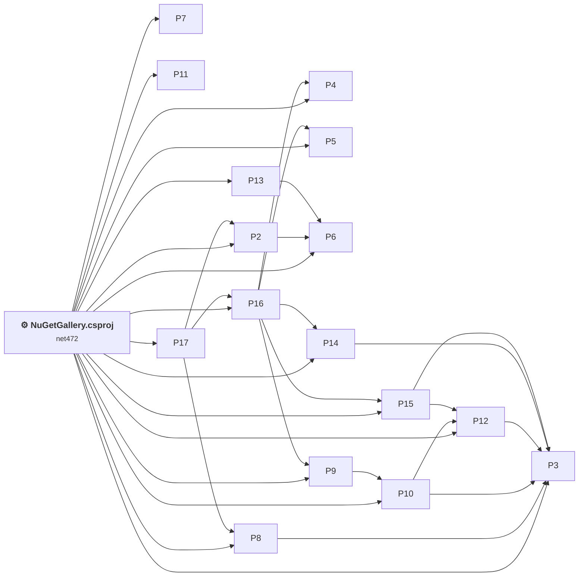
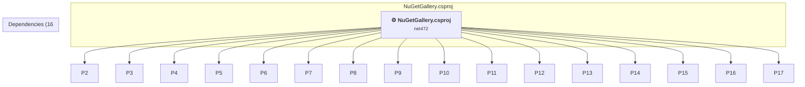

# Projects and dependencies analysis

This document provides a comprehensive overview of the projects and their dependencies in the context of upgrading to .NETCoreApp,Version=v10.0.

## Table of Contents

- [Executive Summary](#executive-Summary)
  - [Highlevel Metrics](#highlevel-metrics)
  - [Projects Compatibility](#projects-compatibility)
  - [Package Compatibility](#package-compatibility)
  - [API Compatibility](#api-compatibility)
  - [Binding Redirect Configuration](#binding-redirect-configuration)
- [Aggregate NuGet packages details](#aggregate-nuget-packages-details)
- [Top API Migration Challenges](#top-api-migration-challenges)
  - [Technologies and Features](#technologies-and-features)
  - [Most Frequent API Issues](#most-frequent-api-issues)
- [Projects Relationship Graph](#projects-relationship-graph)
- [Project Details](#project-details)

  - [%USERPROFILE%\source\repos\copilot-worktrees\nugetgallery-core2\agr-scaling-carnival\src\NuGet.Services.Configuration\NuGet.Services.Configuration.csproj](#%userprofile%sourcereposcopilot-worktreesnugetgallery-core2agr-scaling-carnivalsrcnugetservicesconfigurationnugetservicesconfigurationcsproj)
  - [%USERPROFILE%\source\repos\copilot-worktrees\nugetgallery-core2\agr-scaling-carnival\src\NuGet.Services.Contracts\NuGet.Services.Contracts.csproj](#%userprofile%sourcereposcopilot-worktreesnugetgallery-core2agr-scaling-carnivalsrcnugetservicescontractsnugetservicescontractscsproj)
  - [%USERPROFILE%\source\repos\copilot-worktrees\nugetgallery-core2\agr-scaling-carnival\src\NuGet.Services.Entities\NuGet.Services.Entities.csproj](#%userprofile%sourcereposcopilot-worktreesnugetgallery-core2agr-scaling-carnivalsrcnugetservicesentitiesnugetservicesentitiescsproj)
  - [%USERPROFILE%\source\repos\copilot-worktrees\nugetgallery-core2\agr-scaling-carnival\src\NuGet.Services.FeatureFlags\NuGet.Services.FeatureFlags.csproj](#%userprofile%sourcereposcopilot-worktreesnugetgallery-core2agr-scaling-carnivalsrcnugetservicesfeatureflagsnugetservicesfeatureflagscsproj)
  - [%USERPROFILE%\source\repos\copilot-worktrees\nugetgallery-core2\agr-scaling-carnival\src\NuGet.Services.KeyVault\NuGet.Services.KeyVault.csproj](#%userprofile%sourcereposcopilot-worktreesnugetgallery-core2agr-scaling-carnivalsrcnugetserviceskeyvaultnugetserviceskeyvaultcsproj)
  - [%USERPROFILE%\source\repos\copilot-worktrees\nugetgallery-core2\agr-scaling-carnival\src\NuGet.Services.Licenses\NuGet.Services.Licenses.csproj](#%userprofile%sourcereposcopilot-worktreesnugetgallery-core2agr-scaling-carnivalsrcnugetserviceslicensesnugetserviceslicensescsproj)
  - [%USERPROFILE%\source\repos\copilot-worktrees\nugetgallery-core2\agr-scaling-carnival\src\NuGet.Services.Logging\NuGet.Services.Logging.csproj](#%userprofile%sourcereposcopilot-worktreesnugetgallery-core2agr-scaling-carnivalsrcnugetservicesloggingnugetservicesloggingcsproj)
  - [%USERPROFILE%\source\repos\copilot-worktrees\nugetgallery-core2\agr-scaling-carnival\src\NuGet.Services.Messaging.Email\NuGet.Services.Messaging.Email.csproj](#%userprofile%sourcereposcopilot-worktreesnugetgallery-core2agr-scaling-carnivalsrcnugetservicesmessagingemailnugetservicesmessagingemailcsproj)
  - [%USERPROFILE%\source\repos\copilot-worktrees\nugetgallery-core2\agr-scaling-carnival\src\NuGet.Services.Messaging\NuGet.Services.Messaging.csproj](#%userprofile%sourcereposcopilot-worktreesnugetgallery-core2agr-scaling-carnivalsrcnugetservicesmessagingnugetservicesmessagingcsproj)
  - [%USERPROFILE%\source\repos\copilot-worktrees\nugetgallery-core2\agr-scaling-carnival\src\NuGet.Services.Owin\NuGet.Services.Owin.csproj](#%userprofile%sourcereposcopilot-worktreesnugetgallery-core2agr-scaling-carnivalsrcnugetservicesowinnugetservicesowincsproj)
  - [%USERPROFILE%\source\repos\copilot-worktrees\nugetgallery-core2\agr-scaling-carnival\src\NuGet.Services.ServiceBus\NuGet.Services.ServiceBus.csproj](#%userprofile%sourcereposcopilot-worktreesnugetgallery-core2agr-scaling-carnivalsrcnugetservicesservicebusnugetservicesservicebuscsproj)
  - [%USERPROFILE%\source\repos\copilot-worktrees\nugetgallery-core2\agr-scaling-carnival\src\NuGet.Services.Sql\NuGet.Services.Sql.csproj](#%userprofile%sourcereposcopilot-worktreesnugetgallery-core2agr-scaling-carnivalsrcnugetservicessqlnugetservicessqlcsproj)
  - [%USERPROFILE%\source\repos\copilot-worktrees\nugetgallery-core2\agr-scaling-carnival\src\NuGet.Services.Validation.Issues\NuGet.Services.Validation.Issues.csproj](#%userprofile%sourcereposcopilot-worktreesnugetgallery-core2agr-scaling-carnivalsrcnugetservicesvalidationissuesnugetservicesvalidationissuescsproj)
  - [%USERPROFILE%\source\repos\copilot-worktrees\nugetgallery-core2\agr-scaling-carnival\src\NuGet.Services.Validation\NuGet.Services.Validation.csproj](#%userprofile%sourcereposcopilot-worktreesnugetgallery-core2agr-scaling-carnivalsrcnugetservicesvalidationnugetservicesvalidationcsproj)
  - [%USERPROFILE%\source\repos\copilot-worktrees\nugetgallery-core2\agr-scaling-carnival\src\NuGetGallery.Core\NuGetGallery.Core.csproj](#%userprofile%sourcereposcopilot-worktreesnugetgallery-core2agr-scaling-carnivalsrcnugetgallerycorenugetgallerycorecsproj)
  - [%USERPROFILE%\source\repos\copilot-worktrees\nugetgallery-core2\agr-scaling-carnival\src\NuGetGallery.Services\NuGetGallery.Services.csproj](#%userprofile%sourcereposcopilot-worktreesnugetgallery-core2agr-scaling-carnivalsrcnugetgalleryservicesnugetgalleryservicescsproj)
  - [NuGetGallery.csproj](#nugetgallerycsproj)

## Approved Scenario Scope and Assessment Interpretation

The generated compatibility inventory below analyzes the legacy `NuGetGallery.csproj` and its
transitive project dependencies against `net10.0`. It is an impact inventory, not a directive to
retarget all 17 projects or to convert the existing web application in place.

The approved implementation is a side-by-side ASP.NET Core project at
`src\NuGetGallery.net10\NuGetGallery.net10.csproj`. The existing .NET Framework application remains
the legacy origin and the sole interactive sign-in authority and cookie refresher for this phase.
ASP.NET Core endpoints take precedence; unmatched requests fall through a catch-all YARP route to
the configured legacy origin. Existing Gallery libraries, including EF6 and their transitive
dependencies, may be reused. EF Core migration, controller migration, Azure deployment topology,
and Aspire AppHost changes are out of scope. The new project must use an explicit `Program` class
rather than top-level statements.

Authentication compatibility is a release-critical requirement. Both hosts must explicitly use the
verified cookie name `.AspNet.LocalUser`; the new host must read the legacy cookie and eventually be
capable of issuing and refreshing the same format. A one-time sign-in disruption at the Azure App
Service slot swap is acceptable if the format changes. Data Protection integration must use the
official `IKeyEncryptionKeyResolver` and Key Vault Data Protection extension, not a custom XML
encryption format.

Two framework-neutral foundations are prerequisites and independent deliverables:

1. **Storage foundation:** a coordinated, atomic source/API refactor across every affected consumer,
   preserving observable service behavior and the filesystem implementation by moving or extracting
   existing code. This foundation contains only the download-result refactor; file enumeration and
   all Data Protection capabilities are deferred to Data Protection integration.
2. **Key Vault foundation:** a separate behavior-preserving change that retains
   `new KeyVaultReader(KeyVaultConfiguration)`, `ISecretReader`, and existing secret/signing
   behavior.

Each foundation must be independently cherry-pickable onto unmodified `dev`, buildable, deployable,
and observable without .NET 10 migration behavior. Storage and Key Vault foundations must complete
before migration-specific work. Azure access must follow the Gallery's existing storage, Key Vault,
configuration, secret-injection, managed-identity, certificate, and connection-string patterns.

Accordingly, the report's 2,932 findings establish the upper-bound compatibility surface of an
in-place migration. The side-by-side approach deliberately avoids most of the 2,410+ estimated
legacy-web LOC changes and the bulk of the 2,199 `System.Web` findings. Planning should instead use
the report to identify which shared libraries and APIs are actually crossed by the new host, then
keep legacy-only MVC, Web API, OWIN, bundling, Dynamic Data, and binding-redirect concerns in the
legacy application unless a selected ASP.NET Core endpoint requires an explicit replacement.

## Executive Summary

### Highlevel Metrics

| Metric | Count | Status |
| :--- | :---: | :--- |
| Total Projects | 17 | All require upgrade |
| Total NuGet Packages | 65 | 39 need upgrade |
| Total Code Files | 1030 |  |
| Total Code Files with Incidents | 267 |  |
| Total Lines of Code | 83053 |  |
| Total Number of Issues | 2932 |  |
| Estimated LOC to modify | 2795+ | at least 3.4% of codebase |

### Projects Compatibility

| Project | Target Framework | Difficulty | Test Coverage | Package Issues | API Issues | Binding Issues | Est. LOC Impact | Description |
| :--- | :---: | :---: | :---: | :---: | :---: | :---: | :---: | :--- |
| [%USERPROFILE%\source\repos\copilot-worktrees\nugetgallery-core2\agr-scaling-carnival\src\NuGet.Services.Configuration\NuGet.Services.Configuration.csproj](#%userprofile%sourcereposcopilot-worktreesnugetgallery-core2agr-scaling-carnivalsrcnugetservicesconfigurationnugetservicesconfigurationcsproj) | net472;netstandard2.0 | 🟢 Low | — | 6 | 0 | 0 |  | ClassLibrary, Sdk Style = True |
| [%USERPROFILE%\source\repos\copilot-worktrees\nugetgallery-core2\agr-scaling-carnival\src\NuGet.Services.Contracts\NuGet.Services.Contracts.csproj](#%userprofile%sourcereposcopilot-worktreesnugetgallery-core2agr-scaling-carnivalsrcnugetservicescontractsnugetservicescontractscsproj) | net472;netstandard2.0 | 🟢 Low | — | 0 | 0 | 0 |  | ClassLibrary, Sdk Style = True |
| [%USERPROFILE%\source\repos\copilot-worktrees\nugetgallery-core2\agr-scaling-carnival\src\NuGet.Services.Entities\NuGet.Services.Entities.csproj](#%userprofile%sourcereposcopilot-worktreesnugetgallery-core2agr-scaling-carnivalsrcnugetservicesentitiesnugetservicesentitiescsproj) | net472;netstandard2.1 | 🟢 Low | 🧪 Recommended | 2 | 1 | 0 | 1+ | ClassLibrary, Sdk Style = True |
| [%USERPROFILE%\source\repos\copilot-worktrees\nugetgallery-core2\agr-scaling-carnival\src\NuGet.Services.FeatureFlags\NuGet.Services.FeatureFlags.csproj](#%userprofile%sourcereposcopilot-worktreesnugetgallery-core2agr-scaling-carnivalsrcnugetservicesfeatureflagsnugetservicesfeatureflagscsproj) | net472;netstandard2.0 | 🟢 Low | — | 1 | 0 | 0 |  | ClassLibrary, Sdk Style = True |
| [%USERPROFILE%\source\repos\copilot-worktrees\nugetgallery-core2\agr-scaling-carnival\src\NuGet.Services.KeyVault\NuGet.Services.KeyVault.csproj](#%userprofile%sourcereposcopilot-worktreesnugetgallery-core2agr-scaling-carnivalsrcnugetserviceskeyvaultnugetserviceskeyvaultcsproj) | net472;netstandard2.0 | 🟢 Low | 🧪 Recommended | 3 | 8 | 0 | 8+ | ClassLibrary, Sdk Style = True |
| [%USERPROFILE%\source\repos\copilot-worktrees\nugetgallery-core2\agr-scaling-carnival\src\NuGet.Services.Licenses\NuGet.Services.Licenses.csproj](#%userprofile%sourcereposcopilot-worktreesnugetgallery-core2agr-scaling-carnivalsrcnugetserviceslicensesnugetserviceslicensescsproj) | net472;netstandard2.0 | 🟢 Low | — | 1 | 0 | 0 |  | ClassLibrary, Sdk Style = True |
| [%USERPROFILE%\source\repos\copilot-worktrees\nugetgallery-core2\agr-scaling-carnival\src\NuGet.Services.Logging\NuGet.Services.Logging.csproj](#%userprofile%sourcereposcopilot-worktreesnugetgallery-core2agr-scaling-carnivalsrcnugetservicesloggingnugetservicesloggingcsproj) | net472;netstandard2.0 | 🟢 Low | 🧪 Recommended | 4 | 6 | 0 | 6+ | ClassLibrary, Sdk Style = True |
| [%USERPROFILE%\source\repos\copilot-worktrees\nugetgallery-core2\agr-scaling-carnival\src\NuGet.Services.Messaging.Email\NuGet.Services.Messaging.Email.csproj](#%userprofile%sourcereposcopilot-worktreesnugetgallery-core2agr-scaling-carnivalsrcnugetservicesmessagingemailnugetservicesmessagingemailcsproj) | net472;netstandard2.0 | 🟢 Low | — | 0 | 0 | 0 |  | ClassLibrary, Sdk Style = True |
| [%USERPROFILE%\source\repos\copilot-worktrees\nugetgallery-core2\agr-scaling-carnival\src\NuGet.Services.Messaging\NuGet.Services.Messaging.csproj](#%userprofile%sourcereposcopilot-worktreesnugetgallery-core2agr-scaling-carnivalsrcnugetservicesmessagingnugetservicesmessagingcsproj) | net472;netstandard2.0 | 🟢 Low | — | 1 | 0 | 0 |  | ClassLibrary, Sdk Style = True |
| [%USERPROFILE%\source\repos\copilot-worktrees\nugetgallery-core2\agr-scaling-carnival\src\NuGet.Services.Owin\NuGet.Services.Owin.csproj](#%userprofile%sourcereposcopilot-worktreesnugetgallery-core2agr-scaling-carnivalsrcnugetservicesowinnugetservicesowincsproj) | net472 | 🟢 Low | 🧪 Recommended | 1 | 3 | 0 | 3+ | ClassLibrary, Sdk Style = True |
| [%USERPROFILE%\source\repos\copilot-worktrees\nugetgallery-core2\agr-scaling-carnival\src\NuGet.Services.ServiceBus\NuGet.Services.ServiceBus.csproj](#%userprofile%sourcereposcopilot-worktreesnugetgallery-core2agr-scaling-carnivalsrcnugetservicesservicebusnugetservicesservicebuscsproj) | net472;netstandard2.0 | 🟢 Low | 🧪 Recommended | 4 | 4 | 0 | 4+ | ClassLibrary, Sdk Style = True |
| [%USERPROFILE%\source\repos\copilot-worktrees\nugetgallery-core2\agr-scaling-carnival\src\NuGet.Services.Sql\NuGet.Services.Sql.csproj](#%userprofile%sourcereposcopilot-worktreesnugetgallery-core2agr-scaling-carnivalsrcnugetservicessqlnugetservicessqlcsproj) | net472;netstandard2.0 | 🟢 Low | 🧪 Recommended | 1 | 38 | 0 | 38+ | ClassLibrary, Sdk Style = True |
| [%USERPROFILE%\source\repos\copilot-worktrees\nugetgallery-core2\agr-scaling-carnival\src\NuGet.Services.Validation.Issues\NuGet.Services.Validation.Issues.csproj](#%userprofile%sourcereposcopilot-worktreesnugetgallery-core2agr-scaling-carnivalsrcnugetservicesvalidationissuesnugetservicesvalidationissuescsproj) | net472;netstandard2.0 | 🟢 Low | — | 1 | 0 | 0 |  | ClassLibrary, Sdk Style = True |
| [%USERPROFILE%\source\repos\copilot-worktrees\nugetgallery-core2\agr-scaling-carnival\src\NuGet.Services.Validation\NuGet.Services.Validation.csproj](#%userprofile%sourcereposcopilot-worktreesnugetgallery-core2agr-scaling-carnivalsrcnugetservicesvalidationnugetservicesvalidationcsproj) | net472;netstandard2.1 | 🟢 Low | 🧪 Recommended | 2 | 13 | 0 | 13+ | ClassLibrary, Sdk Style = True |
| [%USERPROFILE%\source\repos\copilot-worktrees\nugetgallery-core2\agr-scaling-carnival\src\NuGetGallery.Core\NuGetGallery.Core.csproj](#%userprofile%sourcereposcopilot-worktreesnugetgallery-core2agr-scaling-carnivalsrcnugetgallerycorenugetgallerycorecsproj) | net472;netstandard2.1 | 🟢 Low | 🧪 Recommended | 4 | 157 | 0 | 157+ | ClassLibrary, Sdk Style = True |
| [%USERPROFILE%\source\repos\copilot-worktrees\nugetgallery-core2\agr-scaling-carnival\src\NuGetGallery.Services\NuGetGallery.Services.csproj](#%userprofile%sourcereposcopilot-worktreesnugetgallery-core2agr-scaling-carnivalsrcnugetgalleryservicesnugetgalleryservicescsproj) | net472;netstandard2.1 | 🟢 Low | 🧪 Recommended | 2 | 155 | 0 | 155+ | ClassLibrary, Sdk Style = True |
| [NuGetGallery.csproj](#nugetgallerycsproj) | net472 | 🔴 High | 🧪 Recommended | 52 | 2410 | 11 | 2410+ | Wap, Sdk Style = False |

🧪 **Test Coverage** — projects risky enough to add behavior-locking tests before upgrading, to catch regressions the upgrade may introduce. Requires the **dotnet-test** plugin.

### Package Compatibility

| Status | Count | Percentage |
| :--- | :---: | :---: |
| ✅ Compatible | 26 | 40.0% |
| ⚠️ Incompatible | 31 | 47.7% |
| 🔄 Upgrade Recommended | 8 | 12.3% |
| ***Total NuGet Packages*** | ***65*** | ***100%*** |

### API Compatibility

| Category | Count | Impact |
| :--- | :---: | :--- |
| 🔴 Binary Incompatible | 1733 | High - Require code changes |
| 🟡 Source Incompatible | 666 | Medium - Needs re-compilation and potential conflicting API error fixing |
| 🔵 Behavioral change | 396 | Low - Behavioral changes that may require testing at runtime |
| ✅ Compatible | 70550 |  |
| ***Total APIs Analyzed*** | ***73345*** |  |

### Binding Redirect Configuration

| Severity | Count | Description |
| :--- | :---: | :--- |
| 🔴Mandatory | 6 | Must be fixed to avoid runtime failures |
| 🟡Potential | 5 | May cause issues in certain scenarios |
| ***Total Binding Issues*** | ***11*** | ***Across 1 project(s)*** |

## Aggregate NuGet packages details

| Package | Current Version | Suggested Version | Projects | Description |
| :--- | :---: | :---: | :--- | :--- |
| Autofac | 4.9.1 |  | [NuGetGallery.csproj](#nugetgallerycsproj) | ✅Compatible |
| Autofac.Extensions.DependencyInjection | 4.4.0 |  | [NuGetGallery.csproj](#nugetgallerycsproj) | ✅Compatible |
| Autofac.Mvc5 | 4.0.2 |  | [NuGetGallery.csproj](#nugetgallerycsproj) | ⚠️NuGet package is incompatible |
| Autofac.Mvc5.Owin | 4.0.1 |  | [NuGetGallery.csproj](#nugetgallerycsproj) | ⚠️NuGet package is incompatible |
| Autofac.Owin | 4.2.0 |  | [NuGetGallery.csproj](#nugetgallerycsproj) | ⚠️NuGet package is incompatible |
| Autofac.WebApi2 | 4.1.0 |  | [NuGetGallery.csproj](#nugetgallerycsproj) | ⚠️NuGet package is incompatible |
| CommonMark.NET | 0.15.1 |  | [NuGetGallery.csproj](#nugetgallerycsproj) | ✅Compatible |
| d3 | 5.4.0 |  | [NuGetGallery.csproj](#nugetgallerycsproj) | ✅Compatible |
| EntityFramework | 6.5.1 | 6.5.2 | [NuGetGallery.csproj](#nugetgallerycsproj) | NuGet package upgrade is recommended |
| HtmlSanitizer | 9.0.892 |  | [NuGetGallery.csproj](#nugetgallerycsproj) | ✅Compatible |
| Lucene.Net | 3.0.3 |  | [NuGetGallery.csproj](#nugetgallerycsproj) | ⚠️NuGet package is incompatible |
| Lucene.Net.Contrib | 3.0.3 |  | [NuGetGallery.csproj](#nugetgallerycsproj) | ⚠️NuGet package is incompatible |
| MicroBuild.Core | 0.3.0 |  | [NuGetGallery.csproj](#nugetgallerycsproj) | ✅Compatible |
| Microsoft.ApplicationInsights.TraceListener | 2.21.0 |  | [NuGetGallery.csproj](#nugetgallerycsproj) | ⚠️NuGet package is deprecated |
| Microsoft.ApplicationInsights.Web | 2.21.0 |  | [NuGetGallery.csproj](#nugetgallerycsproj) | ⚠️NuGet package is incompatible |
| Microsoft.AspNet.DynamicData.EFProvider | 6.0.0 |  | [NuGetGallery.csproj](#nugetgallerycsproj) | ⚠️NuGet package is incompatible |
| Microsoft.AspNet.Identity.Core | 1.0.0 |  | [NuGetGallery.csproj](#nugetgallerycsproj) | ⚠️NuGet package is incompatible |
| Microsoft.AspNet.Razor | 3.2.9 |  | [NuGetGallery.csproj](#nugetgallerycsproj) | NuGet package functionality is included with framework reference |
| Microsoft.AspNet.Web.Optimization | 1.1.3 |  | [NuGetGallery.csproj](#nugetgallerycsproj) | ⚠️NuGet package is incompatible |
| Microsoft.AspNet.WebApi.Client | 5.2.9 |  | [NuGetGallery.csproj](#nugetgallerycsproj) | ✅Compatible |
| Microsoft.AspNet.WebApi.Core | 5.2.9 |  | [NuGetGallery.csproj](#nugetgallerycsproj) | ⚠️NuGet package is incompatible |
| Microsoft.AspNet.WebApi.MessageHandlers.Compression.StrongName | 1.3.0 |  | [NuGetGallery.csproj](#nugetgallerycsproj) | ⚠️NuGet package is incompatible |
| Microsoft.AspNet.WebApi.OData | 5.7.0 |  | [NuGetGallery.csproj](#nugetgallerycsproj) | ⚠️Replace with Microsoft.AspNetCore.OData: Register OData in Startup; adjust routing and controllers for OData v4 |
| Microsoft.AspNet.WebApi.WebHost | 5.2.9 |  | [NuGetGallery.csproj](#nugetgallerycsproj) | ⚠️NuGet package is incompatible |
| Microsoft.AspNet.WebHelpers | 3.2.9 |  | [NuGetGallery.csproj](#nugetgallerycsproj) | ⚠️NuGet package is incompatible |
| Microsoft.AspNet.WebPages | 3.2.9 |  | [NuGetGallery.csproj](#nugetgallerycsproj) | NuGet package functionality is included with framework reference |
| Microsoft.AspNet.WebPages.Data | 3.2.9 |  | [NuGetGallery.csproj](#nugetgallerycsproj) | ⚠️NuGet package is incompatible |
| Microsoft.AspNet.WebPages.WebData | 3.2.9 |  | [NuGetGallery.csproj](#nugetgallerycsproj) | ⚠️NuGet package is incompatible |
| Microsoft.AspNetCore.Cryptography.Internal | 8.0.10 | 10.0.11 | [NuGetGallery.csproj](#nugetgallerycsproj) | NuGet package upgrade is recommended |
| Microsoft.Bcl.Compression | 3.9.85 |  | [NuGetGallery.csproj](#nugetgallerycsproj) | ⚠️NuGet package is incompatible |
| Microsoft.CodeAnalysis.NetAnalyzers | 8.0.0 |  | [NuGetGallery.csproj](#nugetgallerycsproj) | ✅Compatible |
| Microsoft.CodeDom.Providers.DotNetCompilerPlatform | 4.1.0 |  | [NuGetGallery.csproj](#nugetgallerycsproj) | NuGet package functionality is included with framework reference |
| Microsoft.Data.Services | 5.8.4 |  | [NuGetGallery.csproj](#nugetgallerycsproj) | ⚠️NuGet package is incompatible |
| Microsoft.Extensions.DependencyInjection | 8.0.1 | 10.0.11 | [NuGetGallery.csproj](#nugetgallerycsproj) | NuGet package upgrade is recommended |
| Microsoft.Extensions.Http | 8.0.0 | 10.0.11 | [NuGetGallery.csproj](#nugetgallerycsproj) | NuGet package upgrade is recommended |
| Microsoft.Extensions.Http.Polly | 8.0.8 | 10.0.11 | [NuGetGallery.csproj](#nugetgallerycsproj) | NuGet package upgrade is recommended |
| Microsoft.Extensions.Logging | 8.0.1 | 10.0.11 | [NuGetGallery.csproj](#nugetgallerycsproj) | NuGet package upgrade is recommended |
| Microsoft.Extensions.Logging.Abstractions | 8.0.3 | 10.0.11 | [NuGetGallery.csproj](#nugetgallerycsproj) | NuGet package upgrade is recommended |
| Microsoft.Net.Http | 2.2.29 |  | [NuGetGallery.csproj](#nugetgallerycsproj) | Needs to be replaced with Replace with new package System.Net.Http=4.3.4 |
| Microsoft.SourceLink.GitHub | 8.0.0 |  | [NuGetGallery.csproj](#nugetgallerycsproj) | ✅Compatible |
| Microsoft.Web.Infrastructure | 1.0.0 |  | [NuGetGallery.csproj](#nugetgallerycsproj) | NuGet package functionality is included with framework reference |
| Microsoft.Web.Xdt | 3.1.0 |  | [NuGetGallery.csproj](#nugetgallerycsproj) | ✅Compatible |
| Modernizr | 2.8.3 |  | [NuGetGallery.csproj](#nugetgallerycsproj) | ✅Compatible |
| Moment.js | 2.29.4 |  | [NuGetGallery.csproj](#nugetgallerycsproj) | ⚠️NuGet package is deprecated |
| MvcTreeView | 1.4.0 |  | [NuGetGallery.csproj](#nugetgallerycsproj) | ✅Compatible |
| NuGet.StrongName.AnglicanGeek.MarkdownMailer | 1.2.0 |  | [NuGetGallery.csproj](#nugetgallerycsproj) | ⚠️NuGet package is incompatible |
| NuGet.StrongName.DynamicData.EFCodeFirstProvider | 0.3.0 |  | [NuGetGallery.csproj](#nugetgallerycsproj) | ⚠️NuGet package is incompatible |
| NuGet.StrongName.elmah | 1.2.2 |  | [NuGetGallery.csproj](#nugetgallerycsproj) | ✅Compatible |
| NuGet.StrongName.elmah.sqlserver | 1.2.2 |  | [NuGetGallery.csproj](#nugetgallerycsproj) | ✅Compatible |
| NuGet.StrongName.QueryInterceptor | 0.1.4237.2400 |  | [NuGetGallery.csproj](#nugetgallerycsproj) | ⚠️NuGet package is incompatible |
| NuGet.StrongName.WebActivator | 1.4.4 |  | [NuGetGallery.csproj](#nugetgallerycsproj) | ⚠️NuGet package is incompatible |
| NuGet.StrongName.WebBackgrounder.EntityFramework | 0.1.0 |  | [NuGetGallery.csproj](#nugetgallerycsproj) | ⚠️NuGet package is incompatible |
| Owin | 1.0.0 |  | [NuGetGallery.csproj](#nugetgallerycsproj) | ⚠️NuGet package is incompatible |
| PolySharp | 1.15.0 |  | [NuGetGallery.csproj](#nugetgallerycsproj) | ✅Compatible |
| RouteMagic | 1.1.3 | 0.2.2 | [NuGetGallery.csproj](#nugetgallerycsproj) | ⚠️NuGet package is incompatible |
| SharpZipLib | 1.3.3 |  | [NuGetGallery.csproj](#nugetgallerycsproj) | ✅Compatible |
| Strathweb.CacheOutput.WebApi2.StrongName | 0.9.0 |  | [NuGetGallery.csproj](#nugetgallerycsproj) | ⚠️NuGet package is incompatible |
| System.Data.SqlClient | 4.8.6 |  | [NuGetGallery.csproj](#nugetgallerycsproj) | ✅Compatible |
| System.Diagnostics.Debug | 4.3.0 |  | [NuGetGallery.csproj](#nugetgallerycsproj) | NuGet package functionality is included with framework reference |
| System.Linq.Expressions | 4.3.0 |  | [NuGetGallery.csproj](#nugetgallerycsproj) | NuGet package functionality is included with framework reference |
| System.Net.Http | 4.3.4 |  | [NuGetGallery.csproj](#nugetgallerycsproj) | NuGet package functionality is included with framework reference |
| System.Text.Json | 8.0.6 | 10.0.11 | [NuGetGallery.csproj](#nugetgallerycsproj) | NuGet package upgrade is recommended |
| WebActivatorEx | 2.0.6 |  | [NuGetGallery.csproj](#nugetgallerycsproj) | ⚠️NuGet package is incompatible |
| WebGrease | 1.6.0 |  | [NuGetGallery.csproj](#nugetgallerycsproj) | ✅Compatible |
| WindowsAzure.Caching | 1.7.0 |  | [NuGetGallery.csproj](#nugetgallerycsproj) | ⚠️NuGet package is incompatible |

## Top API Migration Challenges

### Technologies and Features

| Technology | Issues | Percentage | Migration Path |
| :--- | :---: | :---: | :--- |
| ASP.NET Framework (System.Web) | 2199 | 78.7% | Legacy ASP.NET Framework APIs for web applications (System.Web.*) that don't exist in ASP.NET Core due to architectural differences. ASP.NET Core represents a complete redesign of the web framework. Migrate to ASP.NET Core equivalents or consider System.Web.Adapters package for compatibility. |
| WCF Client APIs | 44 | 1.6% | WCF client-side APIs for building service clients that communicate with WCF services. These APIs are available as exact equivalents via NuGet packages - add System.ServiceModel.* NuGet packages (System.ServiceModel.Http, System.ServiceModel.Primitives, System.ServiceModel.NetTcp, etc.) |
| Legacy Configuration System | 25 | 0.9% | Legacy XML-based configuration system (app.config/web.config) that has been replaced by a more flexible configuration model in .NET Core. The old system was rigid and XML-based. Migrate to Microsoft.Extensions.Configuration with JSON/environment variables; use System.Configuration.ConfigurationManager NuGet package as interim bridge if needed. |
| Legacy Cryptography | 10 | 0.4% | Obsolete or insecure cryptographic algorithms that have been deprecated for security reasons. These algorithms are no longer considered secure by modern standards. Migrate to modern cryptographic APIs using secure algorithms. |
| Deprecated Remoting & Serialization | 2 | 0.1% | Legacy .NET Remoting, BinaryFormatter, and related serialization APIs that are deprecated and removed for security reasons. Remoting provided distributed object communication but had significant security vulnerabilities. Migrate to gRPC, HTTP APIs, or modern serialization (System.Text.Json, protobuf). |

### Most Frequent API Issues

| API | Count | Percentage | Category |
| :--- | :---: | :---: | :--- |
| T:System.Uri | 341 | 12.2% | Behavioral Change |
| T:System.Web.Routing.HttpMethodConstraint | 96 | 3.4% | Binary Incompatible |
| T:System.Web.DynamicData.MetaTable | 72 | 2.6% | Binary Incompatible |
| T:System.Web.DynamicData.MetaColumn | 69 | 2.5% | Binary Incompatible |
| T:System.Web.UI.Control | 63 | 2.3% | Binary Incompatible |
| T:System.Web.Routing.RouteValueDictionary | 60 | 2.1% | Binary Incompatible |
| M:System.Web.Routing.RouteValueDictionary.Add(System.String,System.Object) | 57 | 2.0% | Binary Incompatible |
| T:System.Web.HttpContextBase | 51 | 1.8% | Source Incompatible |
| M:System.Web.Routing.HttpMethodConstraint.#ctor(System.String[]) | 48 | 1.7% | Binary Incompatible |
| T:System.Web.HttpContext | 45 | 1.6% | Source Incompatible |
| M:System.Web.Routing.RouteValueDictionary.#ctor | 45 | 1.6% | Binary Incompatible |
| T:System.Web.UI.WebControls.GridView | 43 | 1.5% | Binary Incompatible |
| T:System.Web.UI.WebControls.DropDownList | 39 | 1.4% | Binary Incompatible |
| P:System.Web.DynamicData.FieldTemplateUserControl.Column | 38 | 1.4% | Binary Incompatible |
| T:System.Web.HttpRequestBase | 34 | 1.2% | Source Incompatible |
| T:System.Web.UI.WebControls.TextBox | 34 | 1.2% | Binary Incompatible |
| M:System.Web.DynamicData.FieldTemplateUserControl.SetUpValidator(System.Web.UI.WebControls.BaseValidator) | 26 | 0.9% | Binary Incompatible |
| T:System.Web.HtmlString | 24 | 0.9% | Source Incompatible |
| T:System.Web.UI.WebControls.DataBoundControlMode | 24 | 0.9% | Binary Incompatible |
| P:System.Web.DynamicData.MetaColumn.Name | 23 | 0.8% | Binary Incompatible |
| T:System.Web.DynamicData.DynamicValidator | 22 | 0.8% | Binary Incompatible |
| P:System.Web.Routing.RouteValueDictionary.Item(System.String) | 22 | 0.8% | Binary Incompatible |
| M:System.Web.DynamicData.FieldTemplateUserControl.#ctor | 20 | 0.7% | Binary Incompatible |
| T:System.Web.DynamicData.FieldTemplateUserControl | 20 | 0.7% | Binary Incompatible |
| P:System.Web.HttpContextBase.Request | 18 | 0.6% | Source Incompatible |
| P:System.Web.HttpContext.Current | 18 | 0.6% | Source Incompatible |
| P:System.Uri.AbsoluteUri | 17 | 0.6% | Behavioral Change |
| T:System.Data.SqlClient.SqlConnectionStringBuilder | 16 | 0.6% | Source Incompatible |
| T:System.Web.UI.WebControls.FormView | 16 | 0.6% | Binary Incompatible |
| T:System.Web.UI.WebControls.RequiredFieldValidator | 16 | 0.6% | Binary Incompatible |
| M:System.Uri.#ctor(System.String) | 15 | 0.5% | Behavioral Change |
| T:System.Web.HttpRequest | 15 | 0.5% | Source Incompatible |
| T:System.Web.HttpCookieCollection | 14 | 0.5% | Source Incompatible |
| T:System.Web.Routing.RouteCollection | 14 | 0.5% | Binary Incompatible |
| T:System.Web.UI.WebControls.ListItemCollection | 14 | 0.5% | Binary Incompatible |
| P:System.Web.UI.WebControls.ListControl.Items | 14 | 0.5% | Binary Incompatible |
| T:System.Web.DynamicData.ContainerType | 14 | 0.5% | Binary Incompatible |
| T:System.Data.SqlClient.SqlConnection | 13 | 0.5% | Source Incompatible |
| M:System.TimeSpan.FromMinutes(System.Double) | 13 | 0.5% | Source Incompatible |
| P:System.Web.HttpContext.Request | 13 | 0.5% | Source Incompatible |
| M:System.Uri.TryCreate(System.String,System.UriKind,System.Uri@) | 12 | 0.4% | Behavioral Change |
| T:System.Web.UI.Page | 12 | 0.4% | Binary Incompatible |
| P:System.Web.UI.WebControls.ListControl.SelectedValue | 12 | 0.4% | Binary Incompatible |
| T:System.Web.UI.WebControls.ListItem | 12 | 0.4% | Binary Incompatible |
| T:System.Web.HttpPostedFileBase | 12 | 0.4% | Source Incompatible |
| T:System.Web.UI.WebControls.RegularExpressionValidator | 12 | 0.4% | Binary Incompatible |
| T:System.Web.UI.WebControls.HyperLink | 11 | 0.4% | Binary Incompatible |
| T:System.Web.UI.WebControls.FormViewMode | 11 | 0.4% | Binary Incompatible |
| M:System.TimeSpan.FromSeconds(System.Double) | 10 | 0.4% | Source Incompatible |
| T:System.Web.HttpCookie | 10 | 0.4% | Source Incompatible |

## Projects Relationship Graph

Legend:
📦 SDK-style project
⚙️ Classic project

```mermaid
flowchart LR
    P1["<b>⚙️&nbsp;NuGetGallery.csproj</b><br/><small>net472</small>"]
    P1 --> P2
    P1 --> P3
    P1 --> P4
    P1 --> P5
    P1 --> P6
    P1 --> P7
    P1 --> P8
    P1 --> P9
    P1 --> P10
    P1 --> P11
    P1 --> P12
    P1 --> P13
    P1 --> P14
    P1 --> P15
    P1 --> P16
    P1 --> P17
    P2 --> P6
    P8 --> P3
    P9 --> P10
    P10 --> P3
    P10 --> P12
    P12 --> P3
    P13 --> P6
    P14 --> P3
    P15 --> P3
    P15 --> P12
    P16 --> P9
    P16 --> P14
    P16 --> P15
    P16 --> P4
    P16 --> P5
    P17 --> P16
    P17 --> P2
    P17 --> P8
    click P1 "#nugetgallerycsproj"

```

## Project Details

### NuGetGallery.csproj

#### Project Info

- **Current Target Framework:** net472
- **Proposed Target Framework:** net10.0
- **SDK-style**: False
- **Project Kind:** Wap
- **Dependencies**: 16
- **Dependants**: 0
- **Number of Files**: 1368
- **Number of Files with Incidents**: 189
- **Lines of Code**: 82957
- **Estimated LOC to modify**: 2410+ (at least 2.9% of the project)

#### Dependency Graph

Legend:
📦 SDK-style project
⚙️ Classic project

```mermaid
flowchart TB
    subgraph current["NuGetGallery.csproj"]
        MAIN["<b>⚙️&nbsp;NuGetGallery.csproj</b><br/><small>net472</small>"]
        click MAIN "#nugetgallerycsproj"
    end
    subgraph downstream["Dependencies (16"]
    end
    MAIN --> P2
    MAIN --> P3
    MAIN --> P4
    MAIN --> P5
    MAIN --> P6
    MAIN --> P7
    MAIN --> P8
    MAIN --> P9
    MAIN --> P10
    MAIN --> P11
    MAIN --> P12
    MAIN --> P13
    MAIN --> P14
    MAIN --> P15
    MAIN --> P16
    MAIN --> P17

```

### API Compatibility

| Category | Count | Impact |
| :--- | :---: | :--- |
| 🔴 Binary Incompatible | 1727 | High - Require code changes |
| 🟡 Source Incompatible | 517 | Medium - Needs re-compilation and potential conflicting API error fixing |
| 🔵 Behavioral change | 166 | Low - Behavioral changes that may require testing at runtime |
| ✅ Compatible | 36969 |  |
| ***Total APIs Analyzed*** | ***39379*** |  |

#### Binding Redirect Configuration

| Rule | Severity | Details | Recommendation |
| :--- | :---: | :--- | :--- |
| Manual redirect conflicts with auto-generated version | 🔴Mandatory | Manual redirect for WebGrease targets 1.6.5135.21930 but auto-generation would target 1.6.0 (MSB3836 conflict) | Remove the conflicting manual binding redirect or disable auto-generation. |
| Manual redirect conflicts with auto-generated version | 🔴Mandatory | Manual redirect for System.Text.Json targets 8.0.0.6 but auto-generation would target 8.0.6 (MSB3836 conflict) | Remove the conflicting manual binding redirect or disable auto-generation. |
| Manual redirect conflicts with auto-generated version | 🔴Mandatory | Manual redirect for Microsoft.Extensions.Logging.Abstractions targets 8.0.0.3 but auto-generation would target 8.0.3 (MSB3836 conflict) | Remove the conflicting manual binding redirect or disable auto-generation. |
| Manual redirect conflicts with auto-generated version | 🔴Mandatory | Manual redirect for Microsoft.Extensions.Logging targets 8.0.0.1 but auto-generation would target 8.0.1 (MSB3836 conflict) | Remove the conflicting manual binding redirect or disable auto-generation. |
| Manual redirect conflicts with auto-generated version | 🔴Mandatory | Manual redirect for Microsoft.Extensions.DependencyInjection targets 8.0.0.1 but auto-generation would target 8.0.1 (MSB3836 conflict) | Remove the conflicting manual binding redirect or disable auto-generation. |
| Manual redirect conflicts with auto-generated version | 🔴Mandatory | Manual redirect for EntityFramework targets 6.0.0.0 but auto-generation would target 6.5.1 (MSB3836 conflict) | Remove the conflicting manual binding redirect or disable auto-generation. |
| Binding redirect forces version downgrade | 🟡Potential | Binding redirect for Microsoft.Extensions.DependencyInjection targets 8.0.0.1 but package provides 8.0.1 | Update the binding redirect newVersion to match the version provided by the NuGet package. |
| Binding redirect forces version downgrade | 🟡Potential | Binding redirect for EntityFramework targets 6.0.0.0 but package provides 6.5.1 | Update the binding redirect newVersion to match the version provided by the NuGet package. |
| Binding redirect forces version downgrade | 🟡Potential | Binding redirect for Microsoft.Extensions.Logging targets 8.0.0.1 but package provides 8.0.1 | Update the binding redirect newVersion to match the version provided by the NuGet package. |
| Binding redirect forces version downgrade | 🟡Potential | Binding redirect for Microsoft.Extensions.Logging.Abstractions targets 8.0.0.3 but package provides 8.0.3 | Update the binding redirect newVersion to match the version provided by the NuGet package. |
| Binding redirect forces version downgrade | 🟡Potential | Binding redirect for System.Text.Json targets 8.0.0.6 but package provides 8.0.6 | Update the binding redirect newVersion to match the version provided by the NuGet package. |

#### Project Technologies and Features

| Technology | Issues | Percentage | Migration Path |
| :--- | :---: | :---: | :--- |
| Deprecated Remoting & Serialization | 2 | 0.1% | Legacy .NET Remoting, BinaryFormatter, and related serialization APIs that are deprecated and removed for security reasons. Remoting provided distributed object communication but had significant security vulnerabilities. Migrate to gRPC, HTTP APIs, or modern serialization (System.Text.Json, protobuf). |
| WCF Client APIs | 44 | 1.8% | WCF client-side APIs for building service clients that communicate with WCF services. These APIs are available as exact equivalents via NuGet packages - add System.ServiceModel.* NuGet packages (System.ServiceModel.Http, System.ServiceModel.Primitives, System.ServiceModel.NetTcp, etc.) |
| Legacy Cryptography | 2 | 0.1% | Obsolete or insecure cryptographic algorithms that have been deprecated for security reasons. These algorithms are no longer considered secure by modern standards. Migrate to modern cryptographic APIs using secure algorithms. |
| ASP.NET Framework (System.Web) | 2135 | 88.6% | Legacy ASP.NET Framework APIs for web applications (System.Web.*) that don't exist in ASP.NET Core due to architectural differences. ASP.NET Core represents a complete redesign of the web framework. Migrate to ASP.NET Core equivalents or consider System.Web.Adapters package for compatibility. |
| Legacy Configuration System | 6 | 0.2% | Legacy XML-based configuration system (app.config/web.config) that has been replaced by a more flexible configuration model in .NET Core. The old system was rigid and XML-based. Migrate to Microsoft.Extensions.Configuration with JSON/environment variables; use System.Configuration.ConfigurationManager NuGet package as interim bridge if needed. |
