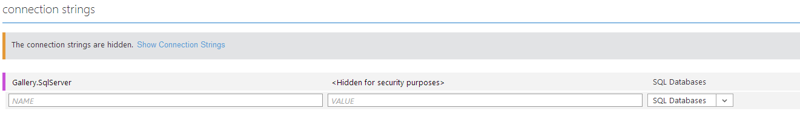

# Deploying the NuGet Gallery to Windows Azure Websites

## Setting up resources
To run the NuGet Gallery on Windows Azure Websites you need to provision the following Azure resources:

1. An Azure Website running .Net 4.5 to run the gallery frontend
2. An Azure SQL Database (preferably in a dedicated Azure SQL Server) to hold the package metadata
3. An Azure Storage account to hold package files, diagnostics data, etc.
4. [Optional] An Azure Cloud Service to run the gallery backend worker
5. [Optional] An Azure Cloud Service to provide SSL Forwarding and Traffic Management to the gallery frontend

It is assumed you know how to provision these resources. This guide will describe how to deploy the components to them once created.

## Deploying the Database
There's not much that needs to be done here. First, create a SQL Azure database (preferably in a dedicated SQL Azure server). In this example, we'll use "NuGetGallery" as the name. First, create the database in the Azure portal. 


Next, we need to create a user for the site to use. Open the **server** in the Azure Portal and click on the URL under `Manage URL`


Type "master" in the database field and log in using the SA password for the server (which you should have copied down when you created the server ;)).

If you receive an error about firewall rules, go to the SQL Server entry in the Azure Portal, click the Configure tab and add your current client IP address to the list of allowed IP addresses (don't forget to click Save!). While here, double check that Allow Windows Azure Services is set to "YES".

Once logged in to the SQL management portal, create a new query and type the following (of course, replace 'some password here' with an actual, secure, password :)):

```SQL
CREATE LOGIN [nuget-site] WITH PASSWORD='some password here'
```

We use "nuget-site" as the name, but feel free to use any user name you want.

Now, log out and log in again, but this time, specify the name of the gallery database in the "Database" field (i.e. NuGetGallery). Then, create a new query and run these scripts (one at a time):

```SQL
CREATE USER [nuget-site] FROM LOGIN [nuget-site]
```

```SQL
EXEC sp_addrolemember 'db_owner', 'nuget-site';
```

If you used a different site username, use it in place of 'nuget-site' in the scripts.

Now, log off the management portal and switch to VS. Open the NuGetGallery solution and expand the "Package Manager Console" tool window:


Craft your connection string using notepad or some other text editor. You want it to take the following form:

```
Server=[servername].database.windows.net;Database=NuGetGallery;User ID=sa@[servername];Password=[sapassword];Trusted_Connection=False;Encrypt=True
```

Replacing '[servername]', 'sa' and '[sapassword]' with the name of your Azure SQL Server, the SA user name and the SA password respectively. Keep this handy for the next step but make sure you store it securely, as this contains a password which grants **full admin access** to your database.

In the Package Manager console, type the following command

```PowerShell
Update-Database -ConnectionString "[ConnectionString]" -ConnectionProviderName System.Data.SqlClient
```

Replacing '[ConnectionString]' with the connection string you just crafted. The command should succeed and you should have a fully prepared database!

## Setting up configuration
Now that you've got the database ready, all the resources are ready for you to deploy the site. First, though, we need to configure the Website so that it will be able to talk to the database and storage when it is deployed. To do this, go to the website in the Azure Portal and select the Configure tab. 

Craft a connection string using the 'nuget-site' user you created earlier (by taking the connection string above and replacing sa and '[sapassword]' with the username/password for that user). Then, in the portal, add the database connection string like so:



Then, go to the storage account you created in the portal and select "Manage Keys". Use the name and primary key on that page to build a connection string like this:

```
DefaultEndpointsProtocol=https;AccountName=[account name];AccountKey=[primary key];
```

Using that connection string, go back to the Configure tab of the website and set the AppSettings as shown below:


Replace '[site url]' with the URL you intend to use as the root of your site, and for the storage connection string, use the string you crafted before. The GalleryOwner setting is a standard email name in the form "Display Name &lt;emailaddress&gt;". If you intend to use SSL, you can set RequireSSL to true, but you should probably wait until you get it up and running before doing that.

Save the changes and get ready to deploy!

## Deploying the frontend
Go back to the dashboard tab and set up deployment from source control. Assuming you cloned this repo from Git, you probably want to choose "Local Git Repository". That is the case we will cover here.

Once you complete this wizard, you'll need to set up deployment credentials. I'll assume you've got that under control ;). Go to the gallery and checkout the branch you want to deploy (say 'master'):

```
git checkout master
```

Add Azure as remote and push that branch up!

```
git remote add azure [git url]
git push azure master
```

NOTE: If you don't use master, make sure to update the "Branch to Deploy" setting in the Configure tab.

After pushing, the site will build, which may take a while. Once finished, just browse to the site and it should start up! The first request may take quite a while, so be prepared to wait a few minutes.

Now that you've got the site up, try registering a user and uploading a package!

## Making an Admin
Once you've got your gallery deployed, you probably want an admin user. That's pretty easy to do. First, register your admin user through the site. Then log in to the database using the Azure SQL Management Portal and the 'nuget-site' user (as we did above). Then run this SQL:

```SQL
INSERT INTO Roles(Name) VALUES('Admin')

DECLARE @adminId int
SELECT @adminId = [Key] FROM Roles WHERE Name = 'Admins'

DECLARE @userId int
SELECT @userId = [Key] FROM Users where Username = 'username'

INSERT INTO UserRoles(UserKey, RoleKey) VALUES(@userId, @adminId)
```

Replacing 'username' with the name of the user you just created. Now log out and back in with that user and you should see the Admin tab! **NOTE** The name of the role is important, it is "Admins" (plural!).
