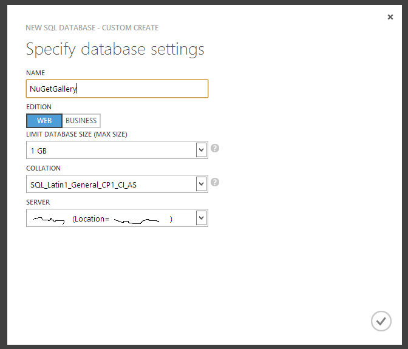
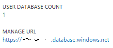
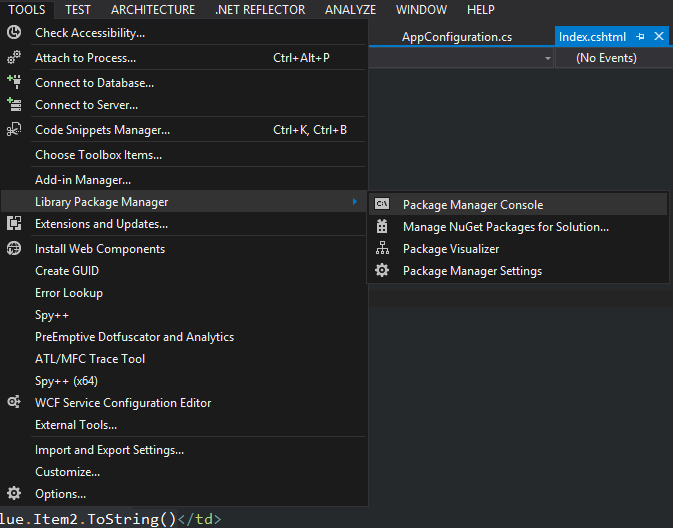
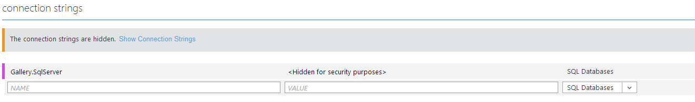

# Deploying the NuGet Gallery

To run the NuGet Gallery you need to provision the following common resources:

1. An SQL Database to hold the package metadata.
2. A location in which to store package files. The Gallery supports two at the moment: Local File System and Azure Storage Account.
3. A Web Frontend to host the Gallery.
4. (Optional) A Worker Backend to perform offline processing tasks.

## Deploying to Azure

We suggest using Windows Azure for hosting the gallery, as that is the environment used by http://www.nuget.org itself. When doing so, we suggest using Azure SQL Databases (formerly SQL Azure) for the database and Azure Storage Accounts to store package files.

We support two profiles of Azure deployment: [Azure Websites](Websites) and [Azure Cloud Services](CloudServices). Before using those guides, however, you need to ensure you provisiong the supporting resources (Database, Storage, etc.).

## Provisioning for Azure

### Provisioning a Database

We recommend provisioning a dedicated Azure SQL Databases Server for the Gallery. If you are going to use our backend worker to generate statistics reports from data in a NuGet Warehouse, we recommend provisioning a separate Server for that database in production (the Warehouse may be co-located with the Gallery database if necessary though, and we do co-locate them in our non-production environments).

So, first create a database:



Next, we need to create a user for the site to use. Open the **server** in the Azure Portal and click on the URL under `Manage URL`



Type "master" in the database field and log in using the SA password for the server (which you should have copied down when you created the server ;)).

If you receive an error about firewall rules, go to the SQL Server entry in the Azure Portal, click the Configure tab and add your current client IP address to the list of allowed IP addresses (don't forget to click Save!). While here, double check that Allow Windows Azure Services is set to "YES".

Once logged in to the SQL management portal, create a new query and type the following (of course, replace 'some password here' with an actual, secure, password :)):

```SQL
CREATE LOGIN [nuget-site] WITH PASSWORD='some password here'
```

We use "nuget-site" as the name, but feel free to use any user name you want.

Now, log out and log in again, but this time, specify the name of the gallery database in the "Database" field (i.e. NuGetGallery). Then, create a new query and run these scripts (one at a time):

```SQL
CREATE USER [nuget-site] FROM LOGIN [nuget-site]
```

```SQL
EXEC sp_addrolemember 'db_owner', 'nuget-site';
```

If you used a different site username, use it in place of 'nuget-site' in the scripts.

Now, log off the management portal and switch to VS. Open the NuGetGallery solution and expand the "Package Manager Console" tool window:



Craft your connection string using notepad or some other text editor. You want it to take the following form:

```
Server=[servername].database.windows.net;Database=NuGetGallery;User ID=sa@[servername];Password=[sapassword];Trusted_Connection=False;Encrypt=True
```

Replacing '[servername]', 'sa' and '[sapassword]' with the name of your Azure SQL Server, the SA user name and the SA password respectively. Keep this handy for the next step but make sure you store it securely, as this contains a password which grants **full admin access** to your database.

In the Package Manager console, type the following command

```PowerShell
Update-Database -ConnectionString "[ConnectionString]" -ConnectionProviderName System.Data.SqlClient
```

Replacing '[ConnectionString]' with the connection string you just crafted. The command should succeed and you should have a fully prepared database!

### Provisioning Storage Accounts
We also recommend the following Storage Accounts for each environment you intend to deploy (i.e. development, test, production, etc):

1. A Primary Storage account to hold package files and other supporting content.
2. A Backup Storage account to hold package and database backups in case the primary storage account is lost.
3. A Diagnostics Storage account to hold logs and other data. In non-production environments, we recommend using the Primary storage account to hold this data. In production, however, your traffic may be large enough that you may wish to move diagnostics data (Web Server logs, etc.) to a separate storage account

### Gathering configuration
Now that you've got the database ready, all the resources are ready for you to deploy the site. First, though, we need to configure the Website so that it will be able to talk to the database and storage when it is deployed. To do this, go to the website in the Azure Portal and select the Configure tab. 

Craft a connection string using the 'nuget-site' user you created earlier (by taking the connection string above and replacing sa and '[sapassword]' with the username/password for that user). Then, in the portal, add the database connection string like so:



Then, go to the storage account you created in the portal and select "Manage Keys". Use the name and primary key on that page to build a connection string like this:

```
DefaultEndpointsProtocol=https;AccountName=[account name];AccountKey=[primary key];
```

Now that you have your dependent resources and their configuration, move on to...

## Deploying the Frontend/Backend
Once you've provisioned these resources, continue to the guide for deploying to the profile of your choice:

1. [Azure Cloud Services](CloudServices/README.md) - Recommended for extremely high availability services
2. [Azure Websites](Websites/README.md) - Recommended for simple deployment scenarios

We do not currently recommend Azure Websites for extremely high availability deployments of the Gallery. Other Azure features for traffic management, such as Azure Traffic Manager, do not support Azure Websites at this time. Also, Azure Websites does not provide the Production/Staging VIP Swap mechanism used in Cloud Services to allow for staging of production changes.

## Making an Admin
Once you've got your gallery deployed, you probably want an admin user. That's pretty easy to do. First, register your admin user through the site. Then log in to the database using the Azure SQL Management Portal and the 'nuget-site' user (as we did above). Then run this SQL:

```SQL
INSERT INTO Roles(Name) VALUES('Admins')

DECLARE @adminId int
SELECT @adminId = [Key] FROM Roles WHERE Name = 'Admins'

DECLARE @userId int
SELECT @userId = [Key] FROM Users where Username = 'username'

INSERT INTO UserRoles(UserKey, RoleKey) VALUES(@userId, @adminId)
```

Replacing 'username' with the name of the user you just created. Now log out and back in with that user and you should see the Admin tab! **NOTE** The name of the role is important, it is "Admins" (plural!).