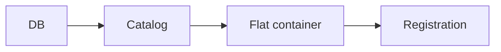
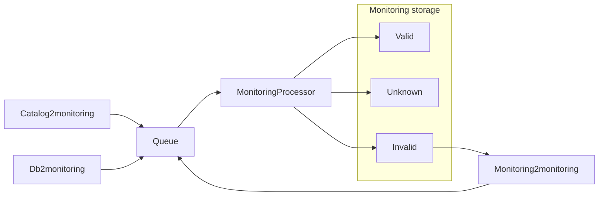

# Background

Ng is a framework for jobs handling V3 metadata. It steps away from our "regular" job approach: all the jobs are shipped as
a single executable and which job runs is specified through command line. Individual job entry points are in `Jobs` directory.

Generally, V3 pipeline processes items in the following order:

Each "arrow" above is represented by an Ng job:

* db2catalog
* catalog2dnx (and catalog2icon for handling package icons from URLs)
* catalog2registration

Besides V3 jobs, there is a 'lightning' job (which isn't really a job, but a tool) for rebuilding registration fast if needed
and V3 Monitoring jobs that validate V3 consistency:
* catalog2monitoring
* db2monitoring
* monitoring2monitoring
* monitoringprocessor

# Monitoring jobs details

Set of monitoring jobs are communicating through a queue.

Catalog2monitoring job follows catalog udpates and queues batches of packages from catalog to monitoring queue.

Db2monitoring reads package ids and versions from two sources:
* database
* package deletion audit storage

and queues them to monitoring queue.

Monitoring2Monitoring job reads package ids and versions from Invalid packages storage
and requeues them to monitoring queue for revalidation.

MonitoringProcessor job reads messages from the monitoring queue and runs validators against them.
